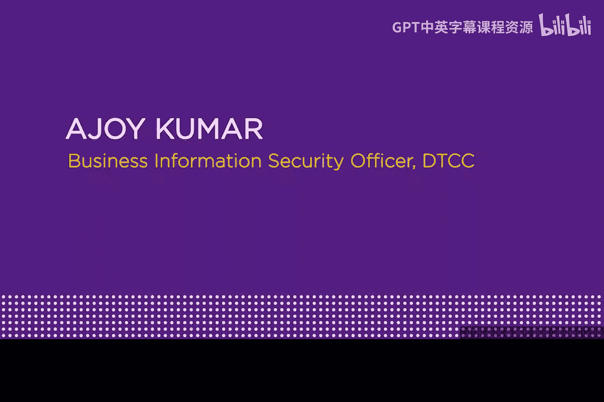

# 070：专访Ajoy Kumar 🎙️

在本节课中，我们将通过纽约大学网络安全课程的一次专访，了解资深信息安全专家Ajoy Kumar的职业历程、对行业的见解以及给初学者的建议。我们将学习到进入网络安全领域所需的技能、当前行业趋势以及持续学习的方法。

***

## 欢迎Ajoy Kumar

大家好，我是Edroso。欢迎来到我们的专访系列，今天我的好朋友Ajoy Kumar将接受采访。Ajoy是DTCC（美国存管信托和结算公司）的业务信息安全官。

欢迎来到我们的专访系列。

谢谢教授。

***

## DTCC是什么？

嘿，DTCC，这代表什么？

它代表存管信托和结算公司。这很可能是一家非常重要的金融服务公司，我敢打赌很多观看视频的年轻人甚至从未听说过它。

它绝对是一个关键的金融基础设施机构。我们在美国政府的金融关键基础设施中扮演着角色。它不是一家政府公司，而是一个行业所有的机构。我们的工作是为华尔街结算账目。我们基本上处于交易流程的末端，确保交易最终完成。

听起来非常重要。

确实如此。这是一份有趣的工作。

***

## 职业旅程

现在让我们谈谈你。请简单介绍一下你是如何对现在从事的技术职业产生兴趣的。你是如何走到今天这个位置的？

当然。我想这始于很多很多年前。我的父亲在印度曾是一名统计学家和经济学家。我有时会在职业体验日之类的日子去他的办公室。他当时从事数据处理工作，使用打孔卡计算机。在我八年级时，我见到了第一台基于8085处理器的个人电脑。我玩了很多吃豆人游戏，这在那时引起了我的兴趣。同时，我也看到他在使用类似Lotus 1-2-3的软件进行数字运算，并对此感到兴奋。我想这激发了我的兴趣。

我在印度完成了计算机科学的本科学业，这为我的职业生涯开了个好头。但我希望探索更多。后来我攻读了电气工程的硕士学位，主修控制和仪器仪表，尽管我在职业生涯中从未用到这个专业。

在美国工作多年后，我曾是一名数据库管理员。我接手了一个项目，主要内容是保护对生产环境的访问权限，以防止开发人员更改我们的数据库。正是在这里，我接触到了安全领域。我参与了一些项目来防止开发人员在生产环境中进行更改，这让我非常着迷。因此，我报名参加了史蒂文斯理工学院的硕士证书课程。在离开学校多年后，我上了你的第一堂课。从那时起，我坚定了要在这个领域发展的决心。这对我来说是一个非常有趣的话题，每天都有新东西可以学习，有令人兴奋的事情可以做。这让我感到兴奋，而如今，13、14年过去了，我依然在这个领域工作。

这太棒了。

***

## 给新人的建议

现在，许多观看视频的年轻人可能在想：“我想进入安全领域”。对此你有什么建议？你认为他们应该更专注于技术或编程，还是黑客技术？对于一个对此感兴趣的年轻人来说，什么是好的发展路径？

我认为技术路径无疑是非常重要的。在当今时代，你至少应该掌握**两门或以上的编程语言**，这是进入这个领域非常好的方式。

哪两门编程语言比较好？

我喜欢Python和Java。所以，毫无疑问，这些是非常重要的语言。它们能让你很好地理解需要解决的业务问题，也能让你对安全有很好的感觉。因为当你使用这些语言时，你需要思考如何“破坏”它，可以利用哪些结构来攻击应用程序。了解这些对于进入这个领域至关重要。

我的重点一直放在技术方面，这也是我的优势所在。但同时，对于更进阶的人来说，我认为他们也需要关注**操作层面**。因为如果你不考虑某个方案如何适配并融入生产环境或更大的生态系统，你可能会忽略整体的安全态势。所以，这是一个结合体：专注于编程、应用程序、基础设施，并确保它们如何在更大的操作框架中安全地运行。

***

## 当前网络安全趋势

你认为当前网络安全有哪些趋势？攻击是否越来越难以阻止？现在进行有效的网络防御是否需要更多技能？

是的，网络防御绝对是一个不断发展的领域。它在过去几年里不断演变、扩展，也更具挑战性。我认为信息安全专业人员需要具备多种技能来应对。

首先，他们需要有**领导力和勇气**，能够指出正确的解决方式。
其次，他们需要有**战略和规划能力**，知道如何系统地处理问题。
第三，也是更重要的领域是**技术专长**。如果只试图通过流程来解决问题，这固然好，但如果缺乏技术技能，你可能无法看清全貌。
最后但同样重要的是，要确保与**财务方面**取得平衡，因为你不能无休止地投资于保护某一个领域，而忽略了其他领域。因此，**纵深防御**的概念必须得到良好实施，以确保以有意义的方式保护所有资产。

所以，是的，这是一个不断发展的领域，非常有趣。它让你每天保持兴奋，因为每天都有新的事件发生。这正是让我保持兴奋的原因。

***

## 攻防技能差异

这听起来很符合逻辑，但很多人认为：“哇，应该是黑客技术、入侵系统，然后我就能成为安全专家”。你描述的技能与这些是非常不同的，比如入侵系统与你提到的需要周密规划的纵深防御思维过程。这有点不同于单纯的“黑客”行为，对吧？它们是不同的技能。

是的。根据我的观察，这个领域在高层次上可以分为两种思路：**进攻性安全**和**防御性安全**。我的重点一直放在防御性安全上，这也是为什么领导力、规划能力、卓越运营和技术能力更能引起我的共鸣。

仅仅像罗宾汉一样说我打算从事进攻性安全，我并没有那样做。有些人可能觉得进攻性安全更有趣，但归根结底，防御性问题大部分需要通过防御机制来解决。当然，一些进攻性研究是有益的，这个领域也有新的工作在进行，但我认为目前重点更多地放在了防御上。

***

## 如何保持技能更新

让我问你，你是如何保持技能更新的？你使用书籍、网站、文章还是课程？有什么好方法吗？或者也许你日常所做的工作本身就是一种方式？你如何保持与时俱进？

是的，这是多种方式的结合。显然，工作让我很忙，我也从中了解到很多。此外，我肯定会定期进行大量阅读。我听很多播客。我也会在像**OWASP**这样的组织中做志愿者，我已经与他们合作了很多年。在那里形成的社区基本上会告诉你哪些问题正在浮现，你需要关注什么。除此之外，我们为公司订阅的各种信息源也告诉我正在发生什么，每天需要关注哪些重大事项，市场上哪些趋势正在增长（可能在三个月后产生影响），以及我如何防范它们。

所以，我是通过多种方式的结合来跟上发展的。但这就像永远在追赶一样，我想这是看待这个领域的方式，因为这里发生的变化太多了。

***

你提到了OWASP（开放Web应用程序安全项目）。那里有机会让学生和其他人参与吗？

是的，绝对有。OWASP和其他组织都是如此。OWASP对我来说一直是一个很好的平台，尤其在我还是新手的时候。我经常鼓励为我工作的实习生和其他同事成为会员。这是低成本会员，学生过去可以免费获得会员资格，他们可以免费参加会议。他们提供大量信息。你可以参与许多项目，可以帮助维护维基百科。在那个领域有很多事情可以做，供任何人学习。你在那里建立的社区、获得的信息、得到的线索以及定期发生的知识共享都非常重要。

***

## 总结

看起来你真的很享受你所做的工作。

是的，我热爱它。

我很高兴你这样想，因为如果你不热爱，我想我们的金融服务行业可能会崩溃。你在确保所有这些交易和结算顺利进行，这非常重要。

这是一项更大的努力，是整个金融部门周围形成的生态系统的一部分。我只是在尽我的一份力。是的，我热爱它，我对此充满热情。

你会继续为我们出色地工作。非常感谢你，很高兴见到你。

我们下次再见。

谢谢。

***

在本节课中，我们一起学习了资深安全专家Ajoy Kumar的分享。我们了解了DTCC在金融基础设施中的关键作用，回顾了Ajoy从接触早期计算机到专注于防御性安全的职业旅程。他建议初学者掌握如**Python**和**Java**等技术技能，并关注操作与战略层面。我们探讨了网络安全领域**防御重于单纯攻击**的趋势，以及通过工作实践、阅读、参与**OWASP**等社区来保持技能更新的方法。最后，我们看到了对工作的热情是在这个充满挑战的领域长期发展的关键动力。