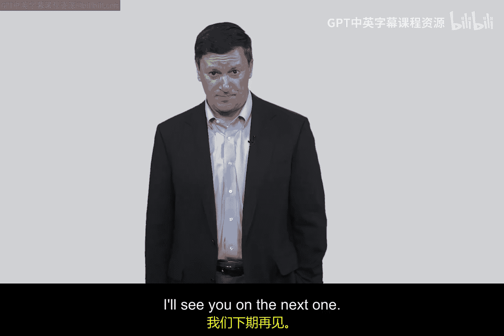
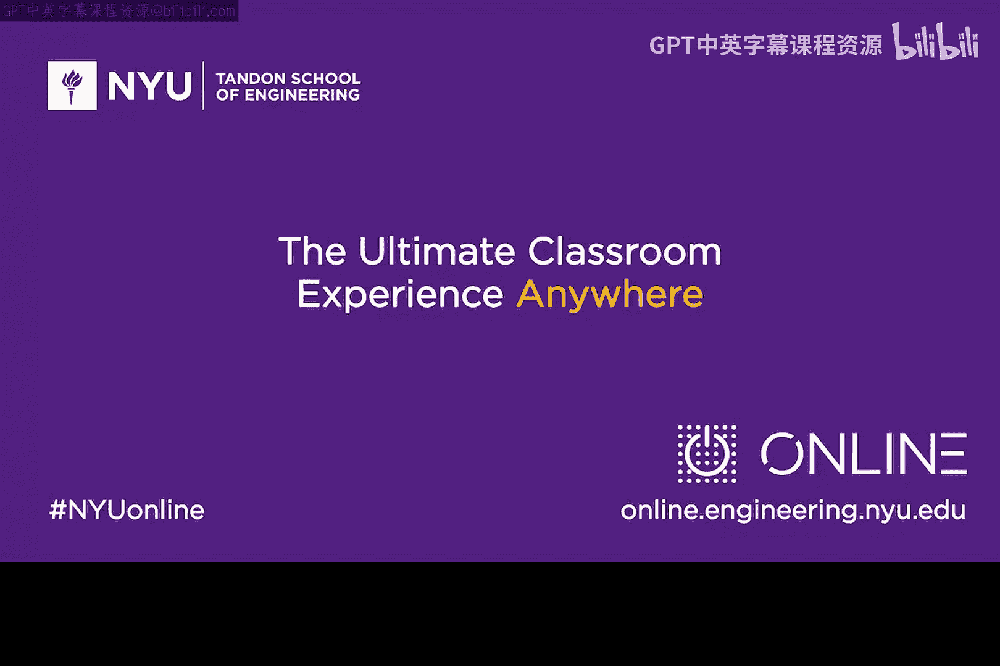

网络安全入门：P71：Kerberos第1部分 - 实现TGT颁发 🔑

在本节课中，我们将学习Kerberos协议的第一部分，即如何安全地颁发“票据授予票据”，这是实现无密码网络认证的关键第一步。

上一节我们介绍了网络安全中密码传输的风险，本节中我们来看看Kerberos协议如何解决这个问题。

Kerberos是一个内置于Windows等众多系统中的流行认证协议。它的核心目标是：**确保用户的明文密码不会在网络中传输**。为了实现这个目标，协议引入了一个称为“密钥分发中心”的中央权威机构。

以下是协议的基本参与方：
*   **密钥分发中心**： 负责为所有用户和服务器生成和管理密钥。
*   **客户端/用户**： 例如Alice，她希望访问某个服务。
*   **服务器**： 例如Bob，提供Alice想要访问的服务。

协议运行在一个拥有同步时钟的企业或校园网络内，时钟同步对于防止协议欺骗行为非常重要。

---

### 协议初始化：密钥分发

在协议开始前，KDC会与每个参与方（用户和服务器）共享一个**长期密钥**。
*   Alice与KDC共享密钥：`K_A`
*   Bob与KDC共享密钥：`K_B`
这个长期密钥也称为**根密钥**，是通信双方的基础秘密。

### 第一步：用户登录与TGT请求

当Alice需要访问网络服务时，她首先在本地机器上输入密码登录。**关键点在于，这个密码仅用于本地验证，不会发送到网络**。

验证通过后，Alice的客户端会向KDC发送一个标准请求消息，申请一个**票据授予票据**。TGT就像是“获取其他服务门票的门票”。

### 第二步：KDC生成并颁发TGT

收到请求后，KDC会执行以下操作：
1.  **生成会话密钥**： KDC为Alice创建一个临时的**会话密钥** `SK_A`。在密码学中，我们希望密钥的寿命尽可能短，使用长期根密钥来派生短期会话密钥是一种安全最佳实践。这样即使会话密钥被破解，根密钥仍然是安全的。
2.  **构造TGT**： KDC会将这个会话密钥 `SK_A` 以及其他信息（如时间戳）封装成一个消息。
3.  **加密TGT**： KDC使用**Alice的根密钥** `K_A` 对这个消息进行加密。加密后的数据块就是TGT。

`TGT = Encrypt(K_A, {SK_A, Timestamp, ...})`

这种使用用户自身密钥加密的方式很巧妙。即使攻击者Eve截获了网络上传送的TGT，由于她没有Alice的密钥 `K_A`，也无法解密和读取其中的内容，尤其是关键的会话密钥。

### 协议目标与复杂性思考

至此，Kerberos协议的第一部分完成。Alice成功地从KDC获得了一个TGT，她可以凭借这个TGT在后续步骤中申请访问特定服务器（如Bob）的票据。

你可能会觉得，仅仅为了准备登录就经历这么多步骤（同步时钟、生成会话密钥、加密TGT）似乎很复杂。相比直接输入密码，这确实引入了更多环节。然而，这种复杂性如果被系统底层完美封装，对用户而言操作仍然是简单的（输入密码即可）。用一定的后台复杂性换取更高的安全性，这通常是一个值得的权衡。

---

本节课中我们一起学习了Kerberos协议的基础架构和TGT颁发过程。我们了解了KDC的角色、长期根密钥与短期会话密钥的区别，以及协议如何通过加密确保TGT在传输过程中的安全性。在下一部分，我们将继续学习Alice如何利用已获得的TGT来最终安全地访问Bob的服务。