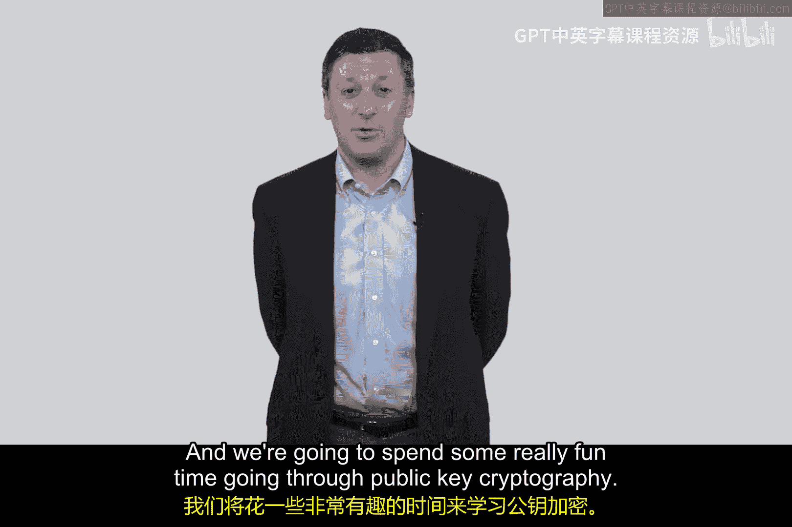

网络安全入门：P72：Kerberos协议第二部分 - 实现与T_Bob颁发 🔑

在本节课中，我们将深入学习Kerberos协议的第二部分，重点探讨Alice如何向密钥分发中心申请与Bob通信的票据，以及整个认证过程的实现细节。我们将通过清晰的步骤和核心概念公式，帮助你理解这个复杂的握手协议。

---

### 概述

上一节我们介绍了Alice如何从密钥分发中心获得票据授予票据。本节中，我们来看看Alice如何利用这个TGT，安全地申请一个用于与Bob通信的会话密钥和票据。

### 申请与Bob通信

Alice现在希望与Bob建立通信，例如登录Bob的服务，但她不想使用密码。根据RFC规范，为Bob申请的票据被称为“给Bob的票据”，我们简称其为 **T_Bob**。

Alice向密钥分发中心发送请求。她使用上一阶段获得的会话密钥加密了一个包含当前时间戳的认证器，以证明自己的身份并实现时钟同步。同时，她也会明文发送想要连接Bob的请求，因为Kerberos的设计目标并非防止流量分析，而是确保密码不在网络中传输。

> 请求消息结构示例：
> `Alice -> KDC: {Timestamp}_{S_A}, "Connect to Bob"`

### 密钥分发中心的角色

密钥分发中心收到请求后，会进行以下操作：
1.  验证Alice的TGT，确认其身份。
2.  为Alice和Bob生成一个**共享的会话密钥**，记为 **S_AB**。
3.  创建一个包含S_AB和Alice身份信息的T_Bob票据，并用**Bob与KDC的共享密钥K_B**加密。
4.  将S_AB和加密后的T_Bob一起，用**Alice与KDC的会话密钥S_A**加密，发回给Alice。

这个过程体现了Kerberos的“仲裁”思想：KDC作为Alice和Bob都信任的第三方，可以安全地为他们分发一个只有双方能使用的秘密。

> KDC响应消息结构：
> `KDC -> Alice: {S_AB, {T_Bob}_{K_B} }_{S_A}`

### Alice向Bob发起认证

Alice收到KDC的回复后，用S_A解密，获得了会话密钥S_AB和给Bob的票据T_Bob。

以下是Alice向Bob发起最终认证的步骤：
1.  Alice将T_Bob（已用K_B加密）发送给Bob。
2.  同时，她用刚获得的会话密钥S_AB加密一个当前时间戳，作为新的认证器一并发送。

> Alice认证Bob的消息：
> `Alice -> Bob: T_Bob, {Timestamp}_{S_AB}`

Bob收到后：
1.  用自己与KDC的密钥K_B解密T_Bob，从中提取出会话密钥S_AB和Alice的身份信息。
2.  用S_AB解密时间戳认证器，验证消息的新鲜性。

至此，Alice和Bob成功建立了共享会话密钥S_AB，可用于后续的安全通信。

### Kerberos的复杂性与可扩展性

Kerberos握手协议确实非常复杂，初次接触感到困惑是正常的。它是认证协议中设计最为精巧和复杂的之一。

此外，我们需要思考其可扩展性。Kerberos在互联网规模的应用上面临挑战，核心问题在于**密钥分发中心的信任与管辖范围**。协议中引入了“领域”的概念，即每个KDC管理一个自治的社区或组织。跨领域的认证需要KDC之间建立信任并进行查询，虽然可以通过层次化结构来组织，但这增加了复杂性。

相比之下，**公钥密码学**为大规模、去中心化的网络认证提供了更灵活和可扩展的解决方案，这也是我们后续课程将重点探讨的内容。

### 总结

本节课中我们一起学习了Kerberos协议的第二阶段。我们详细分析了Alice如何利用票据授予票据向KDC申请与Bob通信的票据T_Bob和会话密钥S_AB，并完成了与Bob的最终双向认证。尽管协议流程复杂，但它精妙地实现了在不传输密码的前提下，通过可信第三方建立安全通信。同时，我们也讨论了Kerberos协议在可扩展性上的局限，为学习更通用的公钥密码体系做好了铺垫。