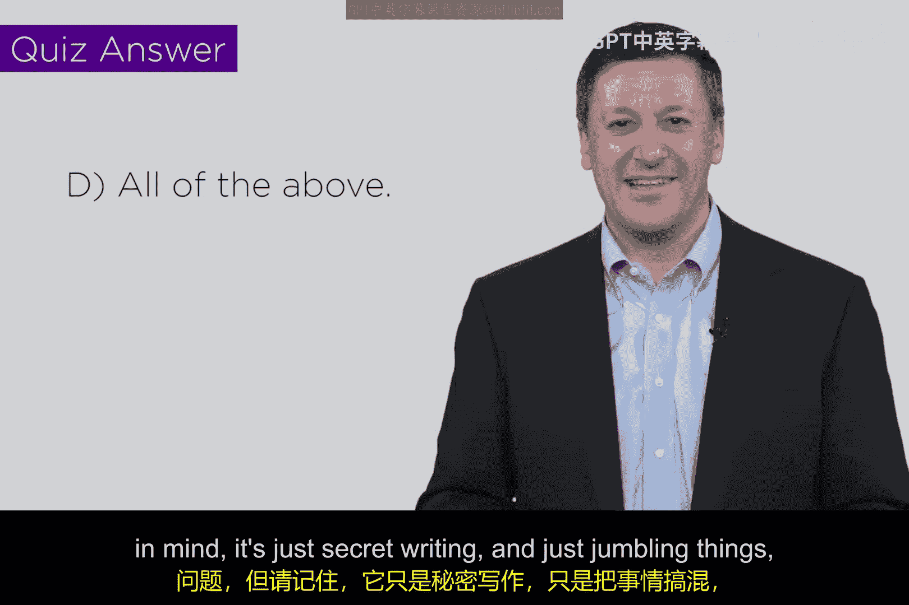

# 074：密码算法设计 🔐

在本节课中，我们将探讨密码算法的设计原理。我们将了解构建加密方案背后的基本策略和核心要求，让初学者也能理解其背后的逻辑。

## 概述

密码学看似高深，但核心思想是“秘密书写”。本节将解析设计密码算法的两种常用策略，并阐明一个强大算法必须满足的两个关键要求。

## 密码设计策略

上一节我们介绍了密码学的目标，本节中我们来看看设计密码算法的具体方法。主要有两种基础策略。

### 1. 替换策略

替换是指将一个事物替换为另一个事物。最简单的例子是将一个字母替换为另一个字母（例如凯撒密码）。虽然这不是最强大的密码，但它阐明了核心概念。

替换可以是非线性的，不一定是一对一的映射。例如，我的家人发明了一种在孩子周围使用的“秘密语言”：在每个元音前加上字母“A”和“B”。比如我的名字“Ed”会变成“Abed”，“video”会变成“vid Abe Abo”。这是一种非线性替换密码，孩子们无法理解。

设计密码时需要注意，不能将所有内容都映射到同一个字母（如字母‘A’），虽然这能隐藏信息，但无法还原。必须确保替换操作存在**逆函数**，以便解密。几乎所有的现代密码都倾向于使用非线性替换。

### 2. 置换策略

第二种策略称为置换。这涉及到创建信息的矩阵排列或表示。

可以将其想象成行和列，然后对矩阵进行线性代数或矩阵算术类型的变换。记住所做的操作以便能够还原。矩阵可以按行遍历、按列遍历或进行各种复杂的重排。

如果你学过线性代数，就会熟悉矩阵操作。将替换与矩阵置换操作结合起来，并记录变换过程，就能创造出对明文进行有趣“混淆”的方法。编写程序来实现这些操作也相对容易。

## 强大算法的核心要求

你可能会想，自己设计的算法可能不够好。那么，一个优秀的密码算法必须满足以下两个核心要求。

以下是评估密码强度的两个关键维度：

1.  **计算复杂性**：算法必须非常复杂。在数学上，我们称之为“计算上困难”。这涉及一类特殊问题，即“NP完全问题”。数学家们普遍认为（虽未证明），解决这类问题的唯一方法是尝试每一种可能性。
    *   **经典例子**：取两个大质数相乘。我给你乘积，然后问：“朋友，这是两个质数的乘积吗？”目前，我们所知的唯一解答方法是从2、3、5、7开始逐一试除。如果有人能找到这个问题的捷径，那将是像牛顿发现万有引力定律一样的重大突破。许多密码学，尤其是我们稍后会讲到的公钥密码学，都依赖于这个难题。

2.  **巨大的域大小**：被加密信息的可能性空间必须极其庞大。如果域太小，即使算法复杂，攻击者也可以通过穷举所有可能性来破解（暴力破解）。
    *   **回顾**：在更早的视频中，我们通过编写程序分析英文字母频率分布来破解凯撒密码，这就是利用了域小的弱点。
    *   **理想规模**：可能性数量应达到地球上沙粒总数那种级别。将一个只能通过穷举所有可能来解决的难题，与一个如此庞大的域结合起来，就能得到相当强大的密码。因为攻击者需要为“地球上的每一粒沙子”尝试一种可能性，这在实际中是不可行的。

## 知识测验

为了检验你的理解，这里有一个小测验。正如你所料，正确答案是“以上所有”。这些术语（如“混淆事物”）虽然不非常技术化，但你应该记住这个核心思想。

许多人在学校或其他地方接触密码学时，总觉得它是一门高深的数学。但请记住，它的本质就是秘密书写，就是打乱信息。你可以尝试自己设计，这其实很有趣。

## 总结

本节课中我们一起学习了密码算法设计的基础。我们探讨了**替换**和**置换**这两种核心策略，并了解了一个强大密码算法必须具备**计算上的高复杂性**和**巨大的密钥或明文空间**这两个关键要求。理解这些基本原理，是进一步学习具体加密技术（如对称加密、非对称加密）的重要基石。