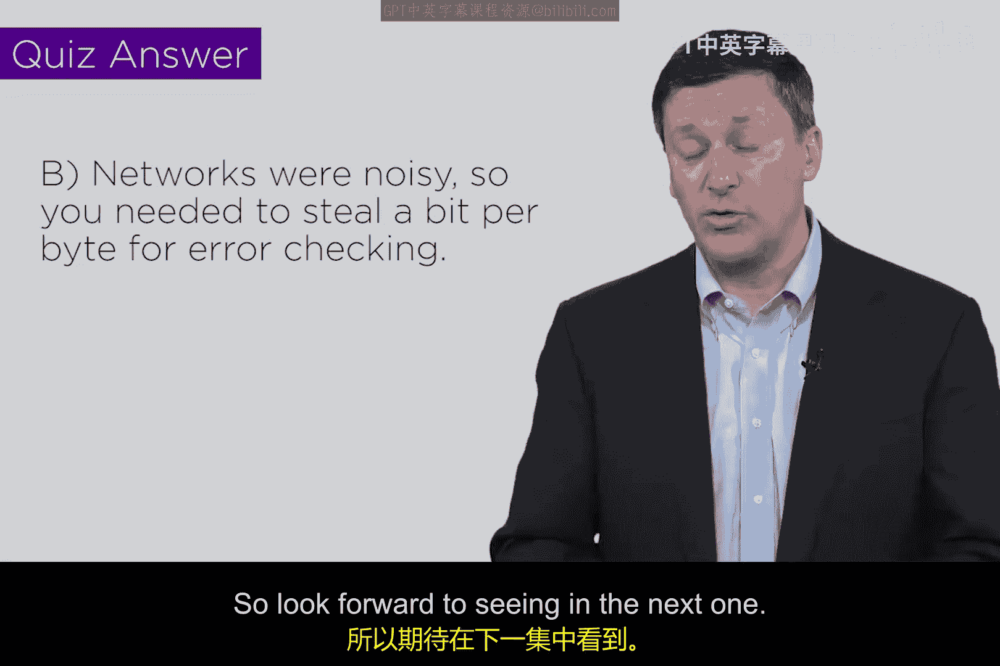

# 075：DES设计 🔐

在本节课中，我们将学习一个非常重要的加密标准算法——数据加密标准（DES）。我们将了解它的历史背景、核心设计原理以及其关键参数。

## 概述

DES是一种对称密钥加密算法，诞生于20世纪70年代。当时，银行业开始广泛使用密码学进行通信，并希望建立一个统一的加密标准以实现互操作性。美国国家标准局（NBS，即现在的NIST）为此发布了提案请求，最终IBM公司基于其“Lucifer”算法开发出了DES。

## DES的核心设计

上一节我们提到了DES诞生的背景，本节中我们来看看它的具体设计结构。

DES是一种**分组密码**。它处理数据的方式如下：
*   **输入与输出**：它以64位的数据块作为输入，并产生对应的64位加密数据块作为输出。可以想象你的数据流像一列火车，每节车厢是64位，依次进入加密“黑箱”进行处理。
*   **密钥长度**：它使用一个64位的密钥。但由于当时的网络通信质量较差，每8位（1字节）中需要拿出1位作为**奇偶校验位**，以确保前7位在传输中未被篡改。因此，实际有效的密钥长度是 **56位**。
*   **加密过程**：DES的核心是进行**16轮**的加密操作。每一轮都包含我们之前学过的**代换**、**置换**和**异或**操作。56位的密钥被用来生成每一轮所需的子密钥。

以下是其核心参数的总结：
*   分组大小：`64 bits`
*   有效密钥长度：`56 bits`
*   加密轮数：`16 rounds`

这种通过多轮代换和置换来加密数据的结构被称为**Feistel结构**，它是一种非常巧妙和强大的设计思想。

## DES的潜在问题

虽然DES的设计概念（如Feistel结构和16轮加密）非常坚固，使其能够有效抵抗密码分析，但其两个关键参数在当今看来存在局限。

*   **分组加密的固有挑战**：由于DES是分组加密，当加密的数据长度不是64位的整数倍时，或者需要加密大量相同的数据块时，会带来一些安全问题（例如，可能暴露数据的模式）。我们将在后续课程中学习如何通过**分组密码工作模式**（如CBC）来解决这些问题。
*   **密钥长度不足**：**56位**的密钥长度是其最主要的弱点。在70年代，`2^56`种可能的密钥数量看起来是安全的。但随着计算机计算能力的飞速发展，暴力破解（即尝试所有可能的密钥）变得可行。`2^56` 对于现代计算机来说已不再构成重大挑战。

## 小测验

为了检验你对DES的理解，这里有一个问题：
**DES的有效密钥长度为什么是56位，而不是其标称的64位？**

**答案**：因为64位密钥中的每8位里有1位被用作**奇偶校验位**，以确保密钥在当时的嘈杂网络中正确传输，因此实际用于加密的只有56位。

## 总结

本节课我们一起学习了数据加密标准（DES）。我们了解了它诞生的历史背景，掌握了其核心设计：它是一种使用56位有效密钥，对64位数据块进行16轮加密的分组密码。我们认识到，尽管其Feistel结构设计精良，但有限的密钥长度是其主要的时代局限性。在接下来的课程中，我们将探讨如何改进DES的这些弱点，并学习后续更强大的加密标准。