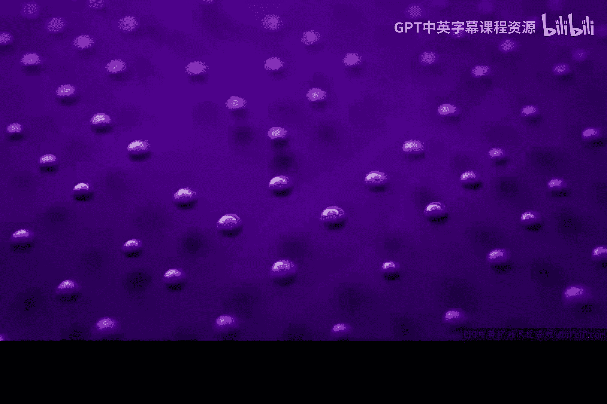
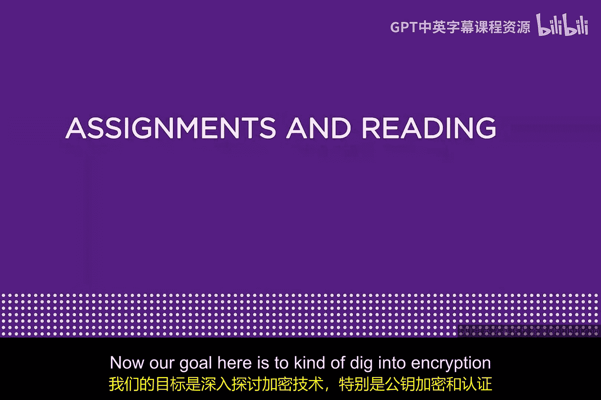
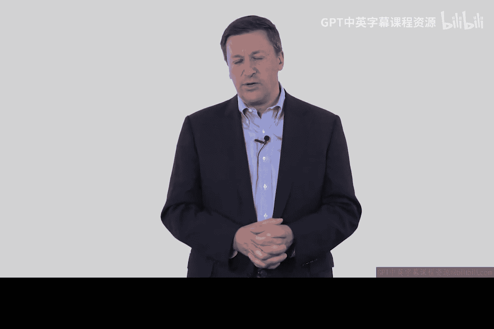
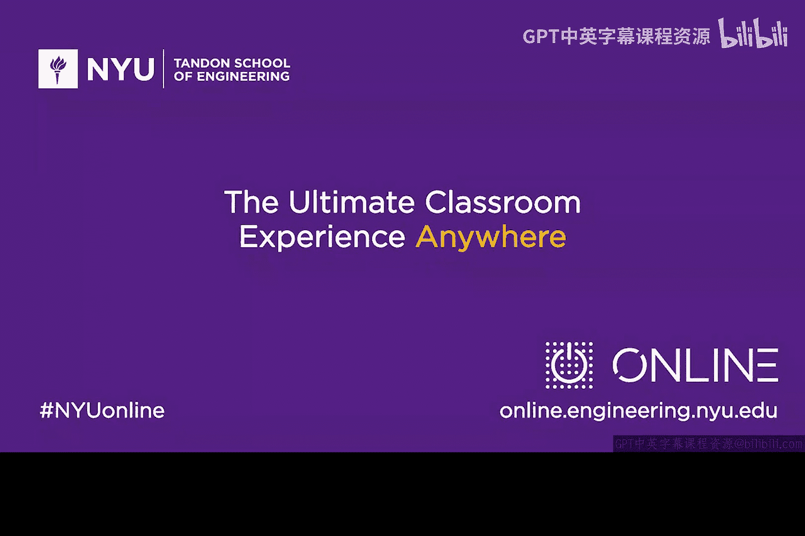

# 077：加密、公钥密码学与证书权威 🔐

在本模块中，我们将深入学习加密技术，重点探讨公钥密码学和证书权威。这些主题与电子商务及未来的物联网等领域高度相关。

上一节我们介绍了本模块的核心目标，本节中我们来看看为辅助学习而推荐的一些阅读材料和视频。以下是建议的参考资料列表：

*   **经典论文**：迪菲和赫尔曼的《密码学新方向》。这篇论文堪称网络安全领域最重要、最著名的著作之一，值得仔细研读。
*   **历史文献**：詹姆斯·埃利斯的《非秘密加密》。这篇鲜为人知的论文在历史上具有重要意义，其观点甚至可能早于迪菲和赫尔曼的开创性工作，其中的历史参考非常有趣。

以下是两本可选的参考书籍：

*   **电子书**：《从CIA到APT：网络安全导论》的第15章和第16章。这是一本由我与他人合著的入门书籍，价格不高，可作为辅助读物。
*   **TCP/IP专著**：理查德·史蒂文斯的《TCP/IP详解 卷1》第15章和第16章。拥有一本实体TCP/IP书籍是一项有价值的投资，本书是经典之作。

此外，还有一个推荐的补充视频：

*   **视频**：Akamai公司安全主管安迪·埃利斯主讲的《密码学简史》。这个视频生动有趣，能帮助你从另一个角度理解本模块的知识。

希望你能享受本模块的学习过程。

---

本节课中我们一起学习了本模块的学习目标与核心主题，并了解了推荐的扩展阅读材料和视频，为后续深入探讨加密、公钥密码学和证书权威奠定了基础。