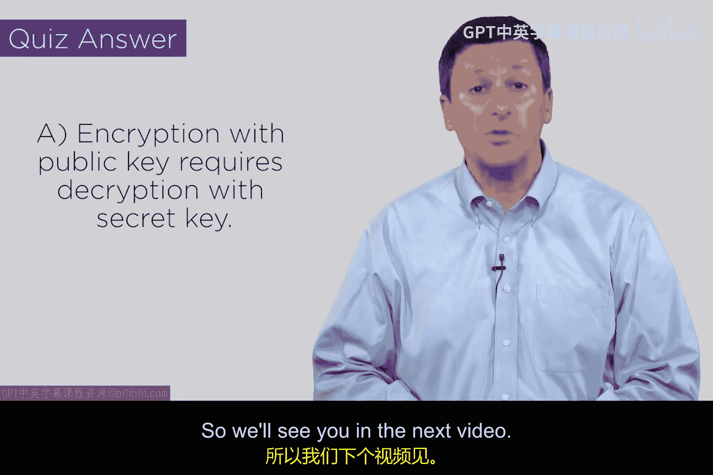
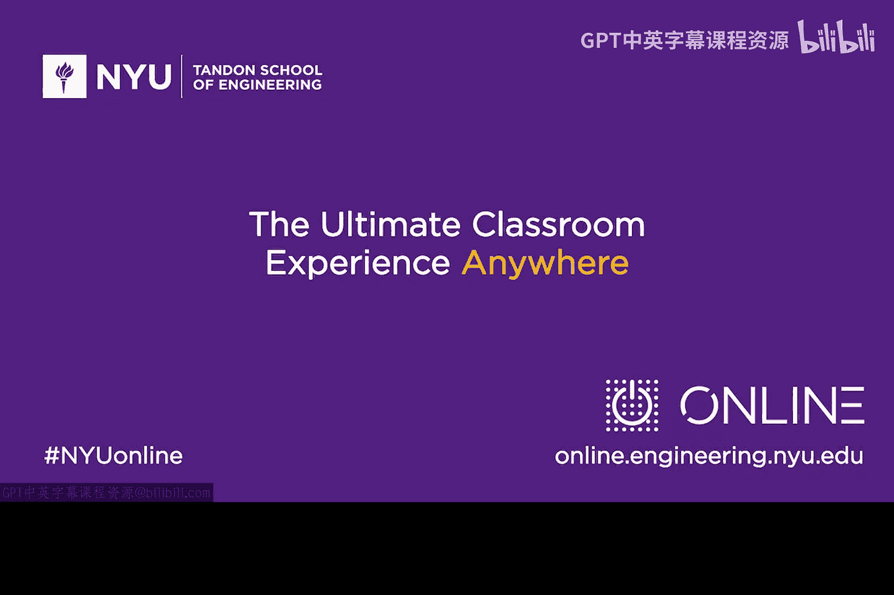

# 080：公钥密码基础 🔑

在本节课中，我们将学习现代网络安全中一个基础且至关重要的概念——公钥密码学。我们将了解它如何解决传统密码学面临的扩展性问题，并介绍其核心工作原理。

## 概述

传统密码学的主要问题在于其扩展性不足。虽然我们通过链接解决了隐蔽信道问题，并通过三重DES等技术根据应用的关键性选择合适的密钥长度，但扩展性问题仍未解决。

## 公钥密码学的诞生

上一节我们讨论了传统密码学的局限性，本节中我们来看看一个革命性的解决方案。迪菲、赫尔曼和默克尔等人在斯坦福大学的工作，为公钥密码学奠定了基础。他们的核心创意是：将单一的密钥拆分为两个部分。

他们提出，每个参与者可以本地运行一个算法来生成一对密钥，而无需向密钥分发中心申请。RSA算法后来成为实现这一理念的主要策略。

## 核心概念与密钥对

以下是公钥密码学的核心运作方式：

*   **密钥对生成**：每个用户运行算法生成一个密钥对，包含一个公钥和一个私钥（或称为秘密密钥）。
*   **公钥**：这是可以公开给所有人的部分，可以放在目录等公开可访问的地方。
*   **私钥**：这是用户必须严格保密的个人部分。

## 加密与解密机制

公钥密码学的精妙之处在于其非对称的加密解密关系。其核心规则可以用以下公式表示：

*   **公钥加密，私钥解密**：`D( S_A, E(P_A, M) ) = M`
    *   其中 `P_A` 是公钥，`S_A` 是私钥，`M` 是消息，`E` 是加密函数，`D` 是解密函数。
    *   这意味着用公钥加密的消息，只能由对应的私钥解密。
*   **私钥加密，公钥解密**：`D( P_A, E(S_A, M) ) = M`
    *   这意味着用私钥加密（即签名）的消息，可以用对应的公钥验证。

这种关系具有唯一性。如果用某个公钥加密后能用某个密钥解密出原始消息，那么这个密钥必定是该公钥对应的唯一私钥。

## RSA算法简介

虽然本节课不深入算法细节，但需要了解RSA的基本思想。它基于将两个大质数相乘。乘积可以公开，而这个乘积中却“封装”了私钥的信息。这种数学特性使得非对称加密成为可能。

## 概念小测验

为了测试你对上述符号的理解，请思考：用公钥 `P_A` 加密消息 `M` 得到密文后，要解密出 `M`，必须使用哪个密钥？
答案是 **`S_A`**，即对应的私钥。根据定义，这正是公钥加密、私钥解密的含义。

## 总结

本节课中我们一起学习了公钥密码学的基础。我们了解了它如何通过密钥对（公钥和私钥）解决传统密码学的扩展性问题，并掌握了其非对称加密的核心规则。在接下来的课程中，我们将探讨如何利用公钥密码学构建实际应用所需的各项安全属性。