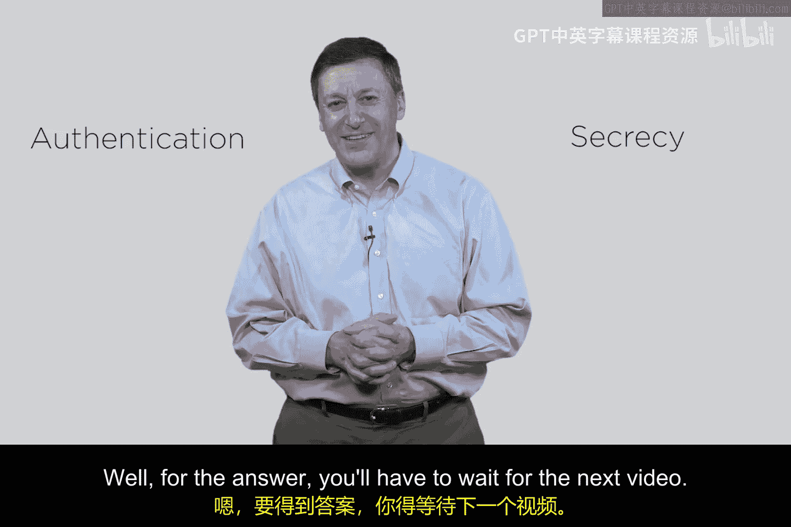

# 081：公钥保密性 🔐

在本节课中，我们将探讨如何使用公钥密码学来发送秘密信息。我们将从迪菲-赫尔曼（Diffie-Hellman）的概念入手，了解公钥加密如何确保消息的保密性，以及它在这一过程中可能存在的局限性。

上一节我们介绍了公钥密码学的基本概念，本节中我们来看看如何利用它来发送秘密消息。

## 前提条件与密钥设置

首先，我们需要明确通信双方（例如爱丽丝和鲍勃）在通信前已经具备的条件。这涉及到公钥基础设施（PKI）的建立。虽然在实际中建立PKI需要大量工作，但为了简化，我们假设以下条件已满足：

*   **爱丽丝**：她通过本地运行算法，生成了自己的**公钥-私钥对**（`PA`, `SA`）。同时，她拥有鲍勃的公钥（`PB`）。
*   **鲍勃**：同样，他本地生成了自己的**公钥-私钥对**（`PB`, `SB`）。同时，他拥有爱丽丝的公钥（`PA`）。
*   **窃听者夏娃**：夏娃也拥有自己的密钥对，并且她知道爱丽丝和鲍勃的公钥（`PA`和`PB`），但她不知道任何人的私钥。

核心概念是：**加密使用公钥，解密使用对应的私钥**。每个人都公开自己的公钥，并严格保密自己的私钥。

## 使用公钥加密实现保密性

现在，假设爱丽丝想发送一条秘密消息 `M`（例如信用卡号）给鲍勃。她可以采取以下步骤：

1.  爱丽丝使用**鲍勃的公钥**（`PB`）对消息 `M` 进行加密。
    *   加密操作：`C = Encrypt(M, PB)`
2.  加密后的密文 `C` 通过网络发送给鲍勃。
3.  鲍勃收到密文 `C` 后，使用他自己的**私钥**（`SB`）进行解密。
    *   解密操作：`M = Decrypt(C, SB)`

由于只有鲍勃拥有与公钥 `PB` 配对的私钥 `SB`，因此只有他能成功解密并读取原始消息 `M`。

以下是这个过程的关键点分析：

*   **保密性**：即使窃听者夏娃截获了密文 `C`，并且她知道这是用鲍勃的公钥 `PB` 加密的，她也无法解密，因为她没有鲍勃的私钥 `SB`。因此，消息的**保密性**得到了保证。
*   **认证性**：然而，鲍勃能确定这条消息确实来自爱丽丝吗？**不能**。因为鲍勃的公钥 `PB` 是公开的，任何人都可以用它来加密一条消息并发送给鲍勃。夏娃完全可以冒充爱丽丝，用 `PB` 加密一条假消息发给鲍勃。因此，这个方案**不提供身份认证**。

## 总结与过渡

本节课中我们一起学习了如何使用公钥加密来实现消息的保密传输。其核心流程是：**发送方使用接收方的公钥加密，接收方使用自己的私钥解密**。这种方法能有效防止窃听，确保只有预期的接收者能阅读消息。

但是，我们也发现了一个重要缺陷：**它无法验证发送者的身份**。任何知道接收者公钥的人都可以加密消息，接收者无法区分消息是来自可信的发送者还是冒充者。

在传统的对称密码学中，我们通常能同时获得保密性和认证性。而目前这个简单的公钥加密方案只实现了前者，失去了后者。这显然不是我们想要的完整安全解决方案。

那么，如何解决这个问题呢？我们能否在使用公钥密码学时，同时确保消息的保密性和发送者的认证性？答案将在下一节课中揭晓。