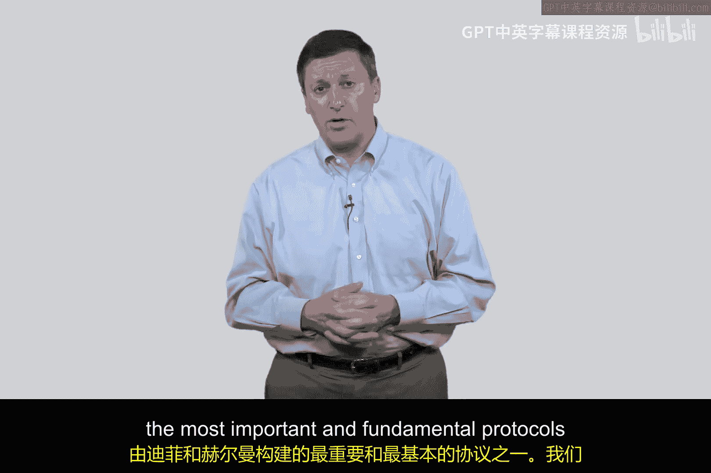

# 082：公钥数字签名

## 概述
在本节课中，我们将要学习公钥密码学中的数字签名概念。我们将回顾使用公钥加密实现保密性的方法，并探讨如何通过使用私钥加密来实现身份认证。最后，我们会发现单独使用这两种方法都存在不足，为下一讲中学习如何将它们结合起来奠定基础。

## 回顾：使用公钥加密实现保密性
上一节我们介绍了如何使用公钥密码学从爱丽丝向鲍勃发送秘密消息。其核心思想是使用接收方的公钥进行加密。

以下是该过程的简化描述：
1.  爱丽丝拥有鲍勃的公钥。
2.  爱丽丝用鲍勃的公钥加密消息 `M`。
3.  加密后的消息发送给鲍勃。
4.  只有拥有对应私钥的鲍勃才能解密并阅读该消息。

这种方法确保了**保密性**，因为即使窃听者伊芙截获了消息，由于她没有鲍勃的私钥，也无法解密内容。

然而，这种方法存在一个缺陷：鲍勃无法确认消息是否真的来自爱丽丝。伊芙可以冒充爱丽丝发送消息，因为鲍勃的公钥是公开的。因此，我们缺乏**身份认证**。

## 使用私钥加密实现认证
为了解决认证问题，本节中我们来看看另一种方法：使用发送方自己的私钥进行加密。在网络安全中，使用自己的私钥处理数据的行为，我们称之为**数字签名**。

其过程如下：
1.  爱丽丝拥有自己的私钥。
2.  爱丽丝用自己的私钥加密消息 `M`。
3.  加密后的消息（即数字签名）发送给鲍勃。
4.  鲍勃使用爱丽丝的公钥解密该消息。

由于只有爱丽丝拥有她的私钥，所以能用爱丽丝公钥成功解密的消息，必然是由爱丽丝的私钥加密的。这证明了消息确实来自爱丽丝，从而实现了**身份认证**。

但是，这里出现了一个新问题：伊芙也拥有爱丽丝的公钥。因此，当爱丽丝发送用自己私钥签名的消息时，伊芙同样可以用爱丽丝的公钥解密并阅读消息内容。这意味着我们失去了**保密性**。

## 对比与核心问题
至此，我们分析了两种基本方案：
*   **方案A（用接收方公钥加密）**：提供保密性，但缺乏认证。
*   **方案B（用发送方私钥签名）**：提供认证，但缺乏保密性。

这两种情况都缺失了网络安全中至关重要的属性。我们如何才能同时获得保密性和认证呢？

在揭示答案之前，让我们思考一个补充情况：使用自己的公钥加密。理论上，这样做只有你自己能解密，可用于在不可信的存储（如云端）上加密保存自己的敏感数据。然而，在公钥密码学的典型通信场景中，两个最重要的基础操作仍然是：
1.  使用**接收方的公钥**加密，以实现指向特定接收者的保密通信。
2.  使用**自己的私钥**签名，以便让接收者能确认发送者的身份。

## 总结
本节课中我们一起学习了公钥数字签名的基本原理。我们回顾了使用接收方公钥加密来实现消息保密，并探讨了使用发送方私钥签名来实现身份认证。我们发现，这两种独立的协议各自只能满足一个安全需求。在下一讲中，我们将看到如何将这两个重要的基础模块组合起来，构建一个能同时提供保密性和认证性的完整协议。