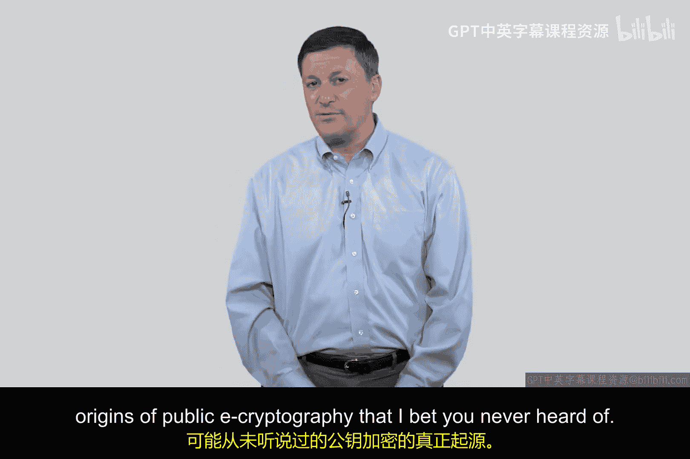
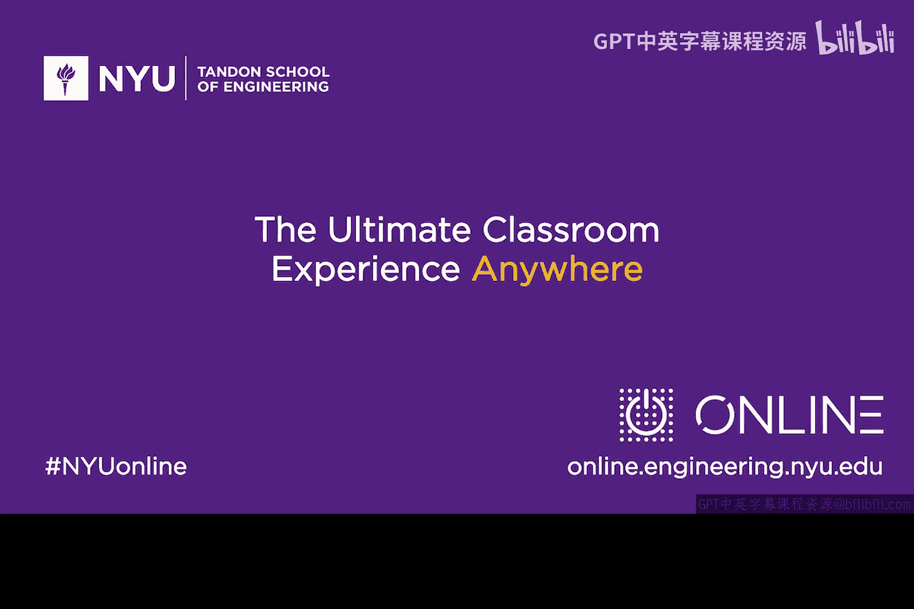

网络安全入门：P86：安全套接层 (SSL) 与证书颁发机构 (CA)

在本节课中，我们将学习安全套接层 (SSL) 如何解决从证书颁发机构 (CA) 获取公钥以验证网站证书的核心问题。我们将了解这一机制如何成为现代安全电子商务的基石。

---

你刚刚从“我们在网上卖超酷运动鞋公司”收到了一个证书。该证书包含了该网站的公钥，你可以使用这个公钥来安全地发送信用卡信息。但是，为了获取这个公钥，你需要用签署该证书的 CA 的公钥来解密证书。

这个问题的解决方案非常巧妙，它由 90 年代一家名为网景 (Netscape) 的初创公司发明。网景团队的想法对电子商务做出了巨大贡献。事实上，没有这个想法，就不会有亚马逊等在线销售平台。

以下是马克·安德森团队提出的方案。他们说，你的浏览器需要拥有那个 CA 的公钥。因为如果浏览器有了 CA 的公钥，就可以解密证书。但他们不希望用户自己去获取公钥。

他们的解决方案既简单又优雅。既然每个人都必须下载浏览器，那么就将 CA 的公钥直接“烧录”到浏览器中。你下载浏览器时，浏览器就已经内置了所有 CA 的公钥。这是通过浏览器公司与 CA 之间预先安排好的协议实现的。

因此，只要你信任从网景、微软或谷歌等公司下载的浏览器，你就信任了其中内置的、经过验证的 CA 公钥列表。这是一个闭环系统。

你的妈妈、朋友或任何想在网上购物的人，只需下载一个浏览器并使用它。浏览器里已经有了 CA 的公钥。当你访问“我们在网上卖超酷运动鞋.com”并想购买商品时，网站会发送给你一个证书。该证书包含网站的公钥，并由某个 CA 签名。

你的浏览器会进行查找，确认这是一个有效的 CA，并使用内置的该 CA 的公钥解密证书，从而获得网站的公钥。然后，你就可以安全地发送信用卡信息了。这就是我们今天所生活的世界得以实现的方式。

这就是为什么你无需做任何额外操作，就能在互联网上安全购物的原因。它就像魔法一样。

现在，对于一些有更多经验并正在思考这个过程的你，可能会产生疑问：如何知道 CA 是有效的？如何知道他们与浏览器公司的合作是可靠的？你的疑问是正确的，这个机制确实存在一些细微的漏洞。

但总体而言，这个系统从毫无保障的状态，发展到了提供相当可靠的保障。你必须承认，这是一个闭环系统，它为我提供了一种无需四处寻找密钥、搜索目录或向他人索要公钥，就能将信用卡信息安全发送给你的方法。

只要我下载了浏览器，我就拥有了所需的一切。我不需要成为技术人员，不需要参加密钥交换聚会，也不需要成为极客就能完成在互联网上看到的各种操作。

对比一下电子邮件安全。我敢打赌，正在观看视频的你我，如果不做大量工作，是无法互相发送安全邮件的，因为相应的基础设施并不存在。

但是，如果你建立了一个网站并获得了证书，那么我就可以从你那里购买东西，而我们无需见面，我也不需要知道你是谁。我们可以使用标准协议来完成交易。

为什么安全商务已经运作成熟，而电子邮件安全却没有？我认为这只是因为安全商务的商业模式更好。这就是原因。作为一个技术专家，你需要理解这一点。拥有伟大的技术固然重要，但运气、商业模式、在正确的时间做正确的事以及从商业角度理解你所做的事情，可能同样重要。

我们应该给予马克·安德森和他的团队很多赞誉。他们在网景公司围绕安全套接层所做的贡献，是网络安全领域的伟大贡献之一。

---

本节课我们一起学习了 SSL 如何通过将 CA 公钥内置到浏览器中的巧妙设计，解决了网站证书验证和公钥获取的难题，从而奠定了现代安全电子商务的基础。这个闭环系统使得普通用户无需任何技术背景就能安全地进行在线交易。