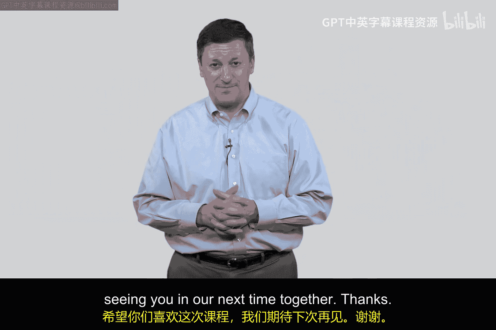
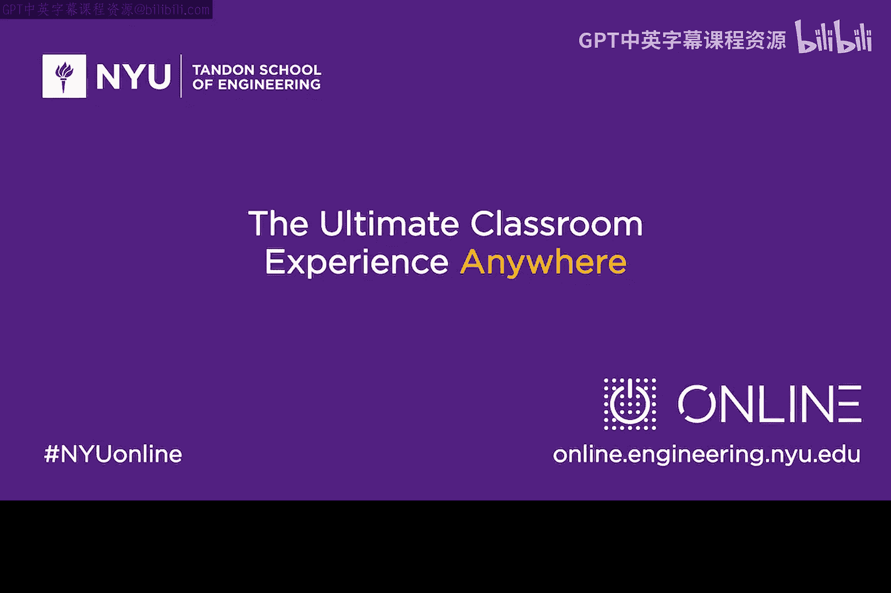

# 087：James Ellis与Clifford Cox的故事 🔐

在本节课中，我们将了解一段关于公钥密码学起源的重要历史。这段故事的主角并非广为人知的Diffie和Hellman，而是两位英国工程师——James Ellis和Clifford Cocks。他们的工作因保密而长期不为人知，但他们对现代密码学的贡献同样至关重要。

## 背景：1960年代的密码学挑战

上一节我们介绍了公钥密码学的基本概念。本节中，我们来看看这个想法最初是如何诞生的。

故事始于1960年代的英国。当时，一位名叫James Ellis的工程师在英国政府通信总部（GCHQ）工作。GCHQ是类似于美国国家安全局（NSA）的密码学机构。James Ellis被分配了一个问题：如何解决传统密码学中密钥分发难以扩展的难题。

## James Ellis的突破：非秘密加密

James Ellis在很短的时间内就提出了一个解决方案。他撰写了一篇名为《非秘密加密》的简短论文。以下是其核心思想：

*   **核心概念**：他提出使用两个密钥，而非一个。一个**公钥**可以公开给所有人，另一个**私钥**则由个人秘密保管。
*   **加密与解密关系**：用公钥加密的信息，只能用对应的私钥解密。这实质上勾勒出了后来Diffie-Hellman密钥交换方案的雏形。

他的同事们，包括Fred Williamson等人，审阅了这篇论文并确认其理论上的可行性。然而，这个想法在当时面临两个主要障碍：第一，这项研究被列为**机密**，无法对外公开；第二，1960年代末的计算机速度太慢，缺乏一个能实现该想法的具体**算法**。

## Clifford Cocks的贡献：RSA算法的雏形

几年后，一位名叫Clifford Cocks的数学家加入了GCHQ。他遇到了James Ellis，并听说了这个“非秘密加密”的想法。

Clifford Cocks刚刚完成数论领域的研究生学业。他立刻意识到，可以利用**素数理论**来实现这个构想。以下是他的核心思路：

*   **核心概念**：将两个大素数相乘得到一个合数。这个合数可以作为公钥的一部分，而那两个原始的素数则作为私钥。
*   **公式描述**：`公钥 N = p * q`，其中 `p` 和 `q` 是两个大素数。私钥就是 `p` 和 `q` 本身。

这几乎就是后来RSA算法的核心原理。然而，由于他们的工作性质，这项突破性的发现依然被**严格保密**，外界无人知晓。

## 历史的巧合与迟来的认可

时间来到1979年，此时Diffie和Hellman已经公开发表了他们的论文并声名鹊起。在一次会议上，NSA局长Bobby Inman被问及Diffie-Hellman的工作是否会阻碍NSA的任务时，他笑着透露：“我们十年前就知道这个了。”

这句话引起了Diffie等人的注意。经过调查，他们发现了James Ellis和Clifford Cocks更早的工作。Diffie甚至专程飞往英国会见James Ellis。据报道，Ellis只是谦逊地说：“你们（对这项技术）的推动比我们可能做的要多。”

直到1990年代中期，GCHQ才正式解密了相关文件。遗憾的是，James Ellis在此之前已经去世，未能亲眼看到自己获得应有的荣誉。

## 总结与启示

本节课中，我们一起学习了James Ellis和Clifford Cocks在公钥密码学发展史上的关键角色。他们的故事告诉我们：

1.  **重要的创新可能诞生于任何地方**，甚至早于其广为人知的时间。
2.  **理论与算法相辅相成**：Ellis提出了革命性的**概念模型**，而Cocks则提供了基于数论的关键**算法实现**思路。
3.  **恪守职责与谦逊品格**：尽管他们的工作被保密且未获得即时名誉，但他们展现了高度的职业操守。

尽管Diffie、Hellman、Rivest、Shamir和Adleman因其公开的工作而获得图灵奖和广泛赞誉，但我们同样应当铭记James Ellis、Clifford Cocks以及GCHQ团队在密码学历史上的 foundational（基础性）贡献。他们的工作为当今互联网的安全通信奠定了最早的理论基石。