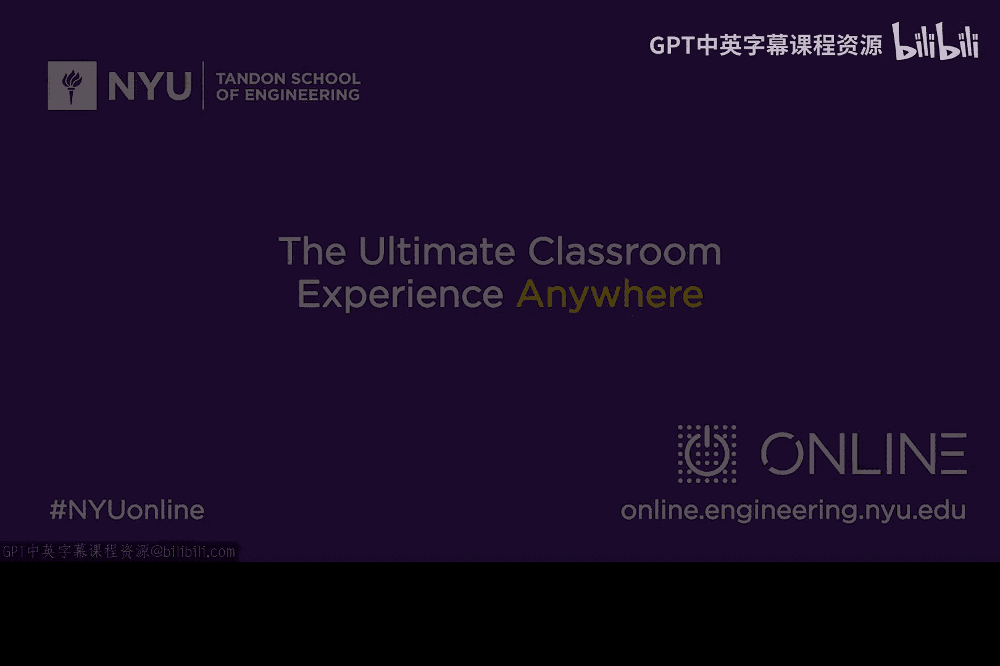

# 090：实时网络安全与TCP/IP基础

在本模块中，我们将深入探讨实时网络安全。要理解这个领域，必须对TCP/IP协议及其相关的安全问题有所了解。这与许多同学可能熟悉的密码学内容有所不同，但同样充满趣味。

为了辅助你的学习，本模块推荐了一些阅读材料和视频资源。

以下是推荐的论文与书籍：

*   **论文一：《网络防火墙》**。作者是Steve Bellovin和Bill Cheswick。这篇论文前瞻性地探讨了许多如今在云操作系统中常见的虚拟安全和防火墙设备概念，对于理解分布式安全很有帮助。
*   **论文二：《TCP/IP网络攻击导论》**。作者是爱荷华州立大学的Guang。这是一份关于TCP/IP网络攻击的优质综述，内容扎实全面。

以下是推荐的扩展阅读书籍：

*   **电子书：《从CIA到APT：网络安全导论》**。作者是我本人和我的儿子Matt。你可以在亚马逊下载。学习本模块时，参考第17章和第18章会很有益处。
*   **参考书：一本扎实的TCP/IP书籍**。我推荐Richard Stevens的《TCP/IP详解 卷1》。如果你选择这本书，可以重点阅读第17章和第18章。这类书籍应该作为你的常备参考资料。

在视频资源方面，推荐观看YouTube上“Eli the Computer Guy”制作的关于“黑客DNS”的视频。他的内容更偏重实践，风格诙谐，与本模块的一些深度学术内容形成互补，相信能增强你的学习效果。

---

本节课中，我们一起学习了本模块的学习目标——实时网络安全，并了解了与之相关的TCP/IP背景知识。同时，我们也介绍了一系列辅助学习的论文、书籍和视频资源，为后续的深入探讨做好准备。