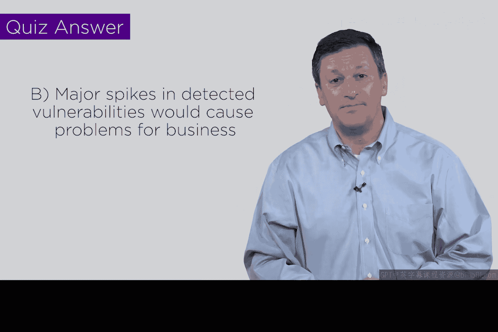

# 091：通过隐匿实现安全 🔒

在本节课中，我们将探讨网络安全领域一个广为人知但常被误解的概念——“通过隐匿实现安全”。我们将分析其含义，并对比开源软件与专有软件在安全层面的不同表现。

---

上一节我们介绍了网络安全中的一些普遍观念，本节中我们来看看“通过隐匿实现安全”这一具体概念。在密码学社区，**通过隐匿实现安全**意味着试图通过隐藏加密算法本身来增强安全性，寄希望于攻击者无法发现它。然而，在当今世界，保密几乎是不可能的。因此，理想的安全方案应建立在即使对手完全知晓你的方法，系统依然安全的基础上，这与“通过隐匿实现安全”的理念相反。

然而，当我们将这一概念应用于软件时，情况会变得更加微妙。软件主要分为两种类型。

以下是两种主要软件类型的介绍：

*   **开源软件**：代码公开，社区共同审查代码。通常有相应的规则，例如修改后需要分享。其核心在于代码可见、可知。
*   **专有软件**：软件供应商出于商业决策，将源代码保密。

那么，这在“通过隐匿实现安全”的语境下意味着什么呢？让我们通过一个图表来分析。

图表显示，对于**开源代码**，发布后会受到广泛审查。已知漏洞的强度会随着审查增加而上升，达到一个峰值。但随后，修复漏洞的速度会超过发现新漏洞的速度。经过长期、彻底的社区审查（例如经历了数十年的Unix系统），代码会变得非常健壮和安全。

相比之下，**专有代码**在发布时是保密的，其内核和源代码不可见。因此，其已知漏洞强度曲线通常较为平坦。只要代码保持隐匿，就不会经历密集的审查期，这意味着大量潜在问题可能未被发现。

这说明了什么？如果同一段代码分别以开源和专有形式起步，它们将走上不同的道路。专有代码中可能嵌藏着一系列尚未被察觉的潜在问题，因为根本没人仔细检查过它。

因此，开源的优势在于最终能达到一个相当安全的状态，劣势是过程可能颠簸。专有软件的优势则是在整个生命周期内，有较大可能将风险维持在某个可接受的阈值之下。

为了检验理解，这里有一个小测验：如果微软某天突然决定将Windows操作系统开源，短期内最可能发生什么？

以下是选项：

*   A. 安全性立即显著提升。
*   B. 短期内会发现大量漏洞，导致问题激增。
*   C. 安全状况基本保持不变。

答案显然是**B**。我们将看到开源化带来的典型峰值，这可能会给业务带来很多问题。虽然长期来看情况可能会好转，但过程会相当坎坷。所以，希望微软永远不会某天醒来就决定开源Windows，否则我们都会看到不少问题。

---

本节课中我们一起学习了“通过隐匿实现安全”的概念，并对比了开源与专有软件在安全演进路径上的根本差异。关键点在于：真正的安全应不依赖于保密，而开源通过透明和集体审查，虽过程曲折，但能导向更坚实的长远安全基础。

