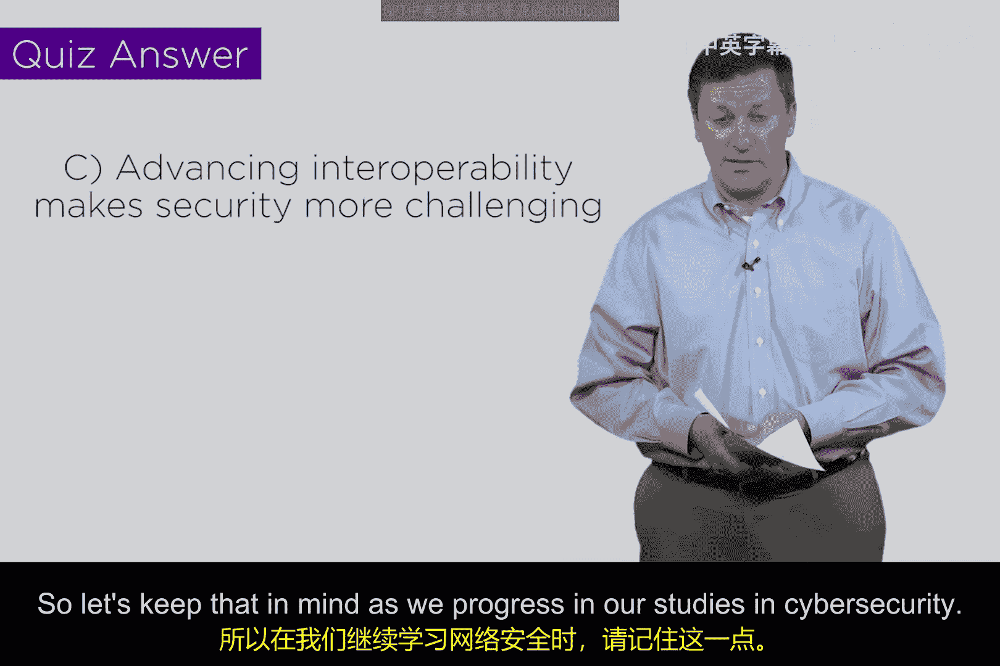

# 092：TCP/IP演变与安全 🔐

在本节课中，我们将要学习TCP/IP协议套件的历史演变，并探讨其广泛采用对网络安全带来的深远影响。我们将看到，技术的统一与标准化在推动互联互通的同时，也带来了新的安全挑战。

## 课程概述

TCP/IP是计算领域的通用语言，是整个互联网基础设施的驱动核心。理解TCP/IP对于学习网络安全至关重要。本节将从历史视角出发，分析从多种网络协议并存到TCP/IP一统天下的演变过程，并揭示这一变化如何从根本上改变了网络攻击与防御的格局。

## TCP/IP：计算世界的通用语言 🌐

TCP/IP协议套件，我们常简称为IP或互联网协议，是计算领域真正的通用语言。我们的整个基础设施都运行在TCP/IP之上。如果你不理解TCP/IP，就需要深入学习和研究它。我们有一些推荐的阅读材料，你需要确保自己对TCP/IP非常熟悉。

## 历史的回顾：协议割裂的时代

上一节我们强调了TCP/IP的重要性，本节中我们来看看它的历史背景。将时钟拨回到20世纪90年代，那时的情况与今天截然不同。

当时，大多数企业、政府机构和其他运行网络的组织，使用的协议并非TCP/IP。事实上，一家名为Novell的公司有一款极其流行的产品叫NetWare，它使用一种名为IPX的协议。这个名字与IP非常相似，容易造成混淆，但它是完全不同的协议。

这意味着，在90年代，如果一家小公司运行着NetWare，它使用的就是与IP不同的协议。如果这家公司想要连接到互联网，就必须进行协议转换。因此，当时的网络架构通常是：一个局域网，连接着一个协议转换盒，然后再连接到另一个可能运行IP的局域网或互联网上。

这就像你开着一辆卡车，突然遇到一个障碍，前面变成了水域。如果你想继续前进，就必须从卡车换到船上。你可以想象，这个过程会很慢。当时缺乏良好的转换标准，而且显然无法实现互操作。

## 统一的代价：安全格局的剧变

从黑客攻击的角度来看，在那个协议割裂的时代，攻击者想要从一个局域网攻击互联网上的目标，并非简单地运行扫描、发现目标那么简单。各种协议不互操作的问题，在某种程度上会减缓黑客攻击的速度，当然也会减缓计算速度。

然而，自那以后，世界做出了一个决定：为什么我们要运行这些不互操作的东西？为什么不让我们的网络——无论是园区网、企业网、政府网络还是大型公共网络——都运行与公共基础设施相同的协议呢？

于是，TCP/IP成为了全球统一的标准。这一变化彻底消除了“卡车换船”的障碍，一切都变成了开放的高速公路。现在，一个典型的运行TCP/IP的局域网，连接的是一个路由器（而不再是意义不大的协议转换盒）。这个路由器很乐意根据你提供的信息，或者它被设定的规则，将数据包推送到任何指定的地方。

从黑客攻击的角度思考这意味着什么：突然间，一切都在攻击范围之内了。从你的有利位置，你可以看到互联网上的一切、商业网络中的一切等等。随着我们在本课程中的深入讨论，你会发现这催生了一种被称为“防火墙”的保护机制。防火墙有各种不同的形式和细微差别，但大体上，你可以将其视为放置在原来协议转换盒位置的一种安全设备。现在，我们只有路由器，因此我们必须学会在那里采取一些安全措施。

## 安全启示：多样性与统一性的权衡

这里有一个重要的启示：**多样性实际上可能对安全有益**。

然而，如果你是一家公司的首席信息官（CIO），你希望降低成本，希望所有人都使用相同的工具，希望实现互操作，不希望有差异。你希望用同一套东西培训所有人。有些公司就是这样做的。例如在美国，有一家名为西南航空的公司，我相当确定他们只运行一种机型——波音737喷气式飞机。我常常思考，如果这种飞机被停飞会怎样？那将导致整个公司停飞。这是一个追求“非多样性”的商业决策，它降低了培训成本，一切都标准化。这可以理解。

但从安全工程师的角度，在进行设计时，你必须思考：是让一切都相同更好，还是让一些东西有所不同更好？这将是你作为工程师需要做出的决策。

## 知识测验

为了检验你的理解，这里有一个小测验：

**问题：** 提高互操作性对安全的主要影响是什么？

以下是可能的选项：

A. 它使安全变得无关紧要。
B. 它自动增强了安全性。
C. 它使安全更具挑战性。
D. 它对安全没有影响。

**答案：** C显然是正确答案。提高互操作性确实使安全更具挑战性。这是一个事实。这是基础设施决策与安全决策存在冲突的案例之一。

在你继续学习计算机安全的过程中，你会发现情况并非总是如此。例如，随着我们推进虚拟化和云计算（大多数首席信息安全官和首席信息官都喜欢这些技术），那些旨在提供更好计算体验的提议，往往也对安全更有利。因此，并非所有技术进步都与安全目标相悖。

但在互操作性与安全的关系上，我们必须承认：**当我们让计算变得更容易时，我们也让攻击变得更容易了**。让我们在网络安全的学习进程中牢记这一点。

## 课程总结

本节课中我们一起学习了TCP/IP协议套件从历史割裂到全球统一的发展历程。我们认识到，协议的标准化极大地促进了互联互通和计算效率，但同时也消除了攻击的地理和协议障碍，扩大了攻击面，使网络安全防御面临更大挑战。我们探讨了在技术设计中，统一性（利于互操作和成本）与多样性（可能利于安全）之间的永恒权衡。理解这一历史背景和根本矛盾，是构建有效网络安全策略的重要基础。

我们将在下一个视频中再见。