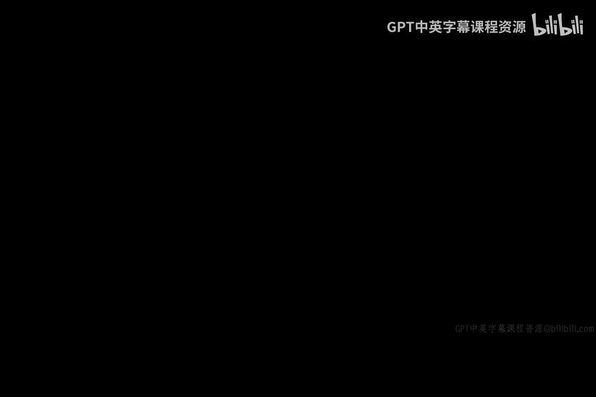
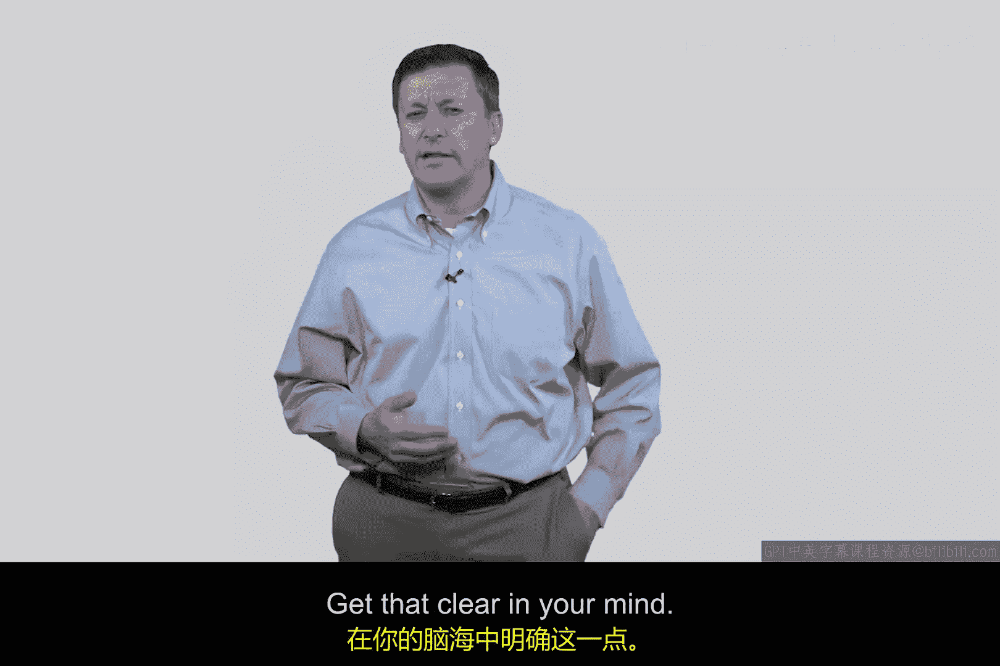

# 093：TCP/IP概述 🧠

在本节课中，我们将要学习TCP/IP协议的基础知识。TCP/IP是互联网通信的基石，理解其工作原理对于任何计算机科学、软件开发或网络安全领域的学习者都至关重要。本节将概述TCP/IP的核心概念，包括五元组和TCP三次握手过程。

## 五元组：定义网络流

上一节我们介绍了网络通信的基本概念，本节中我们来看看如何具体定义一个网络数据流。在TCP/IP协议中，一个数据流或会话可以通过一个称为“五元组”的概念来精确定义。五元组包含五个关键信息，它们共同标识了一个唯一的网络连接。

以下是构成五元组的五个要素：

1.  **源IP地址**：发送数据包的设备的IP地址。这通常由互联网服务提供商（ISP）或网络管理员分配。
2.  **目的IP地址**：接收数据包的设备的IP地址。同样由ISP或网络管理员分配。
3.  **源端口号**：发送设备上发起通信的应用程序所使用的端口号。客户端程序（如网页浏览器）通常使用大于1023的临时端口，也称为“临时端口”。
4.  **目的端口号**：接收设备上目标服务所使用的端口号。这些是“知名端口”，例如HTTP服务使用端口`80`。
5.  **协议**：所使用的传输层协议，通常是**TCP**（传输控制协议）或**UDP**（用户数据报协议）。

## TCP三次握手：建立可靠连接

理解了如何标识一个连接后，我们来看看连接是如何建立的。TCP协议通过一个称为“三次握手”的过程来建立可靠的连接。这个过程确保了通信双方都准备好进行数据传输。

以下是TCP三次握手的三个步骤：

1.  **SYN**：客户端（Alice）向服务器（Bob）发送一个数据包，其中TCP头部的**SYN**（同步）标志位设置为`1`。这个包还包含一个客户端随机生成的初始序列号。
2.  **SYN-ACK**：服务器（Bob）收到SYN包后，回复一个数据包。这个包的**SYN**和**ACK**（确认）标志位均设置为`1`。它既确认了客户端的序列号，也包含了服务器自己随机生成的序列号。
3.  **ACK**：客户端（Alice）收到SYN-ACK包后，再向服务器发送一个**ACK**包，确认服务器的序列号。

完成这三次握手后，双方就成功建立了一个TCP连接，可以开始交换数据。理解这个握手过程对于网络安全工程师至关重要，因为许多网络攻击（如SYN洪水攻击）正是针对这一机制的弱点。

## 总结

本节课中我们一起学习了TCP/IP协议的两个核心基础。首先，我们了解了**五元组**，它通过源/目的IP地址、源/目的端口号和协议这五个元素唯一地定义了一个网络数据流。其次，我们探讨了**TCP三次握手**的过程，这是建立可靠网络连接的标准化方法。掌握这些概念是理解更复杂的网络通信和网络安全原理的必经之路。