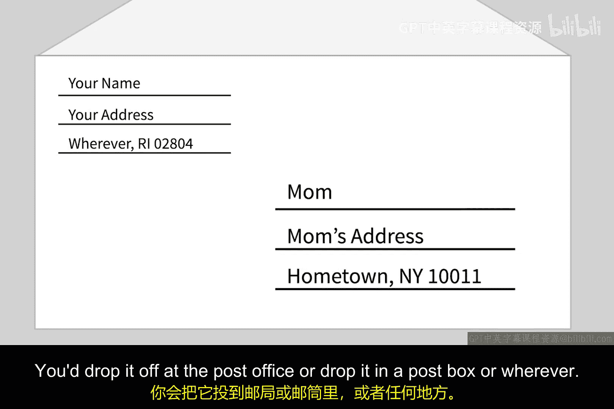
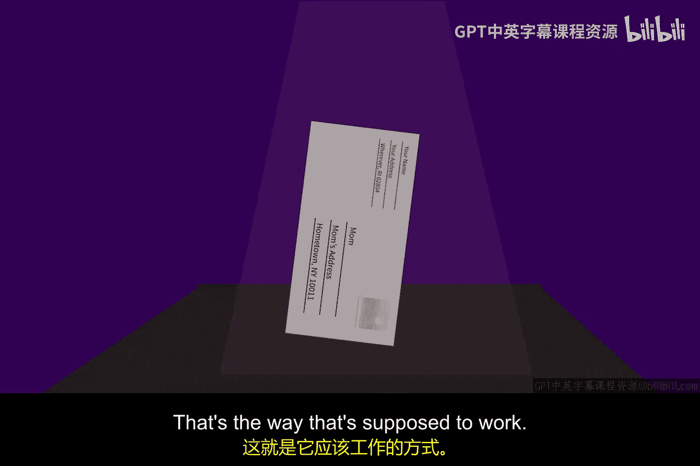
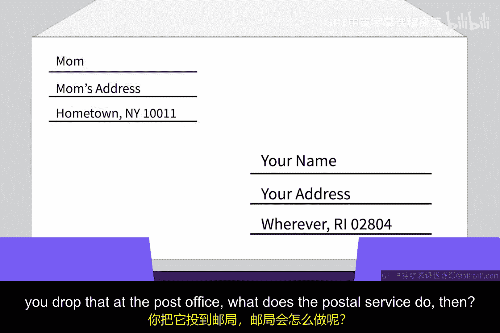
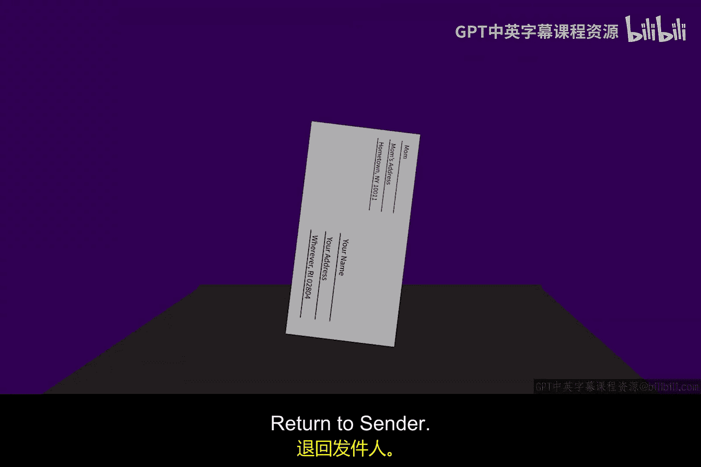
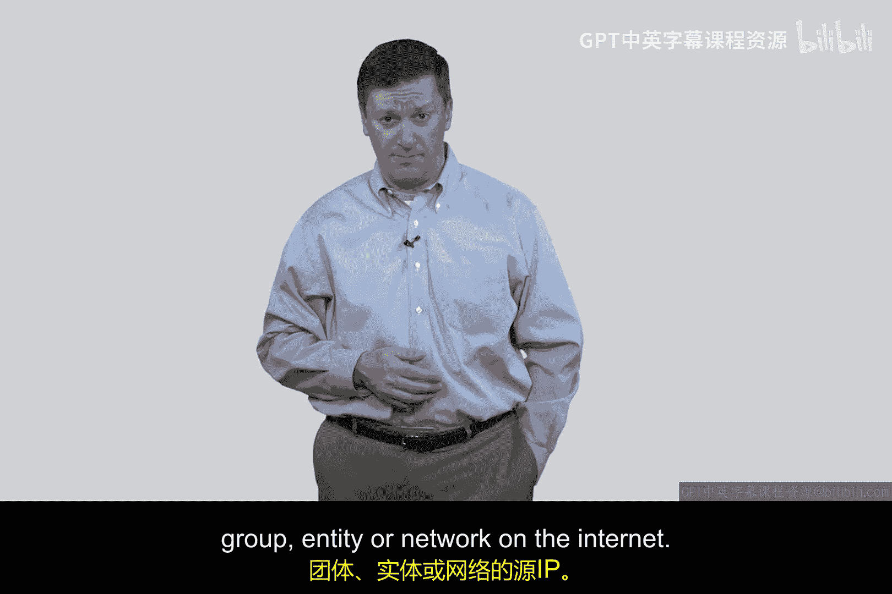

# 094：IP欺骗


在本节课中，我们将要学习一个网络安全中的基础概念：IP欺骗。我们将通过一个生动的类比来理解其原理，并探讨它在互联网协议（IP）中的实现方式及其对网络安全产生的深远影响。

## 📮 一个关于信封的类比

为了帮助理解IP欺骗，我们先来看一个现实生活中的类比。

在20世纪70年代，美国有一本名为《偷这本书》的流行书籍。作者艾比·霍夫曼在书中描述了一个有趣的邮寄技巧。通常，寄信时你会在信封的右下角写上收件人地址（你母亲的地址），在左上角写上你自己的回邮地址，并贴上邮票。

然而，霍夫曼建议你可以这样做：在信封的“发件人”位置写上你母亲的地址，在“收件人”位置写上你自己的地址，并且不贴任何邮票。当你把这封信投递出去后，邮政系统会发现信件没有贴邮票。按照当时的规则，邮局会执行“退回寄件人”的操作。由于“寄件人”地址是你母亲的，这封信就会被免费送到你母亲手中，而不会退回到真实的你这里。





这个技巧的核心在于**对信息来源（发件人地址）进行了欺骗**。虽然现代邮政系统可能已经采取了措施来防止此类行为，但这个类比完美地解释了互联网上IP欺骗的基本思想。

## 🌐 IP欺骗的原理

上一节我们通过信封的类比理解了欺骗来源地址的概念。本节中我们来看看这在互联网协议（IP）中是如何实现的。

互联网的创始人之一鲍勃·卡恩等人在设计TCP/IP协议时做了一个关键决定：**允许数据包的源IP地址被伪造**。这与传统的电路交换电信网络不同，在那些网络中，端点的身份是明确且有意义的。





在IP网络中，每个数据包都包含一个头部，其中指明了源IP地址和目的IP地址。IP欺骗就是指发送方**故意将数据包头部中的源IP地址字段设置为一个不属于自己的、虚假的IP地址**。

例如，你的真实IP地址是 `10.10.11.12`，但你可以在发送的数据包中，将源IP地址伪造成 `192.1.2.3`。当这个数据包到达目的地（比如一台服务器）时，服务器会认为这个数据包来自 `192.1.2.3`。

以下是这个过程的一个简化表示：
```python
# 真实发送方IP
real_source_ip = “10.10.11.12”
# 在数据包头部中伪造的源IP
spoofed_source_ip = “192.1.2.3”
# 发送的数据包
packet = create_packet(source=spoofed_source_ip, destination=server_ip)
send(packet)
```

## ⚠️ IP欺骗的影响与安全启示

理解了IP欺骗的原理后，我们来看看它为何对网络安全如此重要，并澄清一些常见的误解。

当服务器收到一个源IP被伪造的数据包（例如一个TCP连接请求的SYN包）并需要回复时（例如发送SYN-ACK包），它的回复会发送到那个伪造的地址（`192.1.2.3`），而不是真实的发送者（`10.10.11.12`）。这构成了许多网络攻击的基础。

这一点是互联网安全许多核心问题的基石，但围绕它也存在大量误解。例如，当发生一次分布式拒绝服务攻击时，监测数据可能显示海量的数据包似乎来自某个特定国家（比如漫画《呆伯特》作者虚构的“阿尔博尼亚”）。

一个合格的安全工程师必须明白：**这很可能不是真实的攻击来源**。攻击者通常不会傻到用自己的真实IP地址发动攻击。他们更可能入侵他人的计算机作为“肉鸡”，或者直接进行IP欺骗，将攻击流量伪装成来自其他网络或实体。

因此，我们必须时刻牢记：在互联网上，我们可以被欺骗，对方可以撒谎，可以伪造源IP地址。这种能力使得追踪攻击源头、划分责任和实施防御变得异常复杂。

## 📝 课程总结




本节课中我们一起学习了IP欺骗。我们从邮寄信封的类比入手，理解了欺骗信息来源的基本概念。随后，我们探讨了IP协议本身允许源地址被伪造这一设计决策，并通过简单的代码说明了其实现方式。最后，我们分析了IP欺骗对网络安全的深远影响，特别是它在混淆攻击来源、助长拒绝服务攻击等方面所起的作用，并纠正了关于攻击溯源的一个常见误解。理解IP欺骗是理解许多现代网络威胁的第一步。