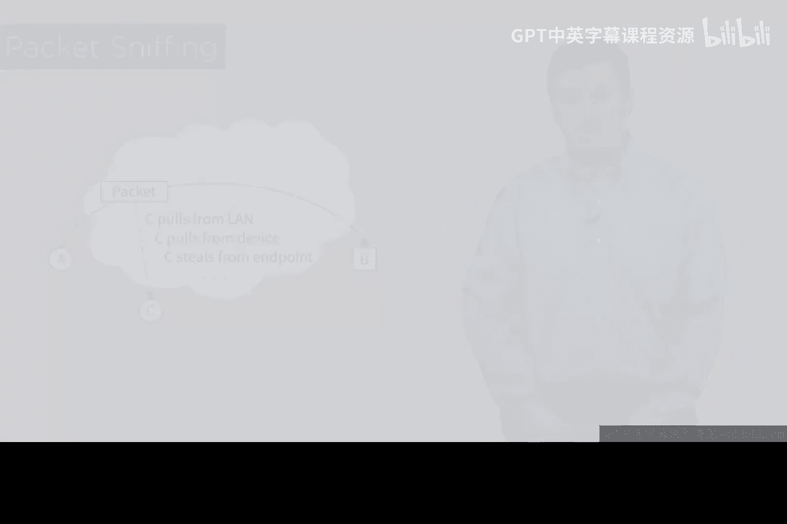

# 097：数据包嗅探

在本节课中，我们将要学习一种基础的网络攻击方式——数据包嗅探。我们将了解其工作原理、它为何能成功，以及为什么现代网络通信的“原生”状态往往是脆弱的。

## 从“共享电话线”说起

上一节我们介绍了网络通信的基本概念，本节中我们来看看数据在局域网中是如何传播的。这让我想起多年前电话系统中的“共享电话线”。

共享电话线并非指举办派对的线路，而是一种社区共用电话的方式。当你拿起听筒时，可能会听到其他人的通话。所有人都可能属于一个大组，大家依靠礼貌和自觉来维持秩序：如果邻居正在通话，你就不会使用电话。这听起来可能有些不可思议，但它确实存在过。

## 以太网的工作原理

许多第二层或局域网协议的工作方式，都让我联想到共享电话线。第二层指的是传统OSI七层模型中的数据链路层。如果你还不了解OSI分层协议栈（从第1层到第7层），建议你花些时间研究一下，这对理解后续内容很有帮助。

无论如何，在第二层，有诸如以太网这样的协议。它们的设计方式总让我想起共享电话线。虽然更现代的版本对此有所改进，但以太网最初的设计大致如下：

想象我面前有一根很长的线缆，上面有许多连接点，分别连接到不同的计算机。假设我是一台计算机，我们都连接在这个以太网局域网上。

以下是以太网协议最初的设计工作方式：
1.  一个被称为“帧”的实体被创建（这与第三层的“数据包”略有不同）。
2.  这个帧被发送到线缆上。
3.  它会到达第一个网络接口并询问：“你好，我是发给你的吗？”
4.  接口另一端的计算机会回答：“不，不是给我的。”帧中有一个地址，我们称之为MAC地址。
5.  帧会继续问下一个接口：“我是发给你的吗？”得到的回答是：“不，不是给我的。”
6.  假设帧传到了我这里，而我是一个喜欢窥探一切的安全黑客。即使这个帧的地址不是我的，我也会说：“是的，你是发给我的。”我对所有帧都说“是”，这种行为就叫做**嗅探**。

## 无线网络与安全风险

这种情况显然不理想。我相信你们很多人都有过这样的经历：在火车上或城镇的咖啡馆里，连接上Wi-Fi局域网。可能有人告诉过你：“这样做要小心一点。”原因就在于，在很大程度上，别人确实可以做到我刚才描述的事情，除非网络叠加了安全措施（我们将在课程中详细讨论）。

我只是想向你展示基础技术，以及在添加安全层之前的原始状况。很多时候人们会说：“你现在不能那样做了。”你问为什么，他们会回答：“因为我设置了安全措施。”问题的关键就在于此：如果你没有设置，情况就会截然不同。

因此，大多数第二层协议本身并没有内置你想要的、能保护你在火车上等场合通话隐私的那种防护机制。使用Wi-Fi是另一个问题，我们几乎在每一层使用的原生协议都是**不加密**的。

当然，你可以对它们进行加密，但它们本身并非加密设计。这就好比你要建一座房子并想在里面布线。假设你觉得Wi-Fi不够好，想铺设以太网线。是在建房时、墙壁还没封上时就布线更好，还是等整个房子建好后再叠加布线呢？在网络安全领域，我们称后者为“**事后补救**”。

这是一个在安全领域你并不想进行的活动术语。问题在于，在局域网环境中，安全性、隐私性和机密性在很大程度上都是事后补救的。

## 什么是数据包嗅探？

所以，这里所讲的攻击就叫做**嗅探**。它指的是将一段设备或软件部署到你能访问的网络上的行为。你可以参考我们的小图示：Alice和Bob在一个小网络上，我们看到一个数据包从Alice发往Bob，而C就坐在那里，从局域网中“抽取”每一个经过的数据包。

正如我之前所说，在进行网络设计或考虑网络安全时，你必须牢记这一点。你必须假设存在一种我们有些尴尬地称之为“**裸数据包**”的情况（你明白这个意思，指的是数据包周围没有“保护衣”，即加密）。我们必须采取措施来添加加密、机密性和隐私性，因为它们并非原生内置在构成公共互联网以及你可能在学校、工作单位、政府和军队中使用的企业网络的基础设施中。

无论你使用何种网络，其原生状态往往是**不安全**的。在我们思考这个问题时，请记住这一点：**原生的基础情况通常是不安全的，我们倾向于在其之上进行事后补救**。如果让我们选择，我宁愿从一开始就设计好安全性。

我们将在下一个视频中继续探讨。

## 本节总结

本节课中我们一起学习了数据包嗅探攻击。我们了解到，像以太网这样的传统局域网协议，其工作方式类似于过去的“共享电话线”，数据帧会在网络中广播，网卡可以设置为接收所有帧（即“嗅探”模式）。我们强调了现代网络协议（包括Wi-Fi）在**原生状态下通常不加密**，安全性往往是**事后补救**添加的。因此，在设计和使用网络时，必须假设存在“裸数据包”的风险，并主动采取加密等措施来保护通信的隐私和机密性。