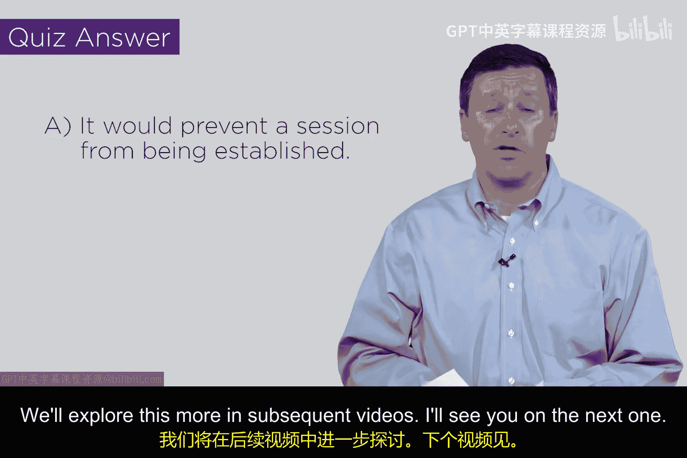

# 098：用于访问控制的SYN数据包 🔐

在本节课中，我们将要学习TCP/IP协议中一个关键的安全机制：如何利用TCP三次握手中的第一个数据包（SYN包）来实现基础的访问控制。这构成了现代防火墙技术的雏形。

## 参考监控器概念回顾

上一节我们介绍了网络安全的基础概念，本节中我们来看看一个具体的实现技术。首先，让我们回顾一个核心的安全模型。

在20世纪70年代，James Anderson提出了“参考监控器”的概念。其核心思想是：当Alice想要与Bob进行交互时，在它们之间放置一个监控器。这个监控器负责监视所有的访问请求，并根据预定义的策略决定是否允许该请求通过。

这个概念虽然简单，但它是计算机安全和网络安全运作方式的基石。

## TCP三次握手与SYN数据包

理解了参考监控器的概念后，现在让我们结合TCP/IP协议的知识，看看Alice和Bob之间建立会话的三次握手过程。

TCP连接通过三次握手建立：
1.  Alice发送一个**SYN**包（同步序列编号）。
2.  Bob回复一个**SYN-ACK**包（同步确认）。
3.  Alice最后发送一个**ACK**包（确认）。

关键在于第一个数据包——SYN包。在TCP协议设计中，这个初始数据包的ACK标志位被设置为`0`。而在此之后所有往返的数据包，包括所有的数据传输，其ACK标志位都被设置为`1`。

这个设计非常巧妙。虽然协议的发明者Vint Cerf和Bob Kahn当时可能并未专门考虑安全，但他们为会话建立所做的这个决定，为后来的安全控制提供了可能。

## 基于SYN包的访问控制原理

那么，这个设计如何帮助我们实现安全控制呢？其原理如下。

我们可以在Alice和Bob之间的通信路径上放置一个设备（可以理解为早期防火墙的雏形）。这个设备监视所有流入的数据包，并检查它们的ACK标志位。

当它看到一个ACK位为`0`的数据包时，它就知道：“注意，有人正试图发起一个新的连接。”此时，设备可以检查这个数据包的完整“五元组”信息：
*   **源IP地址**
*   **源端口**
*   **目的IP地址**
*   **目的端口**
*   **协议类型**

基于这些信息，设备可以做出访问控制决策。例如：
*   如果目的端口是`80`（HTTP），且来自互联网，则可以判断“有人想访问我的网站”，允许通过。
*   如果目的端口是`23`（Telnet，一个古老的远程登录协议），则可以判断“这很可疑，不允许直接登录我的机器”，从而丢弃该数据包。

如果这个初始的SYN包被丢弃，那么整个TCP会话将无法建立。Bob永远不会收到这个“呼叫”，连接也就不会发生。这种方式仅通过检查第一个数据包，就能做出非常强大的访问控制决策。

## 理解测验与安全设计

为了测试你对这个概念的理解，这里有一个小测验。

**问题**：如果一个数据包不是新会话的开始（即ACK位为`1`），但它到达了一个并未期待它的主机，会发生什么？
**答案**：该数据包会被丢弃。

在现代网络设计中，路由器或防火墙会配置规则来丢弃这些“游荡”的、不应出现的异常数据包，以增强安全性。即使有异常数据包侥幸通过，它也无法成功建立一个合法的会话。

## 课程总结

本节课中我们一起学习了TCP协议中SYN数据包的关键作用。我们了解到，利用SYN包中ACK标志位为`0`的特性，可以在网络路径上实现一个简单的访问控制点，这成为了现代防火墙技术的雏形。这种基于连接发起阶段的控制机制，多年来一直是网络安全设计的强大工具。在后续课程中，我们将更深入地探讨防火墙的设计与安全架构。