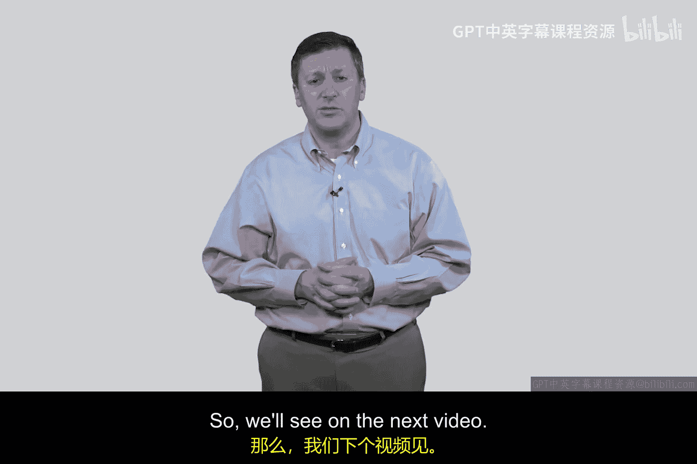

# 099：防火墙的定义 🔥

在本节课中，我们将要学习网络安全中的一个核心概念——防火墙。我们将通过一个历史故事引入，并详细解析防火墙的经典定义及其核心要求。

---

## 课程引入

在20世纪80年代末，一种名为“莫里斯蠕虫”的恶意程序在互联网上迅速传播。它本意是进行测试，但由于设计者的编码错误，导致其失控并对许多公司和基础设施造成了严重破坏。

然而，当时我所在的贝尔实验室却成功抵御了这次攻击。这引发了我的好奇：是什么阻止了蠕虫的入侵？通过调查，我结识了两位杰出的人物——史蒂夫·贝洛文（现为哥伦比亚大学教授）和比尔·切斯威克。他们开发了一套软件，部署在贝尔实验室的网络网关处，用于检查所有传入的数据包并做出决策。这被视为现代防火墙的雏形。

后来，当我在1993年撰写我的第一本网络安全教材时，恰逢贝洛文和切斯威克也在撰写一本关于防火墙的专著。我们互相交流，他们的书取得了巨大的成功，并在书中引用了我的作品，这让我深感荣幸。更重要的是，他们在书中提出了一个关于防火墙的定义，我认为它经受住了时间的考验。

---

## 防火墙的五大定义要素

上一节我们回顾了防火墙的起源。本节中，我们来看看贝洛文和切斯威克为防火墙总结的五个核心定义要素。

以下是构成一个防火墙的五个基本要求：

1.  **网络分隔**：防火墙的基本作用是**分隔两个或更多网络**。它充当网络之间的一个隔离点。
2.  **策略执行**：防火墙**强制执行安全策略**。这意味着需要有人预先定义规则，决定允许哪些流量通过，阻止哪些流量通过。
3.  **集中管理**：防火墙通常**由其中一个网络的管理员进行管理和维护**。虽然有时互联网服务提供商（ISP）也可能在中间进行仲裁，但绝大多数情况下，管理权归属于相连网络中的一方。
4.  **防篡改性**：防火墙本身**必须坚不可摧，无法被篡改**。其系统和配置需要得到强力保护。
5.  **不可绕过性（最困难的要求）**：确保防火墙**无法被绕过**，这已被证明是防火墙设计、实施和部署中最具挑战性的要求。

---

## 对“不可绕过性”的深入思考

上一节我们列出了防火墙的五大要素，其中最后一点“不可绕过性”尤为关键。本节中我们来深入探讨一下这个概念的实践挑战。

这个概念听起来简单，但在现实中却极难实现。试想一下，如果你在学校或办公室，网络管理员通过防火墙策略禁止访问Facebook，希望你专心工作或学习。你会怎么做？你很可能直接从口袋里掏出智能手机，使用移动网络访问Facebook。就这样，你轻松地绕过了本地网络的网关策略。

这个简单的例子揭示了在大型群体中**通过防火墙实施统一策略是异常困难的**。人们总能找到替代路径来绕过限制。

---

## 后续学习展望

在了解了防火墙的定义和核心挑战后，我们将在后续的课程中深入其工作原理。

在接下来的视频中，我们将开始学习如何**建立规则**和**构建访问控制策略**。我会向你展示防火墙是如何基于规则，对“允许”和“拒绝”的流量做出决策的。虽然我们会以路由器为例进行讲解，但**任何依据规则进行流量决策的设备**，其基本原理都是相通的。

---

## 课程总结

本节课中我们一起学习了防火墙的起源及其经典定义。我们了解到，一个防火墙的核心在于**分隔网络、强制执行策略、集中管理、自身坚固且难以被绕过**。同时，我们也认识到，在复杂的现实网络环境中，完全杜绝策略绕行是一项持续的重大挑战。理解这些基础概念，是我们进一步学习具体防火墙技术和策略配置的第一步。

我们下节课再见。