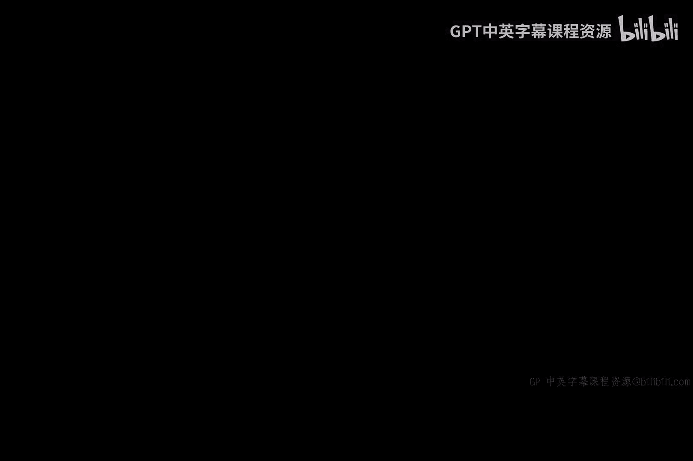
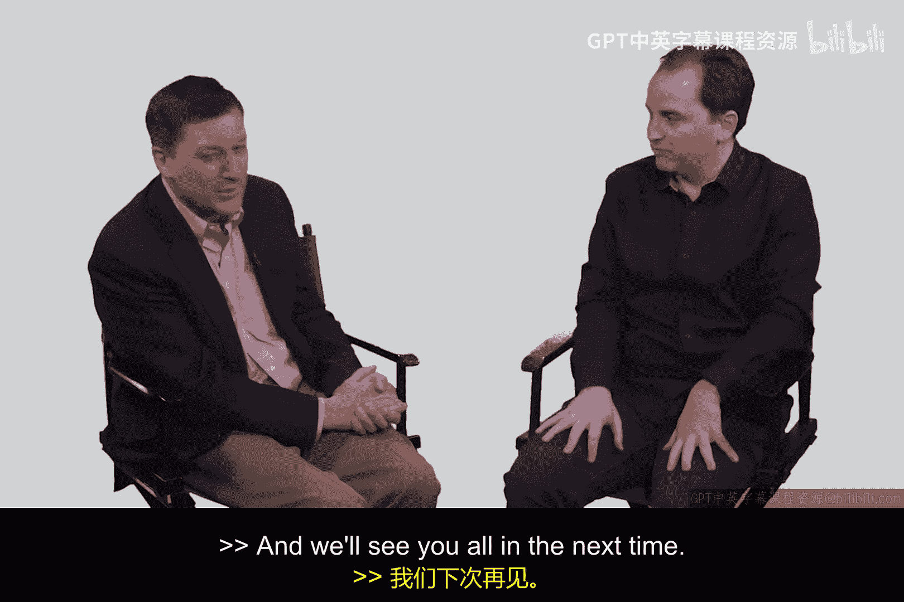
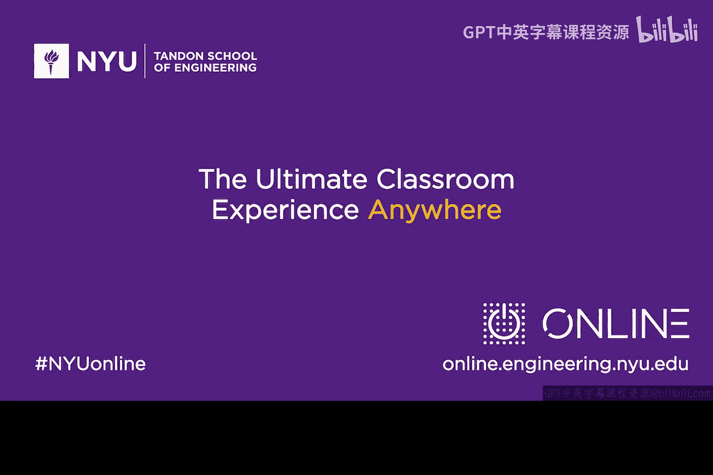

# 101：采访John Viega 🛡️

在本节课中，我们将通过纽约大学《网络安全入门》课程中对John Viega的采访，了解一位安全专家如何从开发者转型为公司CEO，并探讨Linux生产环境安全、安全编码的挑战以及网络安全的未来展望。

## 概述

本次采访对象是Capsule8公司的首席执行官John Viega。我们将了解他的职业背景、公司业务以及他对软件安全和行业趋势的见解。

## 采访内容

### 个人背景与职业转型

John Viega偶然进入了安全领域。他与Gary McGraw合著了第一本面向开发者的安全软件构建书籍，并参与了广泛使用的GCM加密算法开发。随后，他在MacAfee担任了很长时间的技术高管，将深厚的技术背景与商业运营相结合，最终成为了Capsule8的CEO。

从技术专家转型为公司CEO是一个巨大的转变。John表示他需要克制亲自动手解决技术问题的冲动，将精力集中在优先级管理和公司战略上。

### Capsule8公司业务介绍

Capsule8专注于**生产环境**的安全防护。如今，生产环境普遍运行Linux系统。例如，亚马逊云中93%的实例以及微软云中约三分之一的实例都在运行Linux。

以下是Capsule8提供的核心服务：
*   **可视化**：在不影响生产系统性能的前提下，提供系统运行状态的可见性。
*   **威胁防护**：在可视化的基础上实施安全防护，例如检测攻击实例并进行阻止。
*   **事件响应与取证**：当发生安全事件时，能够无缝响应并进行取证调查。

### 技术实现与业务模式

在技术层面，大型企业对在Linux内核中添加模块非常敏感，因为这可能影响系统稳定性且无法获得Linux供应商的支持。因此，Capsule8必须利用Linux系统自身提供的技术来获取数据和实现功能。幸运的是，近年来Linux技术的进步使得实现真正的系统级防护成为可能。

目前，Capsule8的业务主要面向大型企业。这些企业正在向内部平台即服务（PaaS）模式转型，通常会混合使用公有云和私有云，并整合开源或商业组件。Capsule8的目标是成为这类企业转型过程中的安全架构核心。

### 关于安全编码的探讨

John曾与Gary McGraw合著安全编码书籍。当被问及“是否可能编写出绝对安全的代码”时，他认为这几乎是不可能的。即使是最顶尖的黑客团体成员，在了解所有已知漏洞的情况下，也难以完全避免在自己的代码中引入安全问题。

编码本身过于复杂，难以完全杜绝安全漏洞。虽然一些抽象机制有所帮助，但只要有疏忽存在，系统就存在被利用的可能。因此，软件安全问题可能会改善，但永远不会消失。

### 对网络安全未来的看法

John对网络安全的未来持谨慎乐观态度。有时感觉像在跑步机上奔跑，难以取得实质性进展。但他认为仍有很大的创新空间来应对挑战。

通过提高攻击者的攻击成本，可以设立更高的安全门槛。在现代云计算环境中，源代码不可访问，这实际上使得“通过隐匿实现安全”的策略能为系统提供更强大的保护。

许多现代公司在锁定生产环境、减少攻击面方面做得很好，与过去那些可能丢失数十亿记录而毫无察觉的巨头公司相比，安全事件相对较少。网络安全是一场持续的军备竞赛，关键在于找到能够保持优势的“力量倍增器”。

## 总结

本节课我们一起学习了John Viega从安全开发者到企业CEO的转型之路，了解了Capsule8公司如何为Linux生产环境提供安全防护，并探讨了编写绝对安全代码的难度以及网络安全领域持续演进的挑战与机遇。安全是一场永无止境的旅程，需要技术、管理和创新的持续结合。