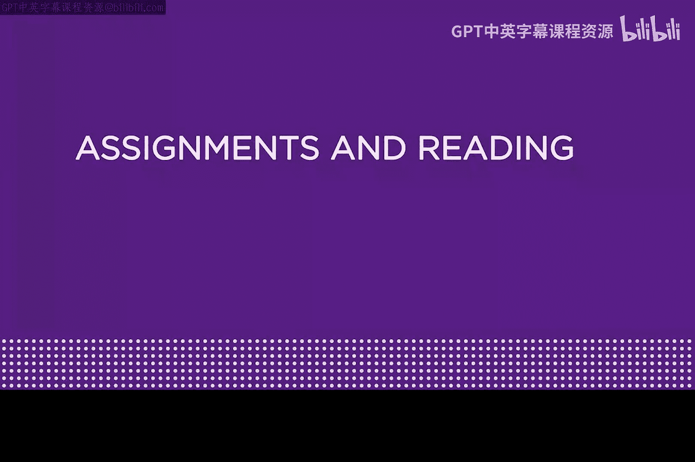
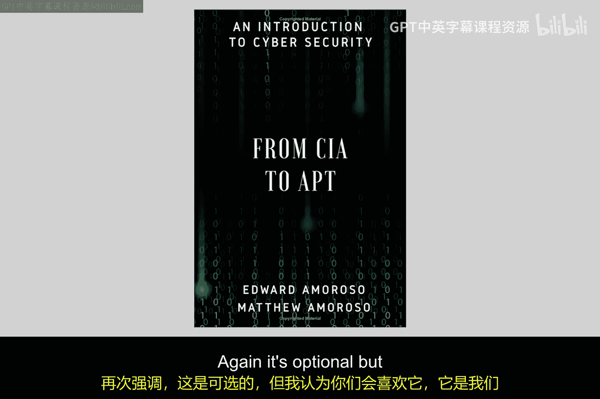
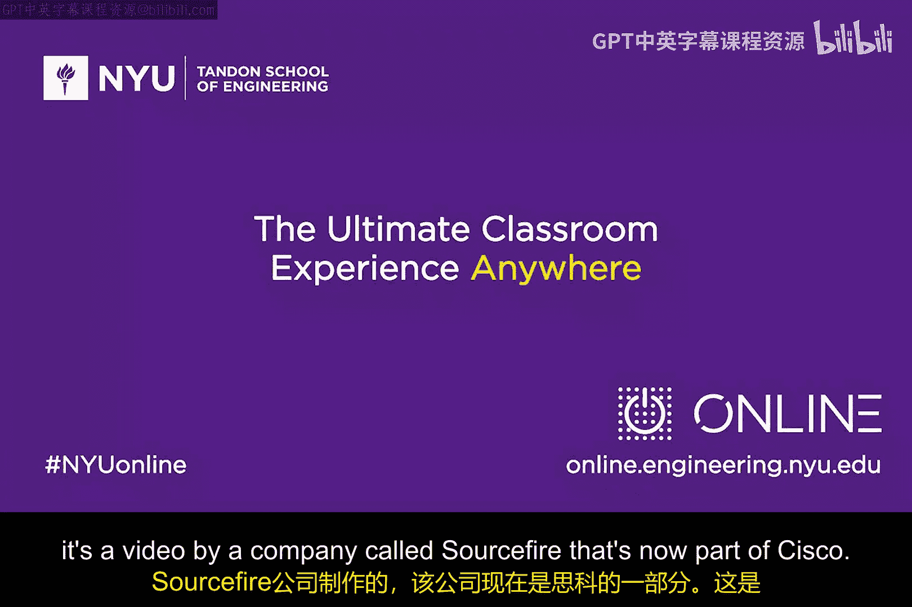

# 102：作业与阅读 📚

在本模块中，我们将学习数据包过滤防火墙，并初步了解入侵检测的相关概念。为了帮助你更好地理解这些内容，本教程将介绍一些推荐的阅读材料和视频资源，它们可以作为课程内容的补充。

## 概述

上一节我们介绍了数据包过滤防火墙的基础知识。本节中，我们来看看为了深化理解，有哪些额外的学习资源可供参考。这些资源包括学术论文、可选书籍和一个视频，它们将帮助你从不同角度思考如何检测和防御网络攻击。

## 推荐阅读论文

以下是两篇关于入侵检测的学术论文，它们虽然可能与模块内容不完全对应，但提供了互补的技术视角，有助于你构建更全面的网络安全知识体系。

1.  **论文一**：由一组作者撰写的长文，题为《基于主机的网络入侵检测技术、系统与挑战综述》。这篇综述性文章内容详实，非常值得一读。
2.  **论文二**：一篇名为《通过静态分析进行入侵检测》的重要论文，作者是Wagner和Dean。

阅读这两篇论文不仅对本模块学习有益，也将促进你在整个网络安全领域的学习进程。

## 可选参考书籍

除了论文，这里还有一本可选的电子书推荐给你。

*   **书籍**：一本你可以在亚马逊上找到的电子书，由我和我的儿子Matt合著，书名为《从CIA到APT：网络安全导论》。建议你阅读第19章和第20章，其内容与本模块高度相关。这本书是课程的良好补充，虽然可选，但相信你会喜欢。

## 补充学习视频

最后，推荐一个视频资源，它生动地展示了入侵防御系统的工作原理。

*   **视频**：由一家名为Sourcefire（现属思科）的公司制作的视频，发布于2013年，标题为《入侵防御系统如何工作》。这个视频非常直观，能很好地补充本模块关于数据包过滤防火墙和实时安全技术的内容。

## 总结

本节课我们一起学习了为配合“数据包过滤防火墙”模块而推荐的额外资源，包括两篇入侵检测论文、一本可选参考书和一个解说视频。希望这些材料能帮助你更深入地理解如何运用技术来阻止针对基础设施和企业的网络攻击。祝你学习愉快！