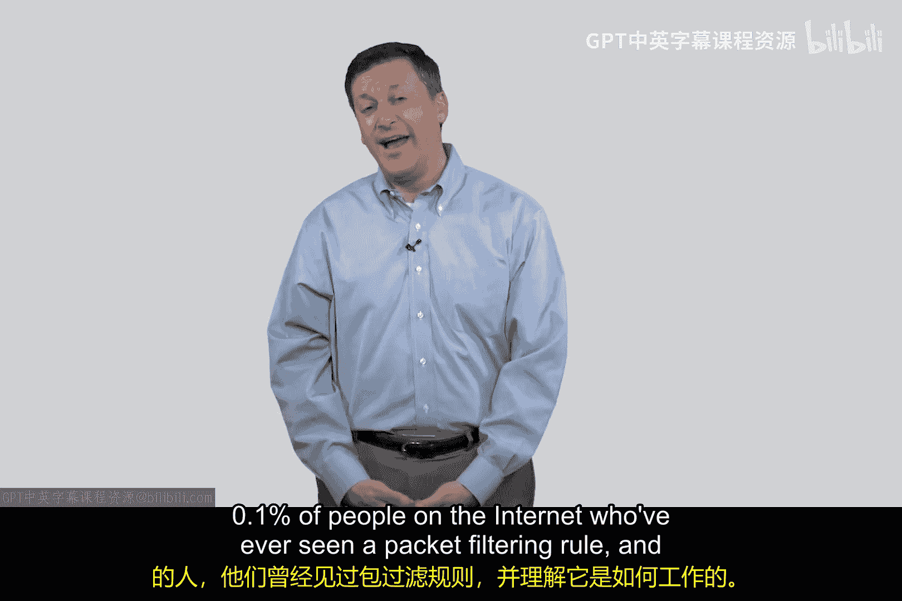

# 104：示例数据包过滤与参考架构 🔒

在本节课中，我们将学习数据包过滤的基本概念和工作原理。我们将通过一个典型的参考架构，了解如何构建规则来允许或阻止网络数据包。课程将涵盖规则的结构、关键字段的含义，以及如何利用这些规则检测和阻止欺骗攻击。

---

## 理解数据包过滤

数据包过滤是路由器或防火墙上的一项核心功能。管理员通过图形用户界面，利用一系列信息列来构建规则。这些规则决定了哪些数据包被允许通过，哪些被阻止。

一个典型的数据包过滤规则包含以下列：
*   **规则名称**
*   **源IP地址**
*   **目的IP地址**
*   **源端口**
*   **目的端口**
*   **使用的协议**（通常假设为TCP）
*   **方向**（数据包是入站还是出站）
*   **动作**（允许或阻止）

这些列中的条件共同构成了我们的过滤规则。

---

## 关键概念解析

上一节我们介绍了规则的基本结构，本节中我们来看看构成规则的一些核心概念。

### IP地址与端口

IP地址由互联网服务提供商或网络管理员分配。端口号则用于区分设备上的不同服务或连接。

端口号范围可大致分为三类：
*   **0 - 1023**：**保留端口**，用于众所周知的服务器服务（如HTTP的80端口，HTTPS的443端口）。
*   **1024 - 50000**：**注册端口**，可用于一些特定服务，既非严格保留也非临时。
*   **大于50000（如50000-65000）**：**临时端口**，由客户端在发起连接时动态、短暂地使用。

理解端口分类对于构建有效的过滤规则很重要。

### 参考架构与数据包方向

我们将使用一个简单的参考架构来理解数据包方向。该架构包含两个网络：
*   **内部网络**：被视为**可信**网络。
*   **外部网络**：被视为**不可信**网络。

基于此架构，数据包方向定义如下：
*   **出站**：从内部网络发往外部网络的数据包。
*   **入站**：从外部网络发往内部网络的数据包。

明确方向是构建逻辑规则的基础。

---

## 构建示例规则

了解了基本概念后，我们现在可以看看如何构建具体的过滤规则。以下是两个基于逻辑检测欺骗攻击的简单规则示例。

### 规则一：检测内部地址的入站欺骗

这条规则检查一个声称来自内部网络的数据包，但其方向却被标记为“入站”。

**规则逻辑**：
*   **源IP**：内部网络地址
*   **方向**：`inbound`（入站）

**分析**：
一个真正源自内部网络的数据包，其方向应该是“出站”。如果一个数据包声称来自内部，却试图从外部进入，这在逻辑上是不合理的。这表明源IP地址被伪造了，是一种欺骗攻击。

**动作**：`DROP`（丢弃该数据包）

### 规则二：检测外部地址的出站欺骗

这条规则检查一个声称来自外部网络的数据包，但其方向却被标记为“出站”。

**规则逻辑**：
*   **源IP**：外部网络地址
*   **方向**：`outbound`（出站）

**分析**：
一个源自互联网（外部网络）的数据包，其方向应该是“入站”。如果它被标记为“出站”，这在逻辑上同样说不通，也极有可能是欺骗行为。

**动作**：`DROP`（丢弃该数据包）

在上述两种情况下，只要源IP和方向的逻辑关系矛盾，就足以判定为欺骗。因此，规则中的其他条件（如端口号）就变得无关紧要。我们通常使用通配符（如 `*`）来表示“不关心”这些字段的匹配值。

---

## 规则构建哲学

通过前面的示例，我们看到了如何构建规则来“阻止”特定的非法数据包。然而，在实际的网络安全策略中，更常见和安全的哲学是 **“默认拒绝”**。

这意味着：
1.  明确定义并允许所有合法的、必要的通信。
2.  默认阻止其他所有未明确允许的通信。

这种方法比试图列出所有需要阻止的恶意行为更为全面和安全。我们将在后续课程中深入探讨这一策略。

---

本节课中我们一起学习了数据包过滤的基本原理。我们了解了过滤规则的构成要素，包括IP地址、端口、协议和方向。通过一个清晰的参考架构，我们分析了数据包方向（入站/出站）的含义，并构建了用于检测IP欺骗攻击的示例规则。最后，我们提到了一个重要的安全策略哲学：通过定义允许的规则来管理流量，比单纯定义阻止的规则更为有效。恭喜你，现在已经理解了数据包过滤规则的基本运作方式！