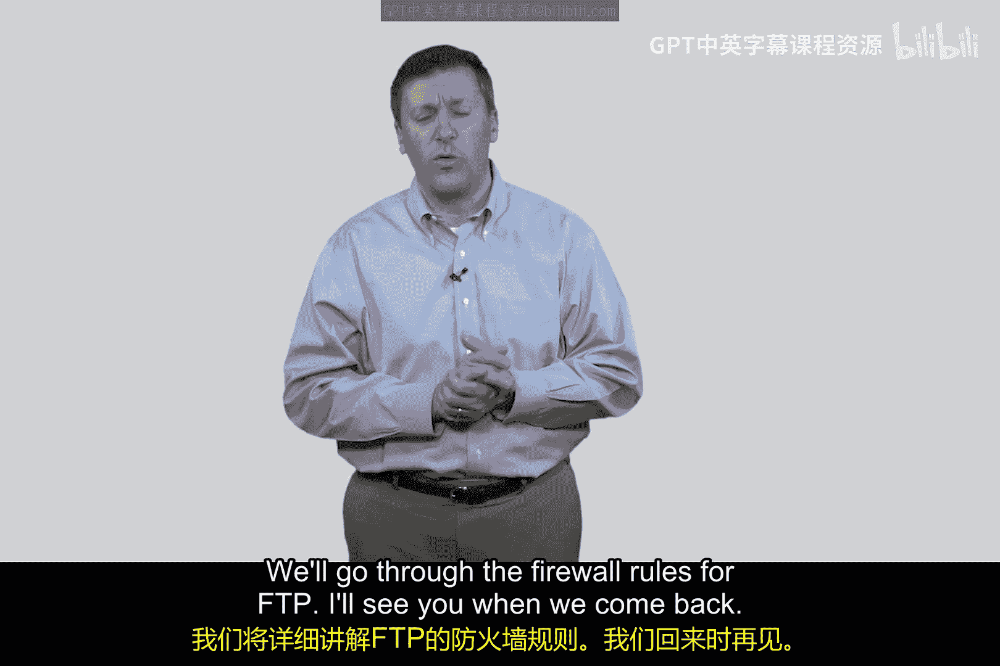

# 109：FTP协议详解 🔍

在本节课中，我们将学习一个名为文件传输协议（FTP）的经典网络协议。我们将了解其独特的工作机制，特别是它如何使用两个独立的TCP连接，并探讨这种设计对网络安全（尤其是防火墙规则配置）带来的挑战。

## 协议概述与历史背景

FTP是一个设计年代久远的协议。有人认为它可能是互联网上最早存在的协议之一。当我们审视其设计时，会发现它的设置方式有些复杂。从安全角度来看，理解这一点至关重要，因为为FTP设计数据包过滤规则比之前讨论的HTTP协议要棘手得多。HTTP协议只是简单地建立在TCP连接之上，而FTP则使用了两个方向不同的TCP连接，这使得情况变得更加复杂。

## FTP工作机制详解

以下是FTP的基本工作方式。我们需要建立一个FTP客户端和一个FTP服务器。图中用箭头代表运行这些具有端口号的命名程序。FTP客户端将打开两个端口：一个是我随意编的高位端口号（例如5005），另一个是5006。服务器端，正如你所知，将使用众所周知的低位端口，即20和21，这两个端口分别保留用于FTP的控制连接和数据传输。

让我们看看这个过程如何运作。假设我们有一个客户端。通常，你需要下载一个客户端程序。大多数客户端程序都允许你从FTP服务器下载文件。可能有人会问，为什么不用HTTP来做这件事？答案是，现在你当然会用HTTP。但在HTTP出现之前，我们就是使用FTP来下载研究论文、文章等资料的。

## 连接建立与数据传输流程

以下是具体的连接步骤：

1.  **控制连接建立**：服务器端首先从一个端口发起。客户端会向FTP服务器的端口20发送一个`PORT`命令（注意，此处的“端口”一词含义与TCP端口不同，但请理解这是FTP使用的命令名称）。
2.  **端口信息告知**：FTP服务器随后回复一个“OK”确认。在这个`PORT`命令的内容中，客户端会告诉FTP服务器：“顺便说一下，我在这里的5006端口也打开了一个连接”。它把这个端口号告诉服务器。服务器已经知道你在5005端口（因为那是源端口），所以我现在需要告诉你，我希望你用5006端口进行数据传输。
3.  **数据连接建立**：这个过程是客户端发起对服务器的出站连接。客户端发起一个TCP会话，发送`PORT`命令，并基本上获得一个“OK”响应。这从某种意义上说是在TCP命令之上的数据传输，但你可以将其理解为：我需要一条允许出站的规则（我们稍后会讨论这个）。
4.  **服务器反向连接**：一旦上述步骤完成，服务器现在会发起一个反向连接回到客户端。它基本上是从端口21连接到我之前在`PORT`命令内容字段中告诉你的5006端口。
5.  **数据传输**：然后客户端说“OK”，接着双方开始传输数据。

可以这样理解：我是客户端，你是服务器。我发起一个出站连接对你说：“嘿，是这边这个家伙要和你传输数据。”然后服务器说：“好的。”接着我们关闭那个TCP连接。现在，一个新的TCP连接从服务器返回到这个客户端，说：“好的，你准备好传输数据了吗？”客户端说：“好的。”然后它们开始传输数据。你明白这个双向过程了吗？

## 安全设计与协议理解的重要性

我们将看到这会引起一些问题，但你明白了吗？你必须查看协议是如何工作的。如果有人拍着你的肩膀说“我需要你为FTP做安全防护”，你会说：“好的，那我需要做什么？”答案是，你必须深入研究协议，看看这个。我教了30年书，有很多学生问我：“我如何成为一名专业的网络安全工程师？”30年来，我的答案一直是：首先成为一名专业的网络工程师。深入理解协议、底层原理和服务。因为一旦你做到了，你需要做什么在某种意义上就变得显而易见了。安全防护措施只是叠加在设计之上。安全是一种工程属性，就像可用性、可靠性、可依赖性一样，这些都是系统的属性。当事情被过度强调时，安全本身就被赋予了过多的生命，正如我们在网络安全领域所看到的那样。

我认为，我很乐意承认的一点是，我最希望看到的是网络安全能够嵌入到其他学科中。就像我们是否会站在这里深入讨论可靠性一样？也许我们会，但当我们讨论安全时，我们当然不会眨眼，而它们都是系统的属性。

## 总结与下节预告

在后续的视频中，我们将查看FTP的防火墙规则。但现在，请给我一个机会，大致揭开FTP工作原理的面纱，并向你展示并非所有协议都像这些容易理解的协议那样显而易见。我们将在下一个视频中回来，详细讲解FTP的防火墙规则。我们回来时再见。

---

本节课中，我们一起学习了FTP协议的双连接工作机制，理解了其控制连接（端口21）与数据连接（动态端口）分离的设计。这种设计使得它在通过防火墙时需要特殊处理，也为理解网络安全必须基于扎实的网络协议知识这一核心观点提供了例证。