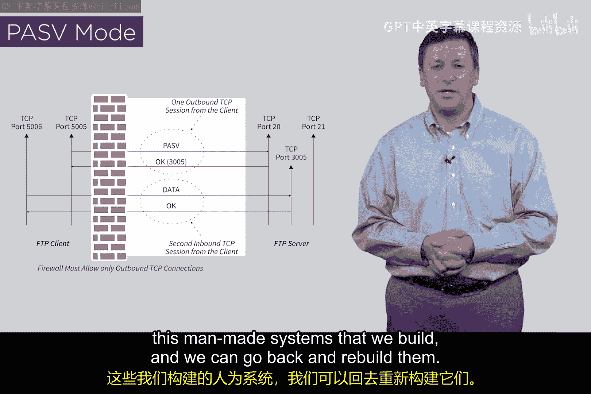

# 110：FTP的防火墙规则 🔥

在本节课中，我们将探讨一个经典的安全挑战：如何为现有协议（如FTP）添加安全措施。我们将重点分析FTP协议原始设计带来的防火墙难题，并了解工程师们如何通过重新设计协议来解决这个问题。

## 为现有协议添加安全措施的挑战

上一节我们讨论了安全设计的重要性。本节中我们来看看，当安全需求出现在一个已经广泛使用的协议之后，会面临怎样的困境。

为现有协议或服务添加安全措施通常非常困难。这通常会造成混乱的局面，因为你需要在已经部署好的东西上，想办法融入安全机制。这种“事后补救”总是很棘手。在某些情况下，困难到必须回头重新设计整个系统。

如果你看过我们之前的视频，可能记得我演示过如何入侵一台旧式汽水贩卖机。那个问题是如何解决的呢？答案是重新设计汽水贩卖机。有时除了承认失败并从头开始设计得更好之外，别无他法。在学习网络安全时，请记住这一点：重新设计始终是一个选项。你可以改变事物的设计方式。网络安全不是天文学，无法改变星辰的排列。我们处理的是人造系统。如果你不喜欢某个系统的设置方式，那就改变它。FTP协议就可以被改变。

## FTP的原始设计与防火墙问题

FTP的设计存在一个根本问题，导致它与防火墙难以兼容。回顾一下，FTP有一个`PORT`命令。客户端通过一个出站的TCP连接向服务器发送此命令（如果防火墙规则允许出站连接）。随后，为了传输数据，会建立一个反向的、入站的TCP连接。

我们讨厌这种设计，因为它迫使防火墙必须为第二条连接设置一条规则。例如，一个保护所有客户端的防火墙，必须允许任何来自外部端口21的入站TCP连接。你会对这样一条规则感到放心吗？没有人想要这样的规则。

## 解决方案：PASV模式（被动模式）

那么他们做了什么？互联网社区提出了一种FTP的新设计，我们称之为**PASV模式**（被动模式）。有些人称之为防火墙友好模式FTP。

以下是其工作原理的核心流程：
1.  客户端向服务器发送一个`PASV`命令。
2.  服务器响应：“好的，让我们传输数据。顺便说一下，我将在端口`3005`上监听。” （端口号是动态分配的）
3.  客户端收到响应后，主动向服务器的端口`3005`发起一个出站的TCP连接以传输数据。

这种模式的关键改进在于，**数据连接也是由客户端主动发起的**。服务器只是动态地指定一个端口并等待连接。

## 新旧模式对比与总结

这种设计带来了一个重要的优化：服务器可以为数据传输动态分配端口。但更重要的是，现在防火墙**只需要允许出站连接，而无需允许任何入站连接**。这让防火墙工程师们非常满意。

本节课中我们一起学习了网络安全中“事后补救”的挑战。我们回顾了FTP协议原始`PORT`模式带来的防火墙规则难题，它迫使防火墙必须开放危险的入站连接。接着，我们探讨了解决方案——**PASV模式**（被动模式）。在这种模式下，所有连接（控制连接和数据连接）都由客户端发起，从而使得防火墙只需配置简单的出站允许规则，极大地提升了网络边界的安全性。

这个故事很好地提醒我们，作为计算机科学家，有时我们必须回头重新设计系统。计算机科学不是自然科学，而是数学与工程科学。我们构建的是人造系统，当我们发现根本性缺陷时，完全可以回头重建它们。希望这个案例对你有启发。我们下节课再见。