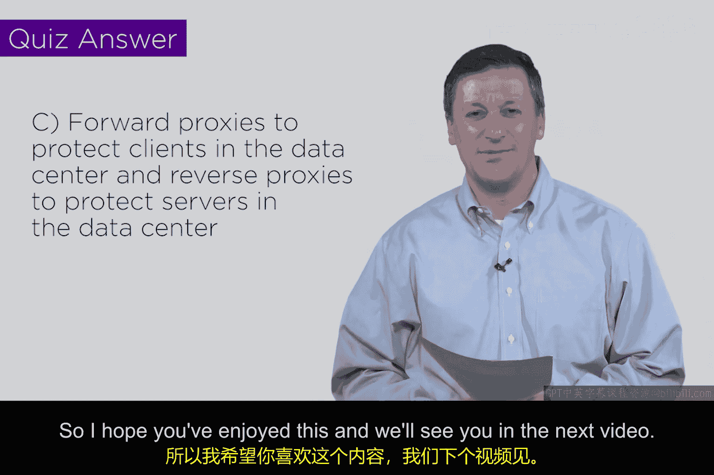

# 112：正向与反向代理 🔄

在本节课中，我们将学习网络安全架构中的一个核心概念：代理。我们将重点探讨两种主要的代理类型——正向代理和反向代理，理解它们的工作原理、区别以及在安全设计中的应用。

---

## 概述

代理服务器在网络中扮演着“中间人”的角色，代表客户端或服务器处理请求。理解代理的架构对于设计有效的网络安全方案至关重要。本节将解释正向代理和反向代理的基本概念及其在安全环境中的重要性。

## 代理的基本概念

代理的核心思想是作为一个“中间人”或“中介”。在现代防火墙中，代理是一种内嵌的概念性功能。后续课程会深入探讨防火墙架构，但现在，我们先了解两种常见的代理设置。

## 正向代理 🚪

正向代理代表一组客户端进行操作。客户端认为自己直接访问了外部目标（例如互联网），但实际上，它们的请求首先被发送到正向代理服务器。

以下是正向代理的典型应用场景：
*   **缓存优化**：代理可以缓存常用网页（如一个在线运动鞋商店的页面）。当多个客户端请求相同资源时，代理可以直接返回缓存内容，无需每次都访问外部网络，从而提高效率并节省带宽。
*   **安全网关**：在企业环境中，正向代理可以内嵌防火墙功能，代表内部所有客户端过滤出站流量，实施访问控制和安全策略。

正向代理的关键在于它**保护并代表客户端**。

## 反向代理 🛡️

反向代理则用于保护服务器。当外部客户端试图访问一个或多个后端服务器时，请求会先经过反向代理。

以下是反向代理的核心特点：
*   **服务器保护**：反向代理隐藏了后端服务器的真实身份和细节，对外充当服务器的门户。它可以过滤恶意流量、抵御攻击（如DDoS），并实施访问控制。
*   **负载均衡**：反向代理可以将传入的客户端请求分发到多个后端服务器，以提高系统的可用性和性能。

反向代理的关键在于它**保护并代表服务器**。

## 概念辨析与重要性

正向代理和反向代理在技术本质上是相同的（都是中间人），但其逻辑侧重点不同。正向代理侧重于客户端，反向代理侧重于服务器端。

在设计网络安全架构时，真正重要的是“代理”这个概念本身：在通信双方之间插入一个中间层。随着计算日益虚拟化，这种代理功能正成为基础设施的一部分。例如，在**软件定义网络（SDN）** 和云环境中，安全功能可以内嵌在虚拟基础设施中，作为工作负载之间的一种仲裁机制。服务提供商甚至可以在用户之间部署代理，提供安全仲裁服务。

## 小测验与总结

假设一个环境内部既有客户端需要访问外部互联网，也有服务器需要对外提供服务。为了提供全面保护，应该部署哪种代理组合？
*   A. 仅部署正向代理
*   B. 仅部署反向代理
*   C. 同时部署正向代理和反向代理

**答案是 C**。我们需要正向代理来保护出站的客户端，同时需要反向代理来保护对内的服务器。

本节课中，我们一起学习了代理服务器的核心概念，区分了正向代理（保护客户端）和反向代理（保护服务器）的不同角色与用途。理解这一基础架构概念，是构建更复杂网络安全解决方案的重要基石。希望这些概念没有让你感到困惑，我们下个视频再见。