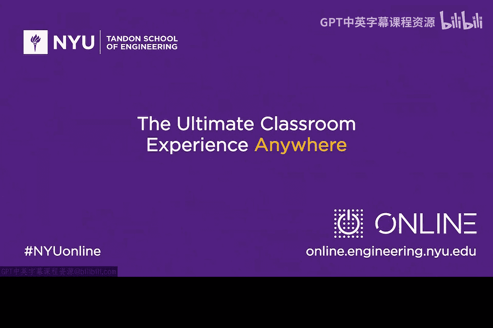

# 113：专访安全研究员Roger Piqueras Jover 🔐

在本节课中，我们将通过纽约大学对安全研究员Roger Piqueras Jover的专访，了解他进入网络安全领域的历程、对移动通信安全的见解，以及给初学者的职业建议。我们将学习移动网络（如2G、3G、4G LTE）安全性的演变，并理解协议设计中的关键安全概念。

大家好，我是Edroso。在今天的视频采访中，我邀请了我的老朋友兼同事Roger Piqueras Jover。Roger是Bloomberg公司的网络安全研究员和安全架构师。

## 技术兴趣的起源 🚀

上一节我们介绍了Roger的背景，本节中我们来看看他最初是如何对技术产生兴趣的。

Roger的祖父回忆说，Roger小时候就对机器、汽车和卡车非常感兴趣。物体越大、发出的噪音越多，他就越喜欢。他很小就开始玩乐高积木。他的父母曾担心他会误吞小零件，因为他总是玩适合12岁以上孩子的套装，而包装上建议的年龄是3到7岁。

但Roger表示，真正对技术本身产生兴趣要快进到大学本科时期。他提到，现在很多青少年在15岁就开始学习编程，但他当时并非如此；他15岁时在踢足球和玩电子游戏。

Roger本科时并不确定要学习什么专业。他知道自己想学工程，但不清楚具体方向。最终他选择了电气工程。他回忆道，大一时主要是学习数学和物理等基础课程。到了大二，他开始接触更专业的课程，如无线通信。

他记得学习**傅里叶变换**的那一天改变了他的人生。那天他理解了汽车收音机的工作原理，明白了收音机上的数字代表什么，以及如何将信号从时域转换到频域进行分析。这让他感到震撼，并确信自己选对了方向。从此，他一直对技术领域充满热情。

## 进入移动安全领域 📡

了解了Roger的技术启蒙后，本节我们来看看他如何进入移动安全这一特定领域。

Roger被问到是否预见到移动技术会像今天这样改变世界。他回答，当他开始读本科时，自己还没有手机，这在今天是难以想象的。他是在大三时才拥有第一部手机。当时同学们会取笑他，因为他正在学习手机工作原理，自己却没有手机。

他当时并未意识到手机会变得如此不可或缺。最初拥有手机时，他有时甚至不想携带，会把它留在家里。但现在，如果手机忘在家里，他会感到慌乱。他从未预料到手机会发展成今天这样，但他很高兴自己进入了正确的领域。

Roger进入安全领域纯属偶然。他的学术背景一直是无线通信、信号处理和网络。几年前，他得到一个机会，加入AT&T的一个安全研究实验室工作。对方告诉他：“你非常了解手机和蜂窝网络的工作原理，你能想出办法让它不安全吗？”他答应了，就这样进入了安全领域。他从未想过会从事安全工作，但现在看来，这又是一个正确的选择，因为安全和移动性正是当前最重要的领域之一。

## 移动网络的安全演进与威胁 🔒

上一节我们了解了Roger进入安全领域的契机，本节中我们来看看他对移动网络安全演进的分析。

当被问及是否担心移动威胁时，Roger分享了他的观点。他认为自己是个普通人，因此不必过于担心手机会发生什么。例如，他本人不太在手机上使用移动银行服务。如果要用，他绝对不会在手机连接到**GSM（2G）**网络时进行。

他告诉大家，只有当连接到GSM网络时，才需要真正担心有人拦截你的流量或进行窃听。除此之外，他并不太担心。但他强调，这是因为他是个“普通人”；如果他是重要人物，比如美国总统，他绝对不会使用安卓手机（他听说总统在使用，但这是另一个话题了）。

关于从1G、2G（GSM）、3G到LTE和5G的演进，安全性似乎随着每一代而提升。Roger在演讲中总是用一张幻灯片来展示移动网络安全性的时间线。

他指出，在第一代移动网络中，甚至不支持加密，起点并不好。
在**2G**中，有了加密，但众所周知，2G只有网络对手机的单向认证。网络可以声称自己是任何运营商，手机会相信，这导致了许多安全问题，例如容易进行窃听。
**3G**通过引入双向认证和强加密解决了这个问题。
到了**LTE（4G）**，安全性变得更好。

尽管安全性大幅提升，Roger总是提醒人们，即使在LTE下，问题也并非完全不存在。他有一张幻灯片引用了他自己的一句话（这是一个有趣的故事：一次演讲后，有人建议他应该引用自己的话，所以现在他的演讲中总会引用自己）。大意是：尽管人们认为在LTE下这些问题不会发生，比如不会被窃听、不会有伪基站，但实际上，任何LTE设备都会与任何看似是LTE基站的东西交换大量消息。在最终进行认证握手之前（手机会在此刻发现那不是真正的基站），已经有大量消息来回传输。攻击者可以截获、篡改这些消息，进行多种攻击，例如拒绝服务、阻止手机连接，甚至进行窃听。因此，你不需要在GSM网络下才能进行窃听。

Roger总结道，安全性确实变得好多了，但他始终认为还有很多工作要做。他曾与FCC的一些人士交流，并告诉他们，他仍然相信在移动安全领域还有很多需要改进的地方。

## 加密与协议：安全的核心 🛡️

在讨论了移动网络安全的整体演进后，本节我们深入探讨一个核心问题：加密本身是否牢不可破。

当被问及是否有信心LTE的加密不会被攻破时，Roger表示自己不是密码学家，据他所知，LTE的加密算法没有部分被破解的先例。弱点通常不在加密本身。

根据近八年的安全研究经验，Roger发现，加密算法通常是最不容易被攻破的部分。那是许多非常聪明的人花费大量时间设计的，他几乎无法完全理解。一旦涉及到Alice和Bob之后的密码学细节，他就选择信任专家。通常，问题出在其他地方。

以LTE为例，加密非常强大。但问题在于，在进行加密之前，手机会盲目信任来自网络的任何信息。在双方实际建立加密连接之前，需要互相介绍。如果Roger告诉手机他是Michael Jackson，手机也会相信。这就是问题所在——在进行尚未被破解的加密流程之前，就已经存在安全漏洞。

## 给初学者的建议 🎓

在探讨了技术细节之后，本节我们转向职业发展，听听Roger对有志于进入网络安全领域的年轻人有何建议。

对于高中生，Roger想说，他高中时有很多朋友认为努力学习没用。但现在，他感激并庆幸自己在高中阶段努力学习了。你可以在高中努力学习，同时晚上踢足球、玩电子游戏。他玩了很多电子游戏，但这确实帮助他在大学取得了好成绩。

如果你想要从事技术工作，上大学非常重要。他并不是说不能自学，实际上他现在也在通过阅读书籍自学很多从未学过的东西。但大学教育无疑为从事技术工作做了非常重要的准备。

Roger还鼓励人们攻读研究生。因为研究生阶段能让你接触一点研究。在高中或本科，你只是上课、学习主题、参加考试，一切都有明确的指引。而在研究生阶段，一旦你参与研究，情况就不同了：你会面对一个领域，那里可能存在问题，需要你去发现和解决。这能培养你的独立性，教会你如何思考和分析现实世界的问题。

这听起来可能有些矛盾，但Roger认为，当你在大学或研究生阶段，完成了课程学习，正在学习新知识时，那是你学习能力最强的时刻。你面对一个未知领域的问题，必须查阅相关书籍和论文来学习。因此，他强烈鼓励人们这样做。

Roger很高兴自己一路走来，虽然很多事情都是偶然。他在巴塞罗那完成本科学业时，当时并不流行读研。但他的一位至今仍是朋友、现在住在纽约的朋友告诉他，申请奖学金或读研可能是个好主意。于是他申请了，并且获得了奖学金，这把他带到了美国。

他建议，你应该试着思考自己想做什么，并寻找有趣的事情去做。Roger非常高兴的一点是他真的很享受自己的工作。这并不常见，但他觉得自己能达到这一点，是因为他探索了这条道路：上了大学和研究生，尝试了不同的事情。最终，事情进展顺利。

## 总结 📝

本节课中，我们一起学习了安全研究员Roger Piqueras Jover的职业生涯路径。我们回顾了他从对机械感兴趣到通过傅里叶变换爱上无线通信的过程，了解了他偶然进入移动安全领域的经历。我们重点分析了移动通信网络（从1G到4G LTE）安全性的演进历程，明白了加密算法本身通常坚固，但协议设计（如认证流程）往往是安全链中的薄弱环节。最后，Roger为初学者提供了宝贵的建议：重视高中和大学的基础教育，考虑攻读研究生以培养研究能力和独立性，并勇于探索，寻找自己真正热爱的方向。