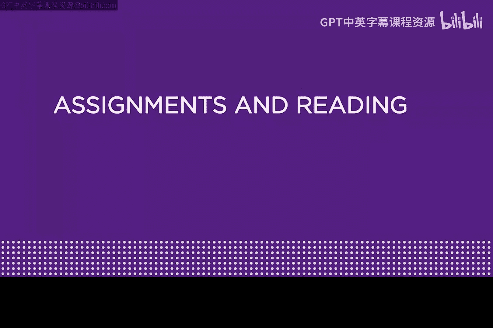
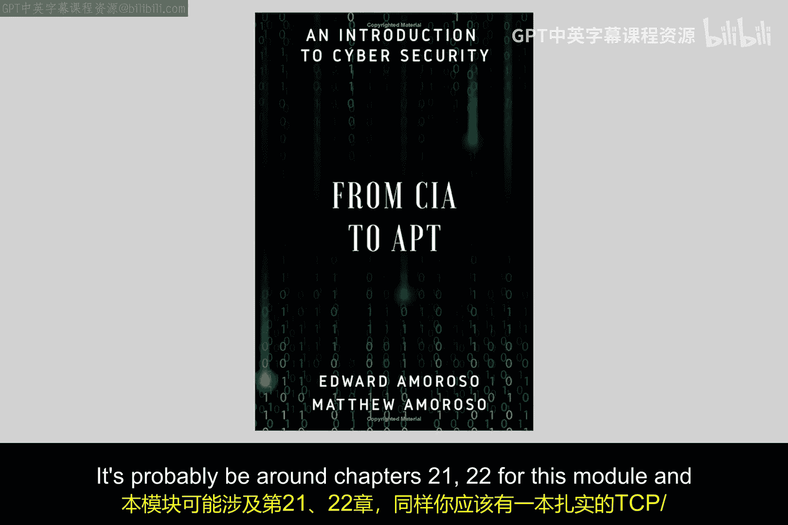
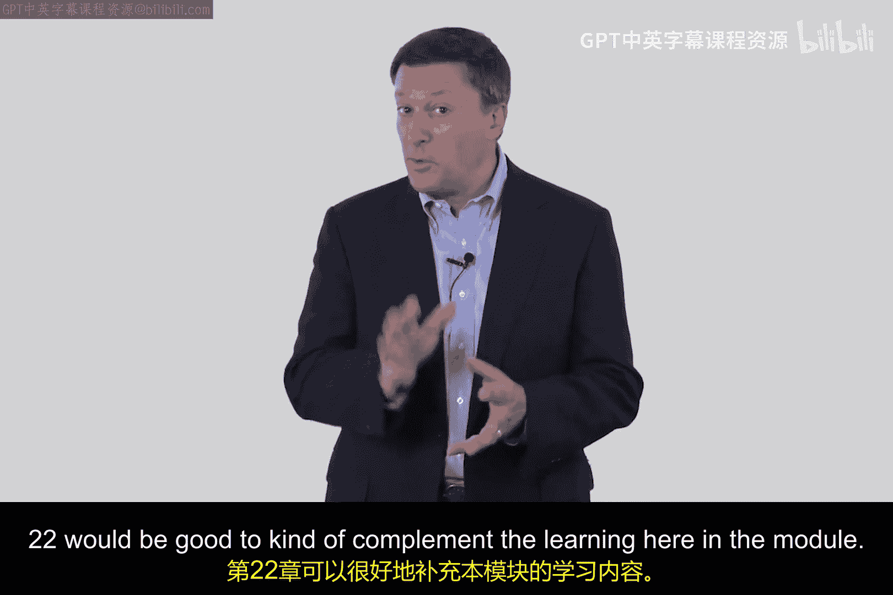
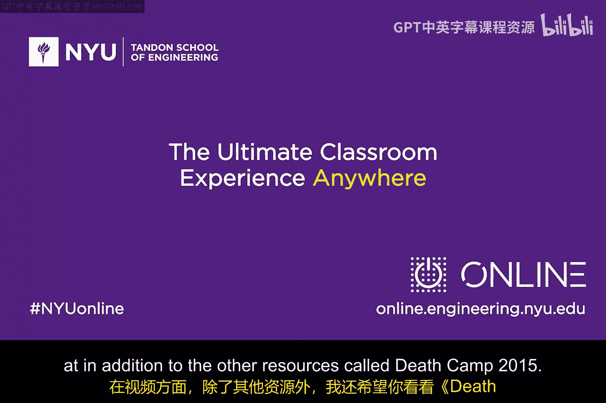

# 114：实时安全与防御架构 🛡️

在本模块中，我们将学习企业环境中的实时安全技术。主要内容包括高级防火墙架构与设置、入侵检测与防御系统，以及安全运营中心的基础知识。这些是用于阻止网络攻击发生或在攻击发生前进行防御的实用方法。

## 课程概述与学习资源 📚

上一节我们介绍了本模块的学习目标，本节中我们来看看完成学习所需的推荐资源。

以下是本模块的核心阅读材料和参考资料：

*   **必读论文**：
    *   **《An Evening with Berferd》**：作者比尔·切斯维克。这篇论文记录了一次追踪并“诱捕”一名自称“Berferd”的黑客的经典案例，被认为是网络安全领域的必读文献。
    *   **《An Intrusion-Detection Model》**：作者多萝西·丹宁。这篇论文为入侵检测系统奠定了理论基础，是理解IDS工作原理的重要文献。

*   **可选书籍**：
    *   **《From CIA to APT: An Introduction to Cybersecurity》**：作者Ed与Matt Amoroso。这是一本可选电子书，与本模块相关的内容主要集中在第21和22章。

*   **推荐视频**：
    *   **《Defcon 2015: Building a Security Operations Center》**：该视频提供了关于建设安全运营中心的实用建议，值得观看。

希望你能立即开始本模块的学习，并享受这个过程。