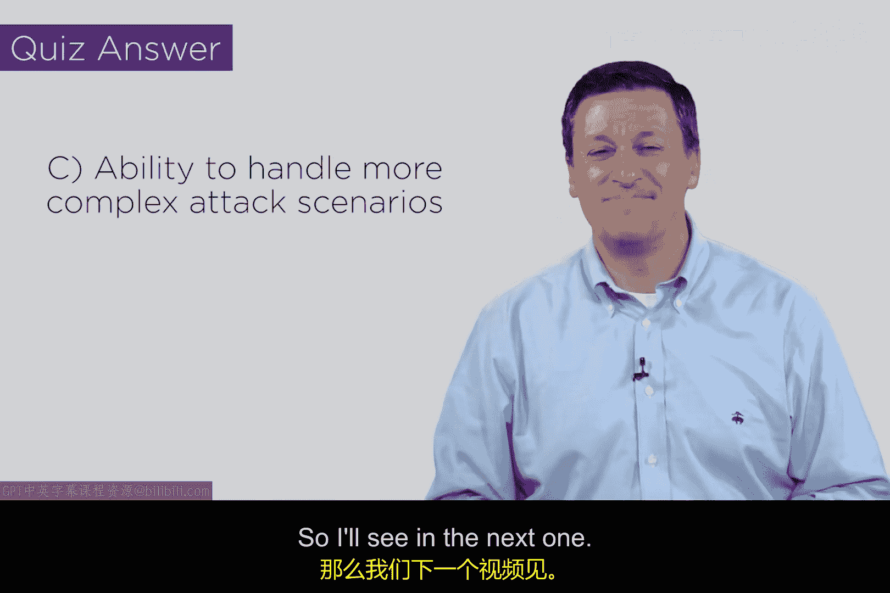

# 115：防火墙架构第一部分 🔒

在本节课中，我们将学习构建非军事区（DMZ）或边界网络的核心组件及其不同架构方式。我们将探讨三种主要的防火墙部署方案，分析各自的优缺点，并理解为何复杂的组织倾向于选择更灵活的边界网络设计。

## 概述

非军事区或边界网络的基本构建模块主要包括**包过滤器**和**应用代理**。我们将探讨几种不同的网络架构方式。作为安全工程师，在尝试保护一个网络免受另一个网络侵害时，需要考虑一些合理的架构方案，这本质上就是我们之前定义的防火墙功能。

## 三种防火墙架构方案

上一节我们介绍了防火墙的基本概念，本节中我们来看看三种具体的实现架构。

### 方案一：路由器包过滤

第一种方案是最经济、最简单的选择：使用一台原生支持包过滤功能的路由器。几乎所有路由器都具备此功能。

以下是该方案的优缺点：

*   **优点**：成本低、结构简单、易于部署。
*   **缺点**：功能有限。它只能执行丢弃或允许数据包的基本操作。

因此，你可以将一台路由设备作为你的DMZ。

### 方案二：包过滤器结合应用代理

第二种方案是部署一个包过滤器，并连接一个应用代理。路由器有多个接口，其工作原理是引导流量。一种可能是引导流量通过路由器进入或离开局域网；另一种可能是路由器决定将流量转发给代理，以便在应用层进行处理。

这种方案的**优点**是比单纯使用路由器提供了更多能力。但它的成本也更高一些。实际上，防火墙行业已经将这两种功能打包成一个产品，无论是作为数据中心机架中的硬件设备，还是作为云操作系统中接收数据包的软件虚拟设备，都取得了巨大成功。

### 方案三：构建非军事区（边界网络）

第三种方案可能是几乎所有大型企业、政府机构、军队等实质性组织都会采用的方式，即构建我们所谓的非军事区或边界网络。

具体做法是：部署一台面向非受信侧（如互联网）的路由器，称为**外部路由器**；再部署另一台面向你试图保护的局域网的路由器，称为**内部路由器**。这两台路由器共享一个接口，这个接口所在的网络就是你可以扩展并放置各种有趣组件的地方。

以下是可以在DMZ中部署的组件示例：

*   应用代理。
*   针对各种不同协议的应用防火墙。
*   负载均衡器（例如，将HTTP流量负载均衡到特定设备，或将电子邮件流量负载均衡到另一台设备）。
*   审计机制，如日志文件管理和审计跟踪。
*   数据防泄漏保护系统。

设计这些架构非常有趣，你可以将各种组件组合到网络中。边界网络为你提供了极大的创造空间。

## 架构总结与对比

从根本上说，你有这三种选择：一台**路由器**、一个可能包含路由功能的**防火墙设备**，或一个完整的**边界网络**。

如今大多数公司都意识到，路由器相当便宜。如果采用虚拟化技术，它们不仅是成本低廉的硬件，还可以是完全基于软件的形态，运行在云操作系统中，这非常有趣。

综合来看，边界网络的**优点**在于它是最灵活、功能最强大、提供选项最多的方案。其**缺点**是成本最高，并且需要投入一些时间和精力进行管理。

因此，你可能不会为家庭网络部署边界网络。但如果你经营的是小型、中型或大型企业，那么你可能需要考虑一下边界网络架构。

## 知识测验

为了检验我们对这些内容的理解，这里有一个小测验。

**问题：构建非军事区（DMZ）的主要原因是什么？**

*   A. 处理应用层协议
*   B. 提供负载均衡
*   C. 处理更复杂的流量场景
*   D. 降低网络成本

**答案：C**

在所有选项中，C可能是最佳答案。当然，你也可以为其他选项提出一些理由（例如，应用层协议可能无法在路由器层面处理）。但最主要的原因是我们需要构建非军事区来处理更复杂的流量场景，这正是我们最初设计边界网络的目的。

## 总结

本节课中，我们一起学习了边界网络设计的三种主要阶段或方案。我们从最简单的路由器包过滤，讲到结合应用代理的增强方案，最后深入探讨了功能全面、高度灵活的边界网络架构。希望你对这些内容有所收获，并在后续视频中继续与我们深入探讨。我们下节课再见。