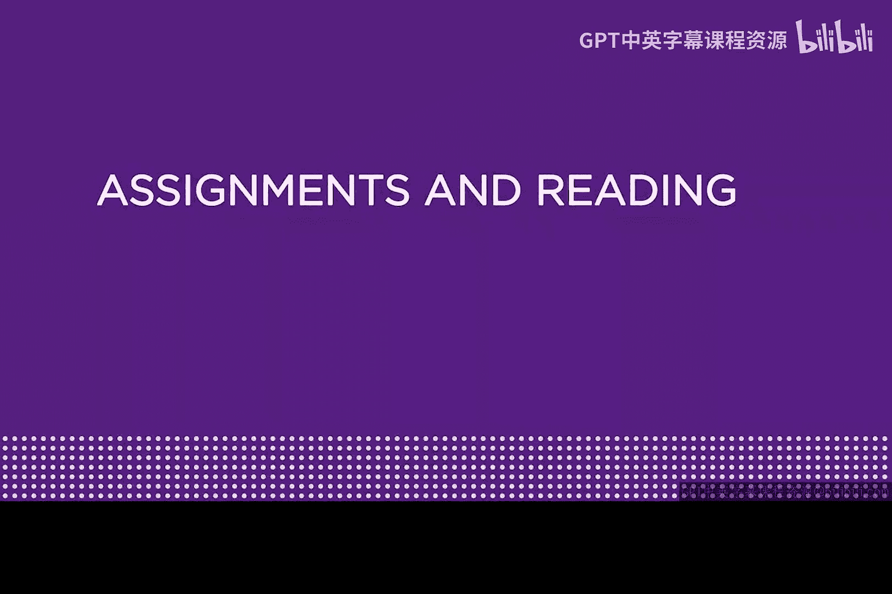
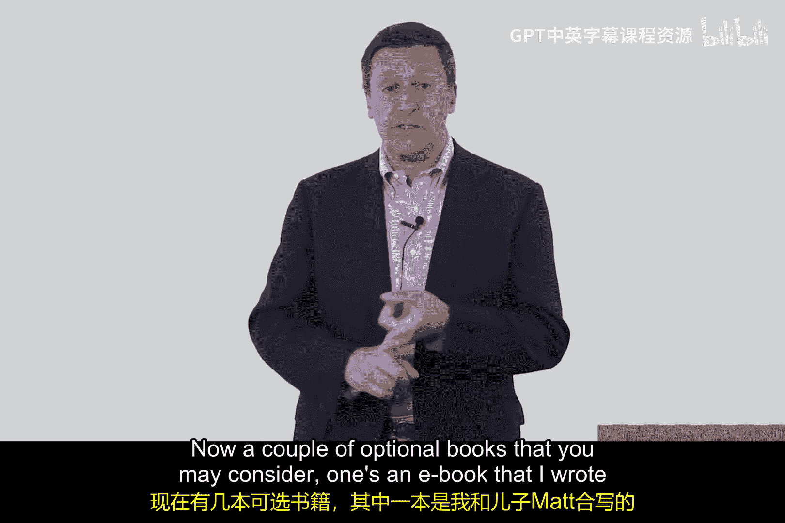
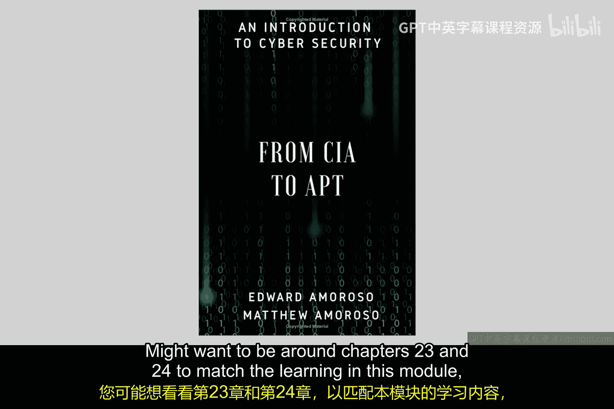
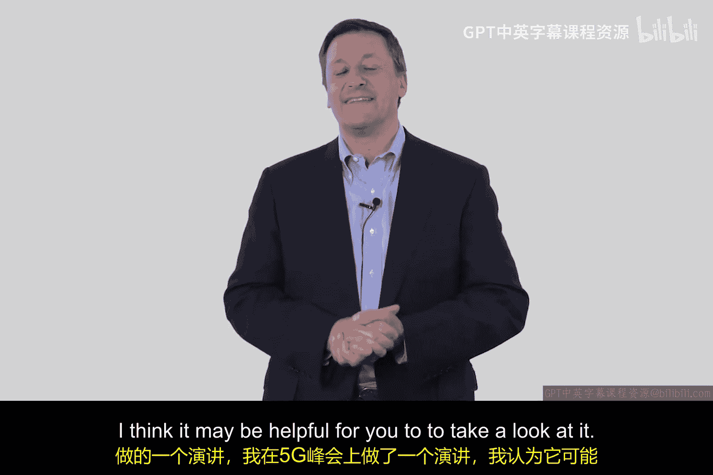

# 125：企业边界与高级持续性威胁

在本模块中，我们将探讨当前基础设施和企业环境中存在的两个重要且微妙的问题：企业边界面临的挑战，以及高级持续性威胁所使用的技术。这些技术正是当前一些国家行为体正在实施的。

为了辅助本模块的学习，这里有一些推荐的补充资源。以下是一些我认为与课程内容契合度很高的材料。

*   **推荐阅读论文**：
    *   一篇我几年前撰写的论文，题为《从企业边界到移动云》。这篇论文将引导你了解边界面临的各种问题，是对本模块学习内容的很好补充。
    *   另一篇优秀的论文名为《高级持续性威胁研究》，由几位能力出众的作者撰写。这篇论文能为你提供关于APT的平衡视角。

*   **可选书籍**：
    *   一本我与儿子Matt合著的电子书，名为《从CIA到APT：网络安全导论》。建议阅读第23和24章，其内容与本模块的学习相匹配。

*   **推荐观看视频**：
    *   一个我在普林斯顿大学5G峰会上所做的演讲视频。我在其中详细阐述了企业边界所发生变化的根本原因。你可以在IEEE TV的5G峰会频道找到它，相信你会从中受益。

现在，让我们立即开始本模块的学习，希望你收获颇丰。谢谢。