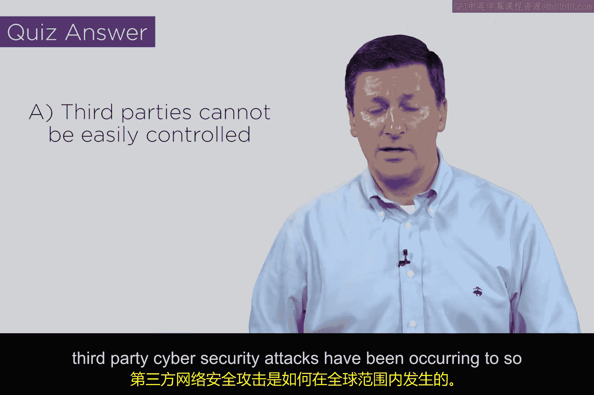

# 128：第三方安全 🔐

在本节课中，我们将要学习网络安全中的一个重要概念：**第三方安全**。我们将探讨什么是第一方、第二方和第三方，理解第三方如何成为企业安全链中的潜在薄弱环节，并分析典型攻击是如何发生的。

## 概述：什么是第三方？

首先，我们来明确几个核心概念。在商业关系中，**第一方**指的是你自己或你运营的企业。**第二方**是你的客户，即购买你产品或服务的人。而**第三方**，则是那些支持你为客户提供服务的外部组织。

以下是常见的第三方类型：
*   **专业服务方**：例如律师、审计师、营销专家或顾问。
*   **业务支持方**：例如客服中心、供应商。
*   **技术合作方**：例如提供特定技术或基础设施支持的公司。

这些第三方存在的唯一目的，就是帮助你更好地服务你的客户。

## 核心视角：客户如何看待你与第三方？

理解各方关系后，我们需要掌握一个关键视角。对你（第一方）而言，第三方是一个与你连接的外部组织，它在做自己的事情。然而，对你的客户（第二方）来说，**你（第一方）和你的所有第三方，在他们眼中是一个整体**。

举例来说，当客户走进手机店购买一部iPhone和5G服务时，他们完全不会关心，也不应该关心，这家公司使用了哪个第三方的技术支持中心。如果因为该第三方被黑客攻击而导致客户信息泄露，客户只会追究他们直接打交道的对象——也就是你——的责任。客户会认为：“我走进了你的商店，购买了你的产品和服务，你就是我的供应商。你选择使用第三方，那是你的问题。”

这个责任归属在业界有时会被混淆。当第一方因第三方被攻击而遭受损失时，他们可能会试图将责任归咎于第三方。但从客户的角度看，这种指责是站不住脚的。

## 风险如何产生：第三方的访问通道

那么，第三方安全风险具体是如何产生的呢？风险始于**第三方需要访问公司内部系统**。

假设有一个公司 `order.com`，它需要接入你的企业网络来支持某些订单处理环节。为了实现这一点，你的企业防火墙边界必须为它打开一个特定的访问端口，通向某个**网关**。

这个网关可能会进行一些基本的验证，例如检查IP地址或要求输入密码。一旦验证通过，第三方就会被放入内部网络（LAN），并获得访问某个生产系统（例如订单服务器）的权限。

这里就出现了安全漏洞：理论上，第三方应该只能访问指定的订单服务器。但是，**是什么阻止他们转向访问其他系统，比如财务服务器呢？** 答案取决于你部署的内部安全措施。

## 内部安全防御的挑战

你可能会说：“我们内部有安全措施。”这正是问题的关键。**你必须部署这些安全措施**。我们之前课程中学到的所有工具都可以派上用场：

*   **身份验证**：确保只有授权人员能访问特定资源。
*   **防火墙（内部）**：在网络内部划分区域，控制流量。
*   **加密技术**：保护传输中和静止的数据。
*   **入侵检测系统**：监控异常活动。
*   **日志文件与安全信息事件管理**：用于审计和事件分析。

然而，实施内部安全并非易事。传统的安全模型通常建立在“边界防御”思想上，即认为内部是可信的，外部是不可信的，大部分安全资源都集中在内外之间的**隔离区**上。但当你允许外部第三方进入内部网络后，你就面临着一个风险：一个被攻破的、不满的或恶意的“内部”人员（此时第三方就相当于内部人员）可能造成巨大破坏。

第三方的情况尤为棘手，因为你允许进入的是一群**你无法直接管理**的个人。你不清楚他们的背景、招聘流程，也不了解他们自身局域网的安全状况。尽管你可能要求他们填写合规表格或进行风险管理，但你对他们知之甚少。一旦他们进入你的网络，理论上他们可以尝试转向任何地方。

## 典型攻击模式与总结

历史上，许多大规模的攻击正是利用了这个弱点。其基本模式可以总结为：
1.  第三方通过专门开放的网关端口获得企业网络访问权限。
2.  通过身份验证后，他们进入了受信任的内部区域。
3.  他们本应访问目标系统（如订单网络），但却利用内部安全措施的不足，转向攻击其他关键系统（如财务服务器）。

关于第三方安全风险的最佳描述，核心在于：**第三方涉及你作为第一方无法完全控制的基础设施、人员和流程**。你可以尝试施加影响，但很难做到完全有效。

本节课中，我们一起学习了第三方安全的概念。我们明确了第一方、第二方和第三方的定义，理解了客户视角下三方的一体性，分析了第三方通过特定通道接入企业网络后可能引发的内部安全风险，并回顾了相应的防御工具和挑战。希望这节课能帮助你清晰地认识到，为何第三方安全问题已成为全球众多企业面临的重要网络安全威胁。