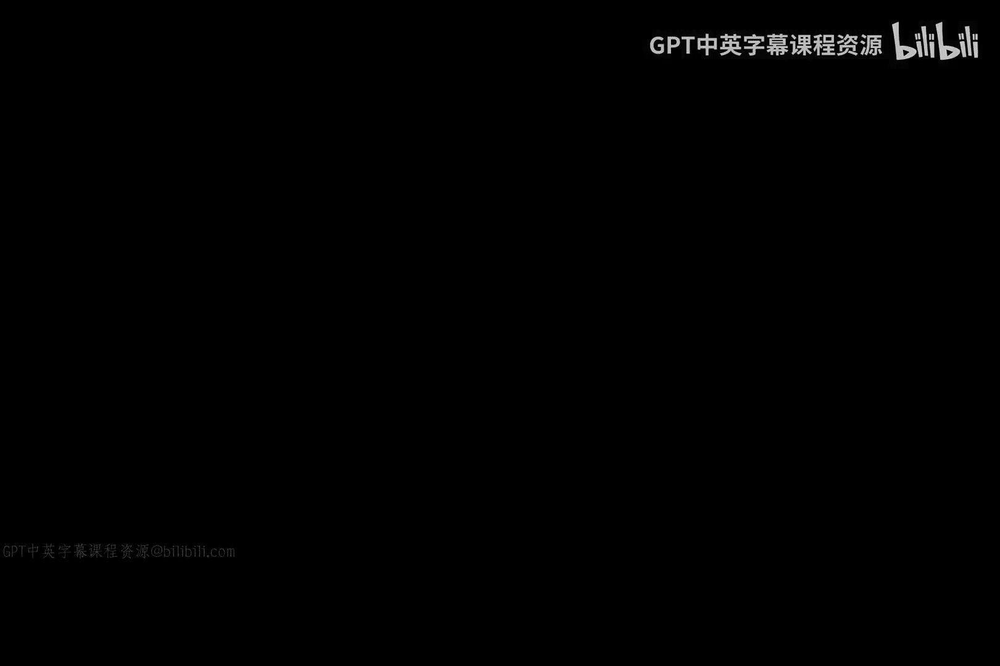

# 129：目标公司APT攻击剖析 🔍

在本节课中，我们将通过分析2014年发生在美国零售巨头目标公司（Target）的真实安全事件，来学习高级持续性威胁（APT）与针对性攻击的核心概念。我们将探讨攻击的路径、后果，并思考其对现代企业的启示。

## 事件背景与攻击路径

上一节我们概述了本节课的主题，本节中我们来看看目标公司遭遇的具体攻击情况。2014年1月，目标公司与其他许多企业一样，成为一次高级持续性威胁（APT）与针对性攻击的受害者。此次攻击的关键在于利用了第三方关系。

攻击的具体路径如下：
1.  **利用第三方访问权限**：攻击者首先通过为目标公司第三方合作伙伴设置的网关获得了初始访问权限。
2.  **横向移动**：在侵入网络后，攻击者实施了横向移动，最终定位到公司的信用卡处理系统。
3.  **数据窃取**：当时（2014年）美国仍普遍使用磁条刷卡技术，该系统会以明文形式暴露信用卡号。攻击者窃取了这些数据。
4.  **数据外泄**：被盗数据通过未进行恰当过滤的网关外泄至公司网络之外。

需要强调的是，以此为例并非为了批评目标公司。此类事件在众多公司中都曾发生，此案例具有很强的代表性，揭示了当时普遍存在的安全挑战。

## 网络攻击对企业的双重影响

了解了攻击如何发生后，我们来看看此类事件对企业造成的后果。作为网络安全专家，我们需要思考网络攻击对业务的影响，这超越了单纯的技术层面。其影响主要可分为两类：

以下是两种主要的影响类型：
*   **机密信息泄露**：例如信用卡号、客户数据等敏感信息的披露。
*   **业务运营完整性受损**：即攻击扰乱或破坏了企业的正常运作。

### 影响一：信息泄露与“安全疲劳”

近年来，像目标公司这样泄露用户个人信息的案例屡见不鲜，甚至让人感到麻木。这种现象被称为 **“安全疲劳”** 。当泄露事件接二连三地发生时，公众可能会产生“隐私已无从谈起”的无奈感，但业务和生活通常仍会继续。例如，如果此刻我们的授课视频被窃听，虽然令人不悦，但课程仍可继续进行。

### 影响二：破坏性攻击与业务瘫痪

第二种影响则更具破坏性。此类攻击会导致企业无法正常运转，例如系统被破坏、网络被摧毁、记录被删除或访问被阻断。设想如果黑客能在我们录制课程时关闭灯光、摄像头和所有设备，那么课程将被迫中止，无法继续。这种破坏性攻击造成的瘫痪状态必须立即处理，企业无法视而不见。

## 未来趋势与总结

综合以上两种影响来看，我们未来可能会见证一个趋势转变：从常见的**信息泄露**攻击，转向更多后果严重的**破坏性**攻击。例如，美国索尼影业曾遭受的攻击就对其业务运营造成了实质性的破坏。再比如**勒索软件**攻击，它能直接导致业务瘫痪，后果更为严重，企业必须正面应对，无法简单回避。

本节课中，我们一起学习了目标公司APT攻击的案例。我们剖析了攻击如何通过第三方渠道渗透，并重点讨论了网络攻击对企业造成的两类主要影响：**信息泄露**与**运营破坏**。理解这种从“披露”到“破坏”的潜在趋势，对于构建更具韧性的网络安全防御体系至关重要。