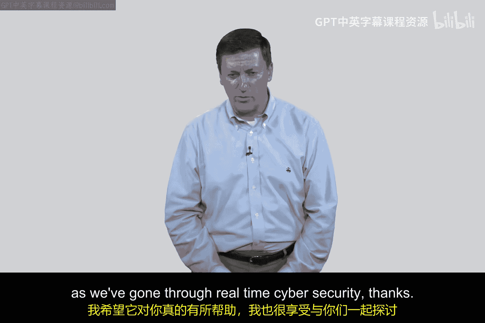

# 134：实时网络安全行业概述 🛡️

在本节课中，我们将对实时网络安全这一主题进行总结，并了解保护一个典型企业所需的全方位控制措施。我们将通过一个综合性的图表，概览网络安全领域的六大类关键控制措施。

## 课程回顾与引入

在前面的课程中，我们探讨了防火墙、数据包过滤、DMZ架构、安全信息与事件管理（SIEM）系统以及代理服务器（SOCKS）等实时网络安全的核心组件。这些内容构成了网络安全防御的基础。

然而，保护一个企业网络远不止于此。这是一个极其复杂且内容丰富的领域。为了全面了解所需的各种控制措施，我们将参考一个综合性的行业框架。

## 网络安全控制措施全景图

以下图表展示了保护企业基础设施所需关注的六大类、共计约50种不同的网络安全控制措施。这个框架可以作为您规划长期学习路径的参考地图。

图表中的六大控制类别包括：

1.  **入侵检测与防御**：监控和阻止恶意网络活动。
2.  **防火墙**：在网络边界执行访问控制策略。
3.  **统一威胁管理**：将多种安全功能（如防火墙、入侵防御、反病毒）集成到单一设备中，尤其适用于小型企业。
4.  **安全信息与事件管理**：对安全日志和事件进行集中收集、分析和报告。
5.  **网络访问控制**：确保只有合规的设备才能接入网络。
6.  **其他专项控制**：包括数据丢失防护、加密、身份管理等。

## 深入学习建议

如果您希望在本课程之外进行更深入的自学，并立志成为网络安全领域的专家，以下资源和建议可能会对您有所帮助。

*   **深入研究图表**：您可以逐一研究图表中列出的约50个控制领域，确保自己对每个领域都有基本的了解。
*   **下载免费报告**：您可以访问 `tagd.cyberber.co` 下载一份免费的三卷本PDF报告。该报告包含了这张图表以及更详细的信息，能为您提供宝贵的参考资料。

## 课程总结 🎯

本节课中，我们一起回顾了实时网络安全的核心内容，并借助一个行业全景图，概览了保护现代企业所需的全方位安全控制措施。从基础的防火墙到综合性的统一威胁管理，网络安全是一个需要持续学习和实践的广阔领域。希望本课程对您的学习有所帮助，也感谢您一同探索实时网络安全的奥秘。

