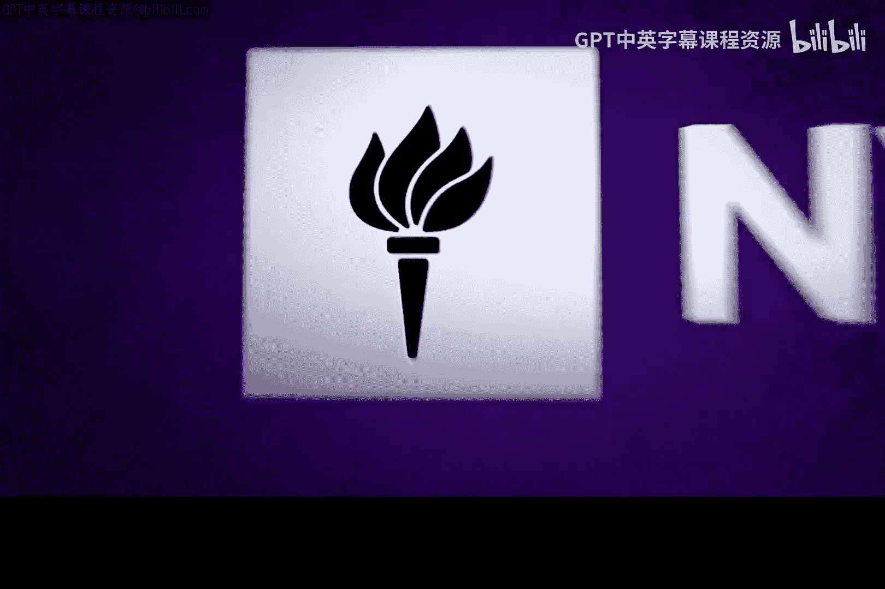
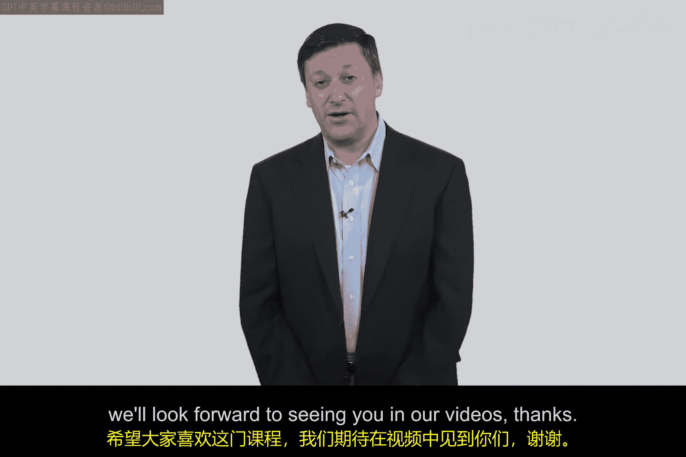
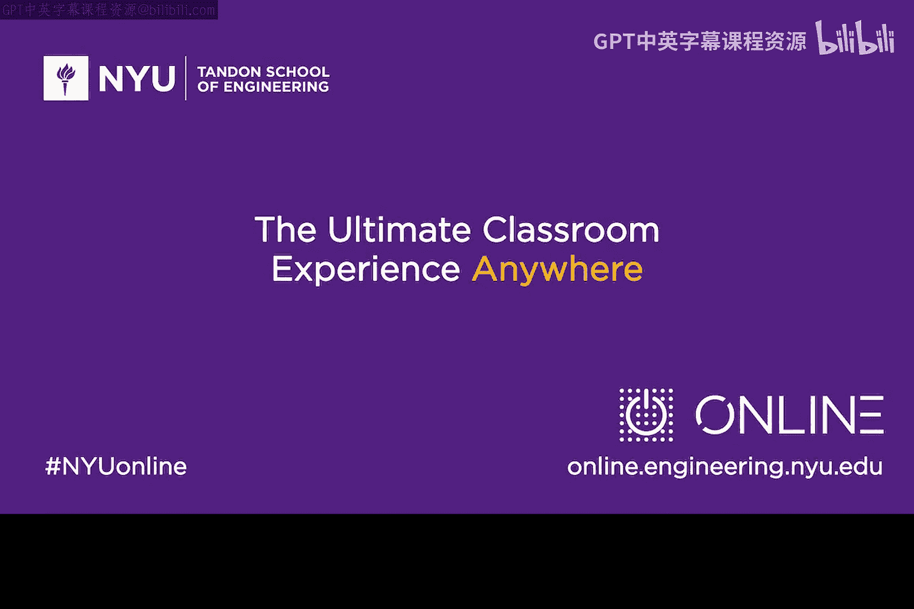

# 137：课程介绍与学习目标 🎯

在本节课中，我们将了解《网络安全高级主题》这门课程的整体框架、核心目标以及你将学习到的具体内容。

大家好，我是Ed Ammarosso，欢迎大家学习这门关于网络安全高级主题的课程。

本课程主要旨在实现三个核心目标。

## 课程三大目标 🎯

以下是本课程希望达成的三个主要目标。

1.  **介绍高级主题**：本课程将向你介绍网络安全领域的一系列高级议题。这是一个充满活力的领域，不断有新的问题涌现。课程内容将涵盖从企业安全意识，到政府和企业的治理、风险与合规平台及方法，再到云安全高级主题等多个方面。
2.  **奠定实践基础**：本课程的重点不在于理论，而在于帮助你将这些知识应用到真实的技术场景中，为你打下坚实的实践基础。
3.  **激发长期兴趣**：我希望能够激发你们中一些人对这个领域的长期兴趣。如果你们中至少有一人因为看到课程中的某些内容而点燃兴趣，并由此开创了新的职业机会和热情，我将感到非常高兴。

## 核心内容聚焦 ☁️

上一节我们概述了课程目标，本节中我们来看看一个特别重要的内容模块。

我认为**云安全高级主题**在当前环境下尤为相关，因为无论是个人、小型企业、大型企业还是政府，都在向云服务迁移。因此，我们将在本课程中花费一些时间来学习这方面的知识。

我希望你们能享受这门课程，并期待在后续的视频中与大家相见。

谢谢。

---

本节课中，我们一起学习了《网络安全高级主题》课程的核心目标，包括介绍前沿议题、建立实践基础以及激发学习兴趣，并特别明确了云安全将是本课程的重点探讨领域之一。