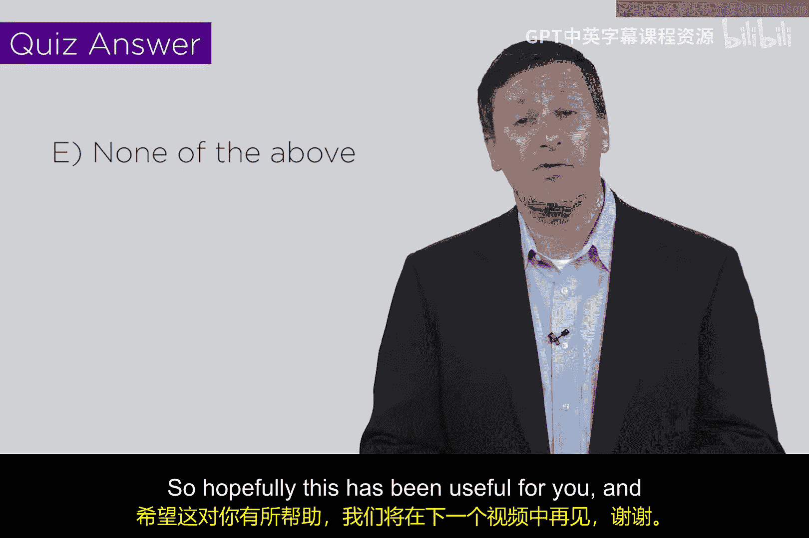
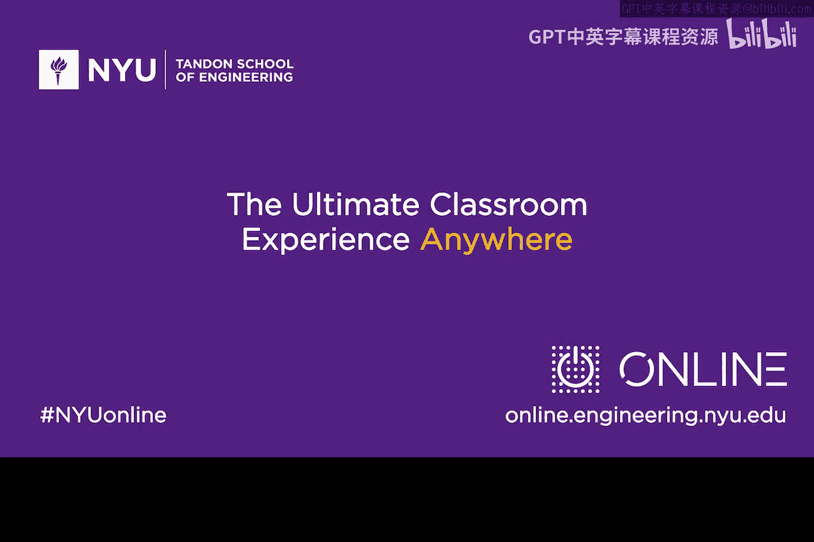

# 139：社会工程学攻击 🎭

在本节课中，我们将要学习一种特别棘手且隐蔽的攻击类型——社会工程学。这种攻击并非直接利用技术漏洞，而是巧妙地利用人与人之间的信任关系来达成目的。

## 概述：什么是社会工程学？

社会工程学是一种相对较新的现象。在几十年前，商业活动中并不常见此类攻击。然而近年来，黑客、欺诈者、犯罪分子，甚至一些出于好奇的年轻人，开始利用企业在服务客户时建立的信任关系进行攻击。

## 社会工程学攻击的原理 🎯

上一节我们介绍了社会工程学的概念，本节中我们来看看它的具体运作方式。

许多企业都设立了友好的客服热线，由面带微笑、态度友善的工作人员为客户提供帮助。这些客服人员的职责就是提供协助，例如帮助客户查询账户信息、处理订单或核对余额。

社会工程学攻击者正是利用了这种“乐于助人”的企业文化。攻击者会伪装成合法客户（例如爱丽丝）致电客服，试图套取敏感信息。从本质上说，这是一种欺骗行为。

黑客们已经形成了一套成熟的攻击方法学。例如，在致电“XYZ银行”之前，攻击者会事先研究该银行的网站，了解其部门名称和内部术语。这样，无论他是伪装成客户还是内部员工，都能在通话中显得知情且可信。

以下是进行此类“定向攻击”或“鱼叉式攻击”的常见准备步骤：
*   研究目标公司的官方网站。
*   浏览目标人物的社交媒体页面。
*   收集目标的家庭住址、电话号码或电子邮箱等信息。

通过获取这些背景信息，攻击者可以从一个“知情者”的角度发起通话，大大提高了欺骗的成功率。

## 物理信息收集：翻垃圾 🗑️

除了电话欺骗，还有一种相关的物理攻击方式，其目标不是与人通话，而是寻找被丢弃的纸质文件或报告，这些信息可用于后续攻击。

在这个领域，有一个经典的术语叫“翻垃圾”（Dumpster Diving），即潜入企业或个人的垃圾箱中寻找有用信息。同样，这也形成了一套“方法论”。

例如，一些年轻人翻垃圾时，会携带一些纸箱散落在垃圾箱周围。如果被保安或警察发现并质问，他们可以声称“我正在找搬家用的纸箱”，这看起来是一个合理的借口。

另一种方法是假装寻找食物。攻击者可以随身携带一个用锡纸包好的三明治，当被发现时，就咬一口三明治，制造出“我只是在垃圾堆里找吃的”的假象。

这些 plausible deniability（看似合理的推诿）手段，都是为了在翻垃圾时不被当场抓获。社会工程学攻击也常常运用类似的心理学技巧。

## 防御的困境与挑战 🛡️

上一节我们了解了攻击手法，本节我们来探讨为何这类攻击如此难以防范。

这类攻击之所以棘手且令人无法接受，是因为其解决方案往往要求我们改变“信任他人”的商业模式。

对于翻垃圾，合理的防御措施是粉碎敏感文件，并通过实体安保来阻止此类物理接触攻击。

然而，对于社会工程学，防御意味着需要训练客服人员“不要过于热心”，要对来电者保持怀疑，秉持“人性本恶”而非“人性本善”的假设。这从根本上改变了商业乃至社会的互动方式：通话的目的从“我真心想帮助您”变成了“确保您不会黑我”。

因此，社会工程学和翻垃圾之所以难以应对，是因为它们利用了企业与客户之间最基本的信任关系。

## 小测验与总结 📝

这里有一个小测验，但答案是“以上都不是”。目前提到的选项都不符合社会工程学的真实情况。

正如我们所说，社会工程学利用了企业对用户的信任。而不幸的是，在许多情况下，解决方案在某种程度上降低了这种信任度。

本节课中我们一起学习了社会工程学攻击的核心原理、其实施方法（如信息搜集和翻垃圾），以及它为何如此难以防御——因为它攻击的是人际信任这一社会基础。希望本教程对您理解这种非技术层面的安全威胁有所帮助。