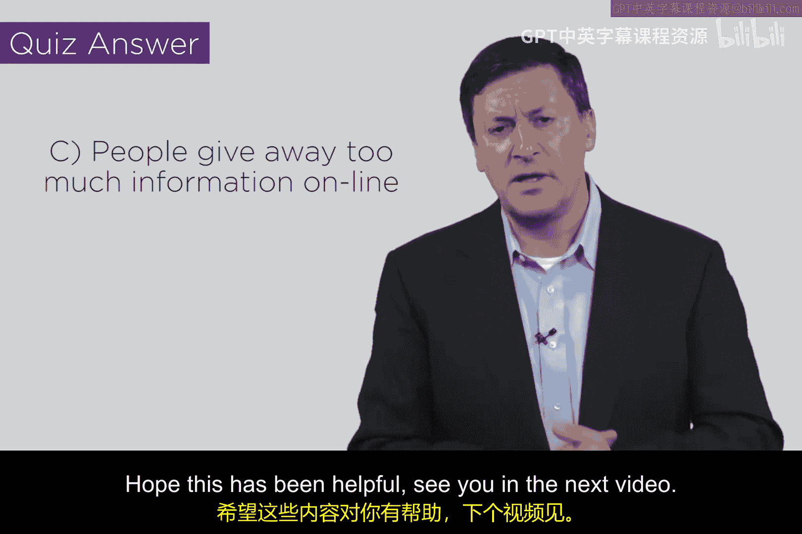
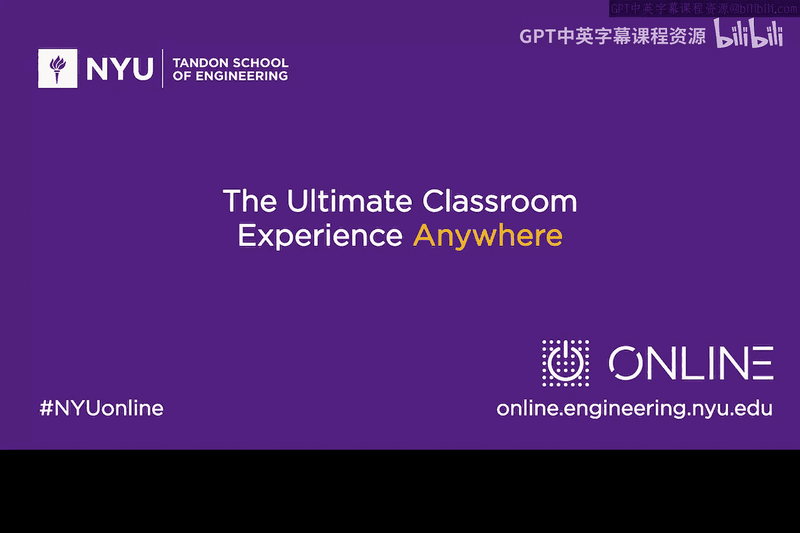

# 140：钓鱼攻击 🎣

在本节课中，我们将要学习一种名为“钓鱼攻击”的网络安全威胁。我们将探讨其工作原理、常见变体以及为何这种看似简单的攻击方式却如此有效和危险。

## 概述

钓鱼攻击是一种利用电子邮件等开放通信协议进行欺骗的网络攻击。攻击者伪装成可信的实体，诱使受害者执行特定操作，例如点击恶意链接或下载恶意软件。这种攻击之所以“高级”，是因为其成功率极高且变体繁多。

## 钓鱼攻击的原理

上一节我们概述了钓鱼攻击，本节中我们来看看其核心工作原理。

互联网的电子邮件协议本质上是开放的。任何人都可以相对自由地交换电子邮件。这种旨在促进沟通的开放性和信任感，恰恰被钓鱼攻击所利用。

电子邮件主要分为两类：一类是日常通信邮件，另一类是要求你执行某些操作的邮件。例如，银行可能发邮件要求你更新信息，或公司IT管理员发邮件要求你点击链接或下载文件。多年来，许多企业的系统管理都高度依赖电子邮件。

当攻击者识别出这种“握手”关系（例如银行与客户之间）时，他们就可以伪造一封看起来非常“官方”的邮件。他们可以复制特定银行或管理员的徽标、外观、字体和语气，使其看起来真实可信。

## 伪造发件人

不幸的是，在互联网上伪造电子邮件的“发件人”也相对容易。支持电子邮件的基础设施协议（在邮件服务器间传输数据）与应用层内容（如邮件中的“发件人”行）之间并非紧密绑定。虽然存在像 **DMARC** 这样的协议可以加强这种绑定，但它并未被广泛采用。

因此，攻击者可以轻松创建一封看起来官方、且似乎来自合理地址的邮件。如果他们觉得直接伪造有困难，还可以注册一个与目标域名相似的“相邻域名”或“兄弟域名”来发送邮件。

## 鱼叉式钓鱼

攻击甚至可以更糟，因为攻击者可以采用一种名为“鱼叉式钓鱼”的技术。与广撒网不同，鱼叉式钓鱼针对特定目标进行深入研究。攻击者可能研究你，例如，如果你是一家公司的首席财务官，他们会制作极具针对性的内容，从看似合理的地址发送，诱使你执行操作。

他们想让你做什么呢？通常是**下载恶意软件**。如何实现？通过让你**点击一个受感染的链接**。这就形成了一个紧密的攻击闭环。因此，我说它看似简单，实则相当“高级”，需要攻击者进行精心准备。

## 防御措施与挑战

我们应对钓鱼攻击的方式目前还非常笨拙。有一些技术解决方案会检测邮件中可能存在的恶意负载，甚至主动测试和“引爆”URL链接，这很有前景，但此类技术的部署远未普及。

我们通常的做法是尝试培训用户，让他们小心点击的内容，例如将鼠标悬停在链接上，检查地址是否真的来自可信来源（如 `yourbank.com`），而不是奇怪的地址。然而，这种培训效果有限，问题在于无法让每个人都做到这一点。

## 钓鱼攻击的重要性

钓鱼攻击通常被认为是几乎所有高级持续性威胁甚至国家级攻击的第一步。这有点讽刺：一个孩子都能学会的、针对简单协议的攻击技术，却深深嵌入在我们所见的一些最先进的攻击中。因此，它是简单与复杂的奇妙混合。

常言道，如果你是世界上最厉害的窃贼，走到一栋房子前发现窗户开着，你还会花一个小时去解码开锁吗？你只会选择最简单的方式——从开着的窗户爬进去。请记住这一点：攻击者大多会利用他们能做到的最简单的事情，而钓鱼攻击被证明是极其有效的。

大多数人习惯于信任并点击邮件中的链接。如果你收到一封看起来官方、来源合理，并且其中还包含一些与你相关的准确信息的邮件，你点击这个钓鱼链接的可能性就会非常高。不幸的是，我们全球社区都需要努力解决这个问题。

## 小测验与总结

以下是一个小测验，关于鱼叉式钓鱼的最佳描述是：它确实涉及研究特定目标个体，而人们在网上泄露过多信息这一事实，无疑增加鱼叉式钓鱼成功的可能性。

本节课中我们一起学习了钓鱼攻击及其变体鱼叉式钓鱼。我们了解了攻击者如何通过**伪造可信内容**、**使来源看起来合理**，并利用**针对性的研究信息**来组合成一套非常有效的互联网攻击方程。希望本课能帮助你理解钓鱼攻击的机制。

我们下个视频再见。