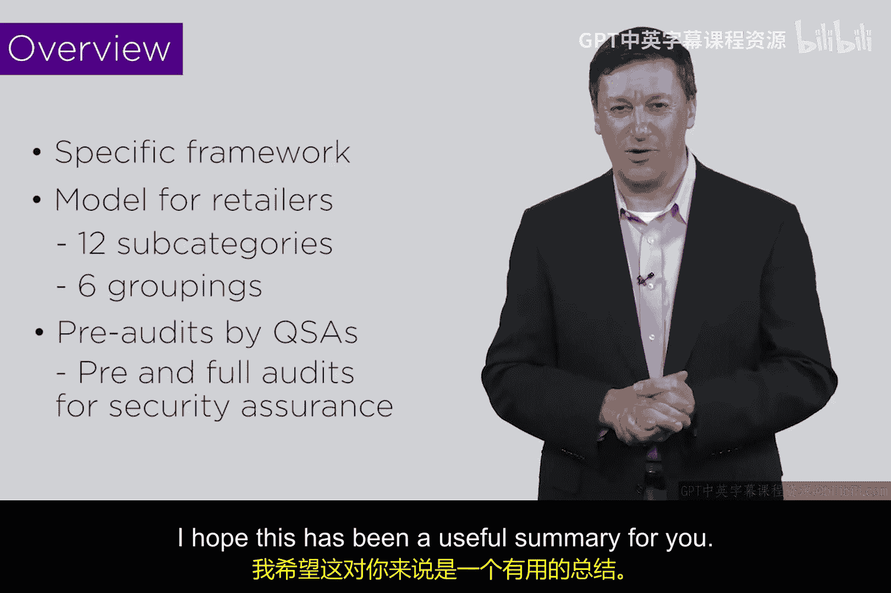

# 146：PCI DSS框架概述 🔐

在本节课中，我们将要学习一个名为**PCI DSS**的特定安全框架。该框架旨在保护支付卡行业的数据安全，减少针对零售业务的网络攻击风险。

## 框架简介与背景

上一节我们介绍了网络安全的基本概念，本节中我们来看看一个专门针对支付卡行业的合规框架。**PCI DSS**代表**支付卡行业数据安全标准**。该框架的诞生，源于过去十年间针对信用卡读卡器、存储零售信息及私人账户数据的服务器攻击事件频发。支付卡行业认为当时的安全状况不可接受，决定必须提升行业安全水平以重建信任，否则用户可能停止使用信用卡，这对行业将是重大打击。

因此，行业制定了这套数据安全标准要求，并强制所有参与支付卡业务的机构遵守。围绕此框架，甚至衍生出一个专门的职业——**合格安全评估员**。

## QSA角色与评估流程

合格安全评估员是一个专门的审计职业。他们的工作包括对企业进行预评估或预审计，检查其是否符合PCI要求；或者进行正式审计，并出具证明，确认特定公司已满足PCI要求。

根据企业在零售行业中所处的角色（例如，是直接处理信用卡的零售商，还是支持该行业的服务提供商），所适用的要求等级也不同。因此，PCI DSS针对不同情况设置了不同的类别。

## PCI DSS的六大控制目标与十二项要求

PCI DSS的要求被归纳为六大控制目标，并进一步细分为十二项具体安全要求。以下是这六大控制目标：

*   **构建并维护安全的网络和系统**
*   **保护持卡人数据**
*   **维护漏洞管理计划**
*   **实施强访问控制措施**
*   **定期监控和测试网络**
*   **维护信息安全策略**

企业需要逐项对照这些要求进行检查，就像使用任何框架一样，目的是发现自身实践与PCI要求之间的差距。如果存在差距，就必须予以弥补。随后需要由QSA进场验证差距已关闭，并生成相应文档。这个过程被称为**安全评估**和**安全审计**：评估是预审计，真正的审计活动则由QSA执行并出具证明。

## 框架的成效与局限

然而，核心问题在于，尽管有这套复杂的体系，零售业黑客攻击事件依然存在。即使是经验丰富的QSA也会指出，**安全评估和审计只能降低风险，无法消除风险**。风险依然存在，但这套体系让情况变得更好，使我们的零售系统更值得信任。

一个重大的改进是从卡片背面的磁条技术转向芯片技术（在欧洲等地是芯片加密码，在美国是芯片加签名）。美国在这方面进展稍慢，直到2016年10月才强制要求商户升级到芯片模式。这项技术变革确实显著降低了风险，是对零售业建立更大信任和保障的真实贡献。但现实是，问题依然存在。由于涉及资金，此类攻击后果非常严重。

本节课中我们一起学习了PCI DSS这一特定安全框架。其核心在于一个包含六大控制目标和十二项要求的模型。QSA会通过预审计和正式审计来为企业出具合规证明，这是企业继续受理信用卡业务的必要条件。整个流程确实在很大程度上降低了风险，但我们必须牢记：它并未根除风险。