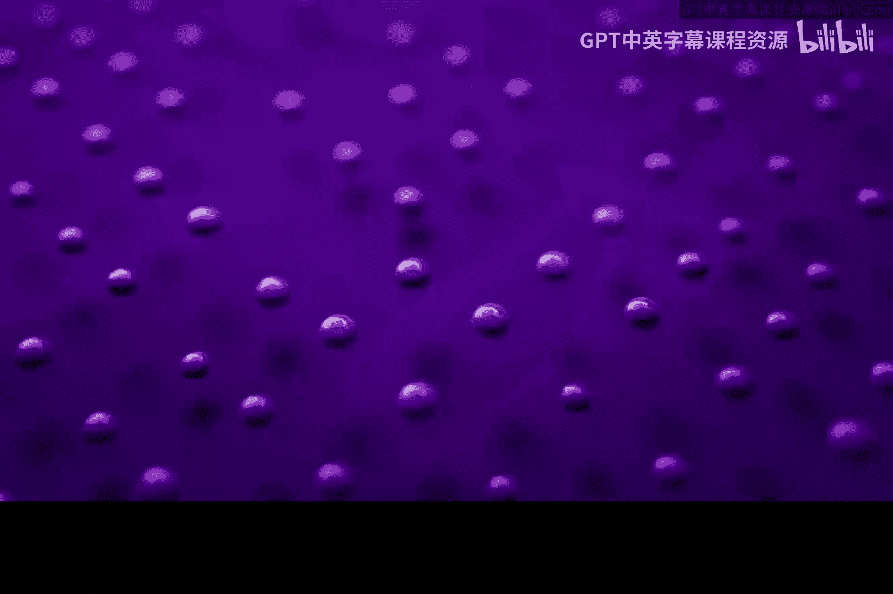
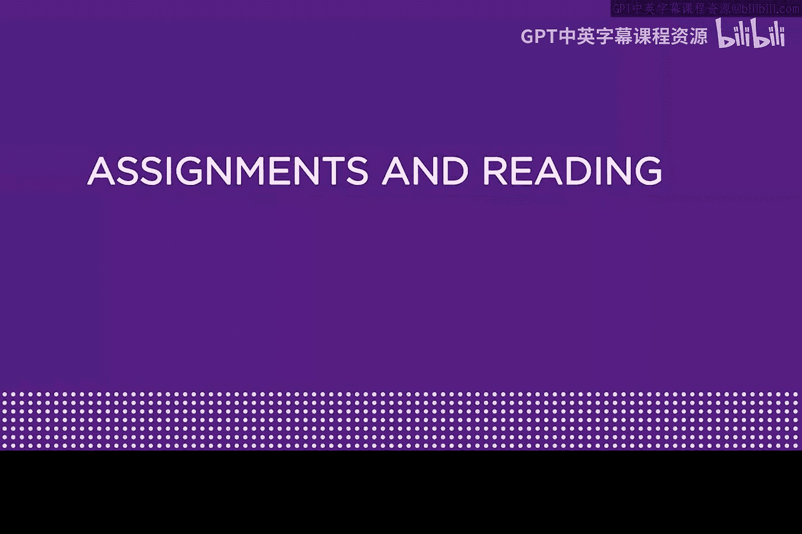
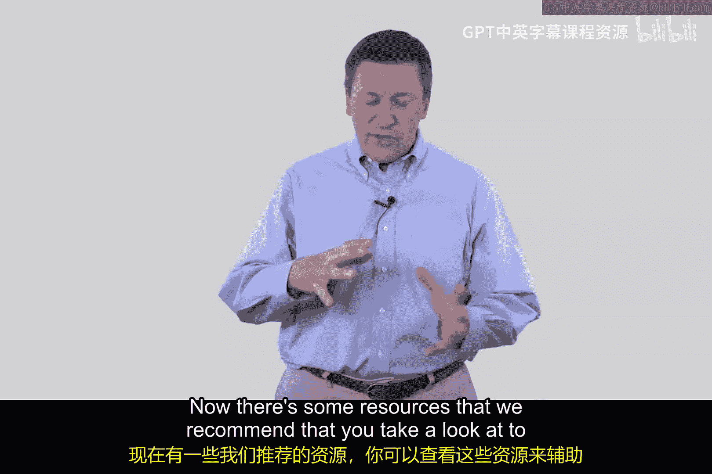
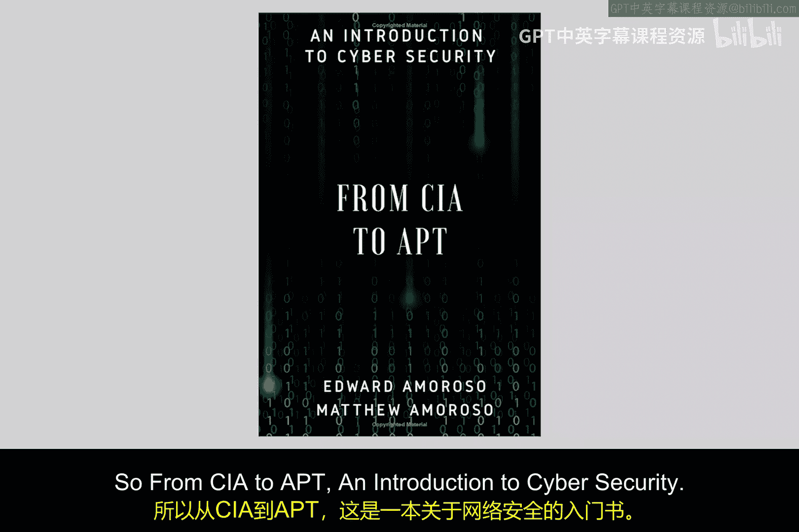
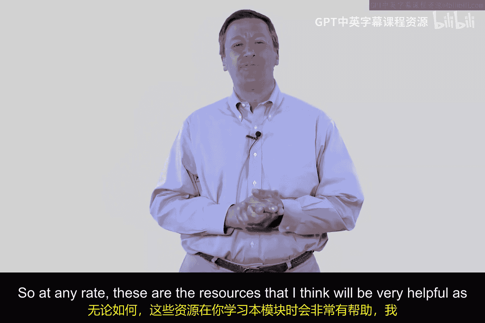
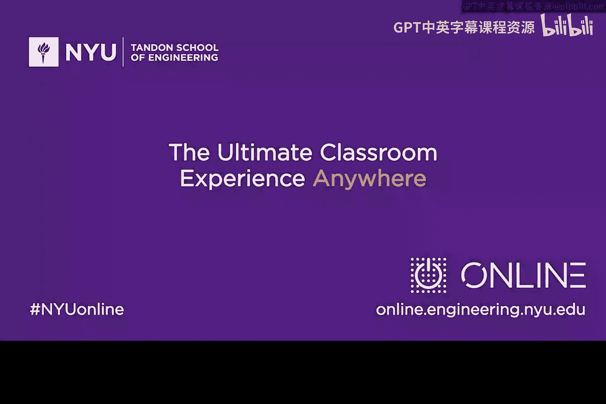

**网络安全导论：模块12：作业与阅读 📚**

在本模块中，我们将介绍一些与云安全、微隔离相关的先进技术，这些技术在现代企业及基础设施网络安全领域非常热门。为了辅助你的学习，我们推荐了一些补充资源。

以下是本模块的推荐阅读材料清单：

*   **一本电子书**：由我与我的儿子Matt合著。此书为可选阅读材料，但你可以在亚马逊上下载。建议你重点阅读其中关于从CIA（保密性、完整性、可用性）到AP（高级持续性威胁）的章节，这能为你提供网络安全的基础背景知识。
*   **一篇论文**：由我多年前为IEEE撰写。这篇论文概述了可用于保护云环境的实用方法，我认为它能完美补充本模块的教学内容。

总而言之，这些资源在你学习本模块的过程中会非常有帮助。希望你能享受本模块的学习。