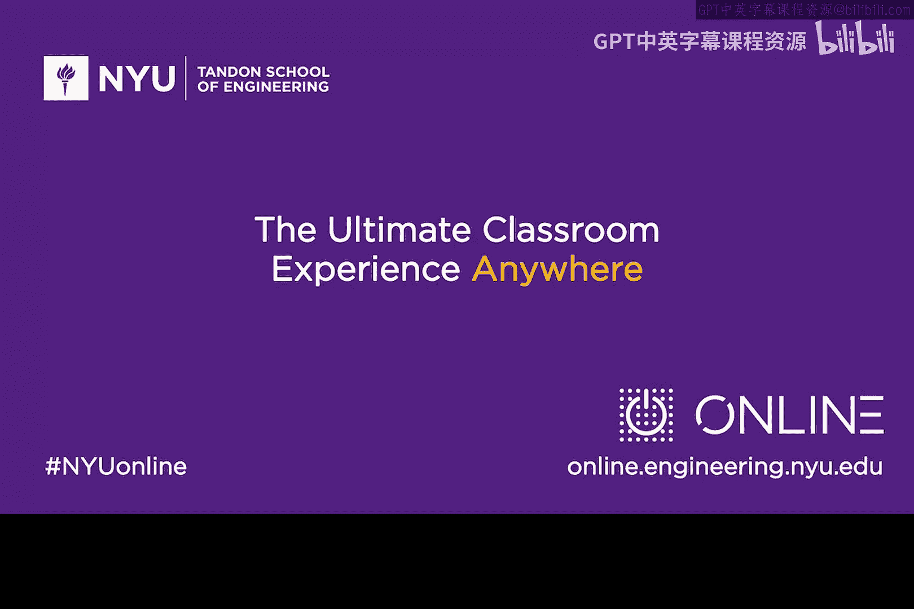

# 151：工作负载微隔离 🛡️


在本节课中，我们将学习一种名为“微隔离”的网络安全技术。这是一种为应用程序或工作负载创建小型、定制化安全边界的方法，尤其适用于混合云和公有云环境。

---

## 从传统边界到云环境的演变

上一节我们回顾了传统的网络安全模型。过去，用户、网络和应用程序都位于一个由防火墙保护的大型网络边界之内。我们通常认为边界内的用户和网络是可信的。

然而，随着向混合云架构的过渡，情况发生了变化。应用程序现在可能托管在云端的虚拟系统上，并通过移动连接进行访问。我们不再拥有一个可以包裹所有基础设施的大型安全边界。

## 微隔离的核心概念

面对这种变化，我们需要新的安全方法。本节中，我们来看看微隔离技术。其核心思想是：**为单个应用程序或工作负载创建一个专属的、小型的虚拟安全边界**。

这就像不再用一堵大墙围住整个园区，而是为园区内的每栋重要建筑都安装独立的门禁和安保系统。

## 微隔离的实现方式

以下是实现微隔离的关键步骤：

1.  **识别工作负载**：首先，确定需要隔离的应用程序或业务功能（例如，人力资源管理系统）。
2.  **部署虚拟安全设备**：利用云环境的虚拟化能力，在目标工作负载前部署软件形态的虚拟防火墙和虚拟入侵防御系统等安全设备。
3.  **定制安全策略**：根据该工作负载的具体需求，配置最小化的、精确的安全规则。例如，一个数据库应用可能只需要开放特定的端口供更新记录使用。

**代码示例：一个简化的微隔离策略概念**
```yaml
workload: hr_database
security_perimeter:
  - virtual_firewall:
      allowed_ports: [3306] # 仅允许数据库端口
      source_ips: ["10.0.1.0/24"] # 仅允许来自特定IP段的访问
  - virtual_ips:
      signatures: ["sql_injection_patterns"] # 仅检测SQL注入攻击
```

## 微隔离的优势与意义

微隔离改变了我们在云环境中实施网络安全的方式。它要求我们更多地关注数据、应用程序和具体的业务活动（即“工作负载”）。

这种方法非常强大，因为它允许：
*   **精细化防护**：安全策略与工作负载的具体需求紧密匹配。
*   **灵活部署**：软件定义的虚拟设备易于在云中快速部署和扩展。
*   **支持云迁移**：为从私有云到混合云，再到公有云的平稳过渡提供了可行的安全框架。

目前，最资深的网络安全团队正在积极探索如何实施微隔离，以保护分散在云中的应用程序。

---

**本节课总结**




本节课中，我们一起学习了**微隔离**技术。我们了解到，它通过为云环境中的每个关键应用程序或工作负载创建独立的、软件定义的虚拟安全边界，实现了更精细、更灵活的安全防护。这是适应现代混合云和公有云架构的重要网络安全理念。