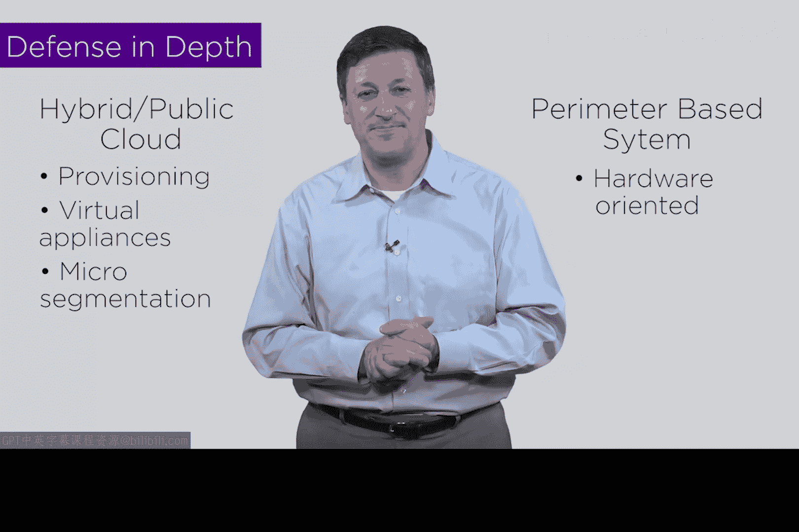

# 152：通过微隔离实现深度防御

在本节课中，我们将学习网络安全中的一个基本概念——**深度防御**，并探讨它如何应用于云环境中的**微隔离**技术。

## 深度防御概念

上一节我们介绍了课程背景，本节中我们来看看深度防御的核心思想。深度防御这个术语本身就表明了其含义：如果我想保护一个资产免受黑客攻击，只设置一层防护措施，那么解决方案的“深度”就不够。一旦黑客突破这层防护，他们就能直接访问资产。

但是，如果我建立两层、三层甚至更多层防护，情况就不同了。其理念在于，即使某一特定防护层失效，只要其他防护层之间存在一定程度的**多样性**，攻击仍可能被阻止。如果所有防护层都相同，黑客一旦找到突破方法，就能通过所有层。但如果它们各不相同，例如一层是门、一层是墙、一层是密码，那么黑客在每一步都需要解决不同的难题或挑战才能通过。

因此，深度防御的理念植根于良好的网络安全架构设计。

## 深度防御示例

以下是深度防御模型的一个具体示例，展示了从黑客到目标资产可能需要突破的多层防护：

*   **第一层：防火墙**。这是攻击者必须突破的第一道防线。
*   **第二层：入侵检测系统**。攻击者需要绕过它，因为它可能会检测到异常活动并触发警报。
*   **第三层：密码验证**。系统会要求输入密码，攻击者可能猜对，也可能猜不对。
*   **第四层：病毒检查**。系统会检查是否存在病毒，这是深度模型中的第四层。
*   **第五层：数据加密**。所有资产数据都可能被加密，即使获得访问权限，数据也无法直接读取。

可以看到，在良好的分层深度防御模型下，从黑客到访问PC或服务器资产的过程，对攻击者而言并不容易。

## 微隔离中的深度防御

上一节我们介绍了深度防御的基本模型，本节中我们来看看这个模型如何在微隔离的背景下发挥作用。

观察下图，可以看到一个用户、第一道防御层（云服务提供商的物理防火墙），以及嵌入在云中的微隔离区。这个微隔离区可以为云中的每个工作负载或应用程序量身定制。

微隔离并非唯一的保护措施。我们还可以部署其他防护，例如物理防火墙。即使在微隔离区内部，也可能存在多个虚拟设备，如虚拟防火墙、入侵防御系统等，理论上可以部署更多防护。

这是一个强大的概念：利用虚拟化技术构建额外的防御层，实现深度防御。这无需依赖硬件，可以通过资源调配轻松完成。

这或许意味着，公有云的安全性可能显著高于我们过去看到的基于传统边界的安全模式。这一点非常重要。

传统的边界安全系统，即使具备一定的深度防御，也主要依赖硬件。随着我们向混合云乃至公有云迁移，我们有可能通过资源调配、使用虚拟设备、利用自带多层防护的微隔离技术，并结合其他类型的保护措施，最终实现一个安全性极高、层次丰富且大部分为虚拟化的结果。

这带来了更低的成本和更高的灵活性。最终，这支持了一个观点：**向公有云迁移实际上比停留在企业内部环境更安全，而非更不安全**。

## 总结

本节课中，我们一起学习了网络安全中的**深度防御**概念。我们了解到，通过部署多层、多样化的防护措施，可以更有效地阻止攻击。随后，我们探讨了如何将这一理念应用于云环境的**微隔离**技术中，利用虚拟化手段灵活、低成本地构建深层防御体系，从而可能实现比传统边界安全更高的安全性。

希望本教程对您有所帮助。我们下节课再见。