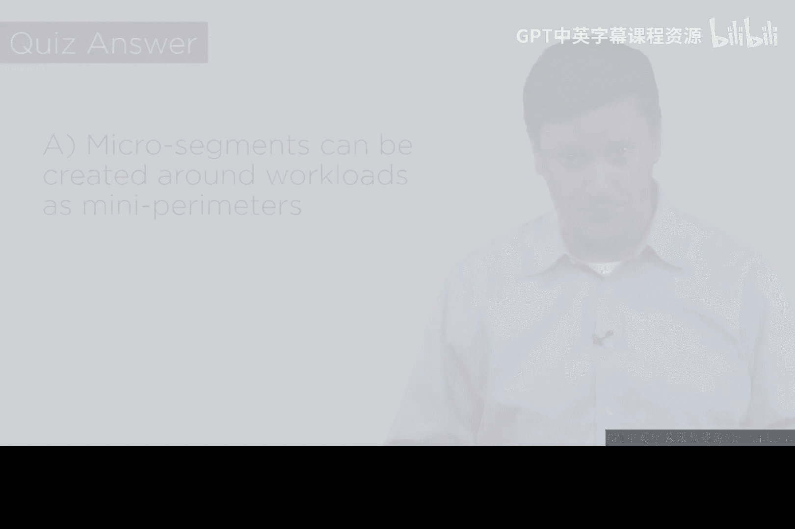

# 154：高级混合云安全架构（第一部分）

## 概述
在本节课中，我们将学习如何构建一个高级的混合云安全架构。我们将从传统的企业边界防护模型出发，逐步将内部工作负载迁移到云端，并利用微隔离技术为每个工作负载提供独立的安全防护。这个过程旨在简化企业边界规则，并提升整体安全态势。

---

## 从传统边界到云端工作负载

上一节我们提到了传统安全模型的挑战，本节中我们来看看如何开始转型。

基本前提是，企业内部运行着虚拟化的工作负载。这里所说的“虚拟”指的是软件，即正在运行的应用程序。这些工作负载位于企业的数据中心和服务器上，但它们通常具备可迁移性。这类能力包括电子邮件、远程访问等。

我们从一个假设开始：这些工作负载位于企业内部，而企业的网络边界存在漏洞。这意味着黑客有可能侵入，这是我们不希望看到的。我们的目标是从这种状态转变为一个环境，其中每个工作负载或资产在云端都成为某种自保护的实体。

因此，我们希望从图表中展示的模型转变——即一个带有缺口的椭圆形边界，内部包含资产——转向我们认为更接近云原生的架构。

---

## 迁移工作负载与实施微隔离

让我们从重新绘制左侧的图表开始，它展示了相同的内容。我将首先选择其中一个名为“外包服务”的工作负载。

也许你有一个网关，所有外包供应商都通过它接入，并提交信息。通常，他们会进入你的企业网络来完成这些操作。但我们的目标是将这个工作负载迁移到某个基于云的虚拟数据中心（图中标注为VDC）。你可以将外包工作负载迁移到那里。

请注意，我们实际上能够简化企业边界的规则集。过去，我们需要一条规则来支持外包服务。现在，我不再需要那条遗留企业网络中的规则。因此，遗留企业的防火墙实际上得到了改善，因为我迁移了某些东西。

那么，如何保护云端那个工作负载呢？我们围绕它构建一个微隔离区。微隔离区再次成为一个“收缩包装”式的虚拟化容器，我们用它来承载外包工作负载，并包含你认为必要的任何安全功能。

这样，我们已经将一个工作负载迁移到了云端。

---

### 迁移更多工作负载
以下是迁移其他工作负载的步骤：

1.  **选择第二个工作负载：电子邮件**
    我们将迁移电子邮件工作负载。在图表中，你可以看到一个指向边界缺口的箭头，标有“电子邮件网关”。当我们把电子邮件工作负载迁移到云端时，观察那个小缺口的变化：它关闭了。边界实际上变得更简单。然后，我们在云端保护电子邮件工作负载：为其构建一个容器化的微隔离区。注意，这可以与外包服务使用同一个云，也可以是不同的。从弹性角度看，如果它们确实在不同的云上会更好。

2.  **选择第三个工作负载：合作伙伴网关**
    这可能涉及许多业务合作伙伴，他们访问某个服务器进行身份验证并获取财务数据，或许通过此网关获得付款。我将做同样的事情。再次注意，箭头指向边界的一个缺口。将其迁移到云端后，我可以简化遗留企业防火墙的边界规则。我将其迁移到第三个云，并围绕它构建一个容器化的微隔离区。

---

## 架构演变与遗留企业的新角色

现在看看我们完成了什么。我们基本上处理了四个工作负载。我将保持“内部资产”不变，因为我们都知道，总会有些应用程序和系统无法迁移到云端。

通过执行所有这些操作，我的企业——即遗留企业——在某种意义上成为了自己托管的云。你的企业因此呈现出公共枢纽的特性。因为面对任何与你合作的实体，你看起来就像一个云。如果他们访问你，那么你就是云。

让我们稍微重新组织一下图表。我们将遗留企业称为托管着一个工作负载。我们可以再次简化它。

观察我们的成果：我们从位于一个边界内的四个工作负载出发，现在为它们构建了微隔离防护（对于迁移到云端的三个），而对于遗留部分，我们简化了之前存在的边界。我们保留了它，但让它变得更好，因为每次我们移出一个工作负载，都可以简化支持该已迁出工作负载的规则集。

如果我足够多地执行此操作，企业边界实际上会变得更好。最终，我得到了四个工作负载：三个新托管在容器中的能力，以及一个留在后方、拥有改进后企业边界的遗留工作负载。这是我们后续可以进行一些设计工作的基础。

---

## 总结
本节课中，我们一起学习了如何从传统的边界防护模型过渡到基于微隔离的云端工作负载架构。我们通过将“外包服务”、“电子邮件”和“合作伙伴网关”三个工作负载迁移到云端，并为其构建独立的微隔离区，简化了原有企业边界的防火墙规则集。同时，我们认识到遗留应用可能无法全部迁移，但可以将其所在的企业网络本身视为一个“云”并优化其边界。这个架构是我们后续在混合云中构建高安全性架构设计工作的基础。在下一部分，我们将基于此进行更深入的设计探讨。