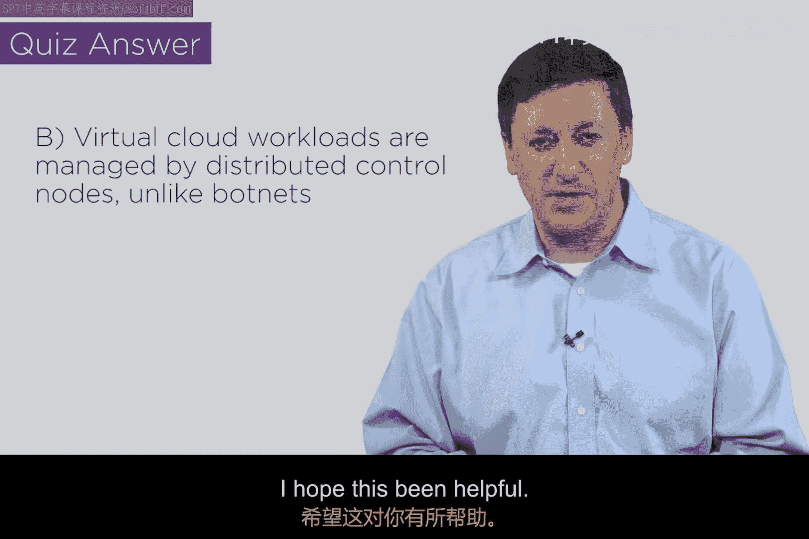

# 156：高级混合云安全架构（第三部分） 🚀

在本节课中，我们将学习如何将之前介绍的云安全组件整合成一个完整的企业级安全架构。我们将看到如何将分布式、微隔离的工作负载与中央控制节点连接起来，构建一个具有超强弹性的未来架构。

---

上一节我们探讨了架构的超强弹性属性。本节中，我们将把这些组件置于一个更真实的全球背景中，并整合成一个完整的体系。

屏幕上最初有5个点：红色点代表中央控制节点，蓝色点代表我们的工作负载节点。这些节点都是从我们早期架构中的工作负载演化而来，它们被微隔离并部署到云端。为了简化，图中没有显示底层的云基础设施。

现在，我们假设这些节点具有地理分布属性。让我们在地图上为这些点找到合理的位置。理想情况下，我们应该将工作负载部署在符合业务逻辑和法规要求的地理位置。

因此，我们将这些节点放置到有实际意义的位置上。红色点代表中央控制节点，蓝色点代表您的工作负载。每个工作负载都是一个独立的、微隔离的组件，可能运行在容器中，并拥有自己的云基础设施。同时，一个CASB（云访问安全代理）可能位于用户和该工作负载之间，提供安全控制。

接下来，我将所有这些概念联系在一起。我们将这些组件逻辑地连接起来，建立网络通信。请记住，它们仍然是相互隔离的网段。朋友们，这就是未来的企业架构。这就是它应有的设置方式。

回想本系列的第一部分，我们最初有一个大的椭圆形“边界”，将所有工作负载放在里面。但这个边界需要开很多“洞”以供访问，因此它并非真正的边界防护。随后，我们将所有工作负载迁移到云端，进行了微隔离，引入了CASB，并使其具备超强弹性。现在，我们将它们托管在全球的逻辑位置，可能在一个国家内，也可能是全球分布，并将它们全部连接起来。这非常强大。

这种架构的运行方式与僵尸网络有相似之处。它具备了僵尸网络的所有弹性特征：自主行为、分布式、虚拟化、超强弹性、安全通信，以及通过中央控制节点或CASB进行回连和控制。但这显然不是僵尸网络，我们并非窃取他人PC的计算资源。

然而，这里的每个点都展现出了一些类似的架构特征。这些特征——分布式、超强弹性——正是我们未来几年构建安全架构时所要借鉴的。这让我们得以一窥未来的发展方向。

以下是未来安全架构的核心特征列表：
*   **分布式部署**：工作负载和控制节点可全球分布。
*   **微隔离**：每个组件都在自己隔离的安全段内。
*   **中央控制**：通过**CNC**或**CASB**进行协调与管理。
*   **超强弹性**：无单点故障，具备自主恢复能力。
*   **安全通信**：节点间采用加密和受控的通信通道。

---

本节课中，我们一起学习了如何将微隔离、云原生的工作负载与中央控制节点整合，构建一个分布式、超强弹性的企业安全架构。我们看到了这种架构与僵尸网络在弹性设计上的相似之处，但也明确了其受控、合法的本质。这为我们指明了未来安全架构的设计方向。希望本课对您有所帮助。我们下个视频再见。