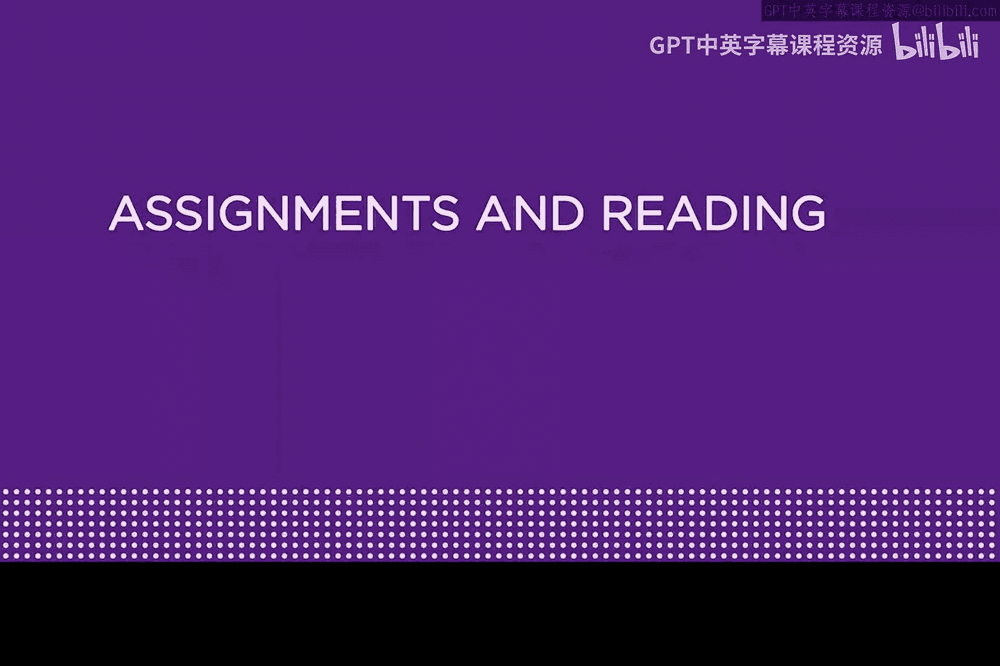
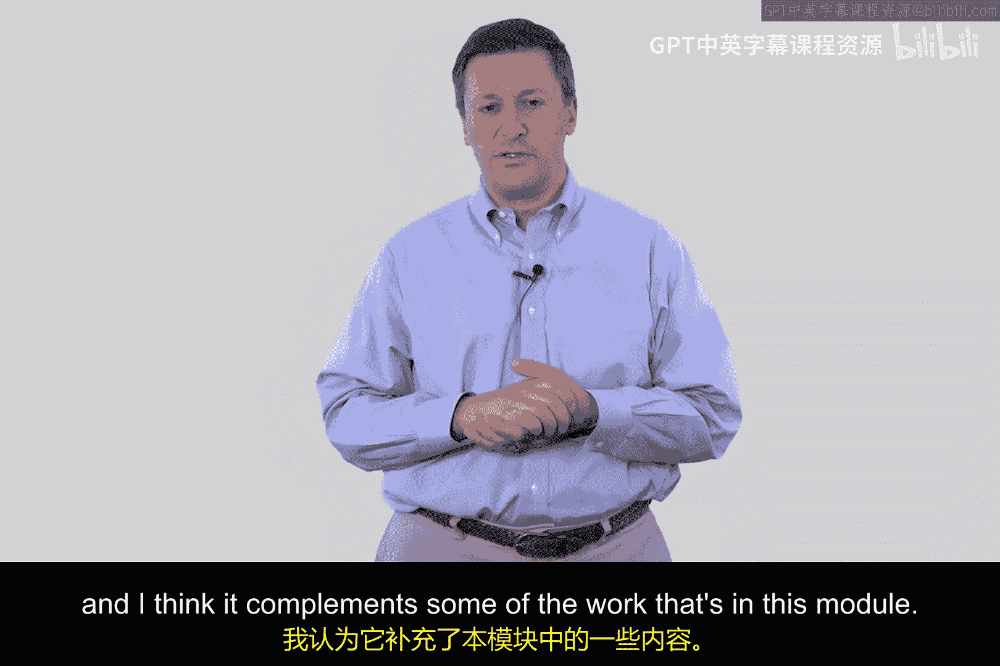
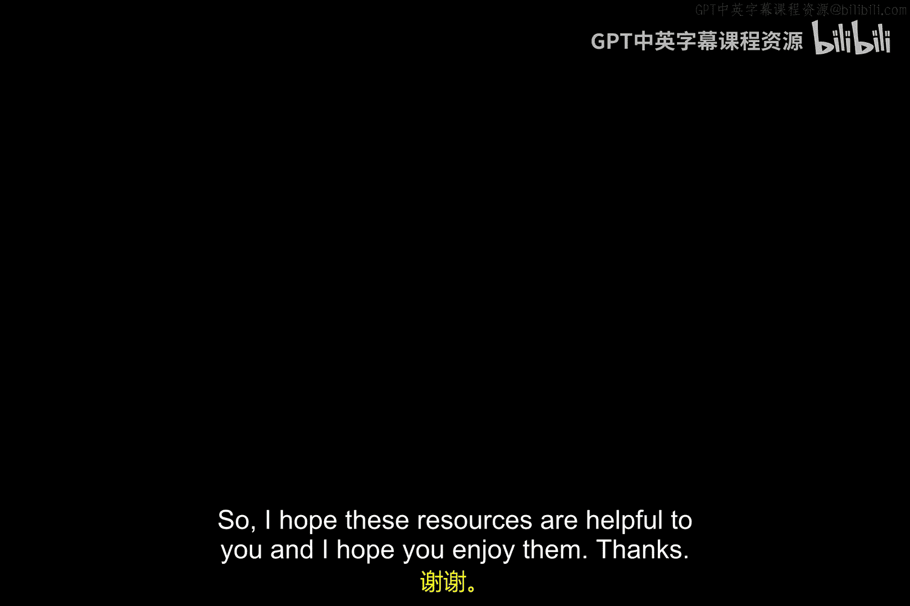

网络安全导论：模块一：电子商务网络安全与区块链基础 🛡️

在本模块中，我们将学习电子商务网络安全的基本原理。要理解这些原理，我们无法绕开区块链技术以及互联网上的一些匿名协议。这些内容非常有趣，相信你会喜欢。

为了帮助你更好地学习，我们推荐以下资源作为补充。

以下是推荐的必读论文：
*   **比特币白皮书**：作者中本聪，标题为《比特币：一种点对点的电子现金系统》。每一位网络安全从业者都熟悉这篇具有里程碑意义的论文，它阐述了比特币及其区块链技术的基本原理。
*   **关键基础设施保护论文**：标题为《关键基础设施面临的常见威胁与脆弱性》，由多位优秀作者撰写。这篇论文概述了关键基础设施保护及其脆弱性，对你将很有帮助。

以下是推荐的可选书籍：
*   **《从CIA到APT：网络安全导论》**：这是一本我与儿子Matt合著的电子书。书中第29章和第30章的内容与本模块的学习高度相关，你可以配合学习。这本书可以在亚马逊上找到。
*   **TCP/IP详解 卷1**：作者Richard Stevens。这是一本我们都需要的TCP/IP参考书。在学习本模块内容时，参考其第29章和第30章会很有益处。

此外，还有一个我非常喜欢的视频推荐给你：亚利桑那州立大学Benjamin Rideella主讲的《HDDIAC关键基础设施保护网络研讨会》。这个演讲非常精彩，能够很好地补充本模块的内容。你可以观看视频来了解这个缩写的具体含义。

希望这些资源对你有帮助，也希望你能享受学习的过程。

---

**总结**

本节课我们一起学习了电子商务网络安全的基础，并认识到区块链与匿名协议是其重要组成部分。我们还列出了包括比特币白皮书、关键基础设施保护论文、相关书籍和网络研讨会在内的核心学习资源，为后续深入理解这些概念做好了准备。