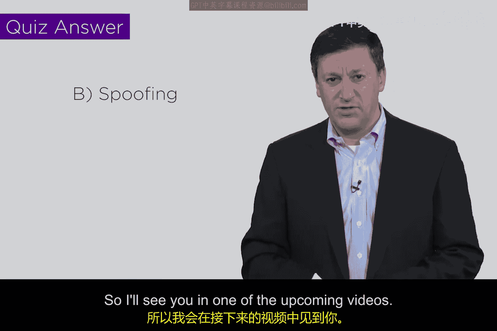

# 160：哈希算法与数字签名 🔐

在本节课中，我们将学习计算机科学和网络安全中一个非常特殊且重要的函数——哈希函数。我们将了解它的核心特性，并探讨它如何作为数字签名的基础，用于验证信息的真实性和完整性。

## 哈希函数概述

上一节我们提到了网络安全的基础概念，本节中我们来看看哈希函数。哈希函数是计算机科学和数学中的一个核心概念。函数将一个集合（称为定义域）中的元素与另一个集合（称为值域）中的元素关联起来。数学家们定义了函数的各种属性和映射特征。

从网络安全分析师的角度来看，哈希函数的关键特性在于：它接收**可变长度的输入**，并产生**固定长度的输出**。输入的长度是可变的，例如你的电子邮件、文档或数据库的大小，取决于具体内容。而输出则是一个固定长度的字符串。

设计哈希函数时，需要确保其值域足够大，以避免“碰撞”的发生。碰撞是指两个不同的输入产生了相同的哈希输出。虽然理论上存在这种可能性，但在实践中通常认为这是不可行的。因此，哈希函数实现了从可变长度输入到固定长度输出的可靠转换。

哈希函数的一个简单例子是校验和，尽管它的值域很小（例如判断奇偶性），但它本质上也是一种哈希，只是安全性不高。在网络安全中，我们使用更强大的哈希函数作为一种实现**数字签名**的手段。

## 数字签名的工作原理

数字签名的妙处在于，它允许我们对电子文档、内容或消息进行签名和认证。让我们通过一个典型的场景来理解其步骤。

假设Alice和Bob已经生成了各自的公钥和私钥对。Alice想生成一条消息发送给Bob并进行签名。她可能是在签署合同或向Bob购买商品，签名目的多种多样。需要注意的是，数字签名本身不保证消息的机密性；如果需要保密，应使用接收者的公钥对消息进行额外加密。

数字签名的核心思想是为消息生成一个“指纹”，这正是哈希函数的用武之地。它允许Alice对她创建的消息`M`运行哈希函数，产生一个输出。我们通常将这个输出抽象地称为`λ`。

过程如下：
1.  Alice撰写消息`M`。
2.  Alice对`M`运行哈希函数，得到哈希值`λ`。
3.  Alice使用她自己的**私钥**对`λ`进行加密。加密内容可能还包含她的姓名、时间戳等信息，但核心是`λ`。
4.  Alice将加密后的签名（和原始消息`M`）发送给Bob。

当Bob收到信息后，他需要验证其真实性。验证步骤如下：
1.  Bob使用Alice的**公钥**对收到的签名进行解密，得到`λ`。
2.  Bob对收到的原始消息`M`**本地**运行相同的哈希函数，得到一个本地哈希值`λ’`。
3.  Bob比较解密得到的`λ`和自己计算出的`λ’`。如果两者匹配，则验证成功。

这种方法的巧妙之处在于：因为只有Alice拥有她的私钥，所以能用其公钥成功解密并得到匹配哈希值的行为，就证明了签名确实来自Alice。这提供了身份认证。

此外，如果消息`M`在传输过程中被篡改，Bob本地计算出的`λ’`就会与Alice发送的`λ`不匹配，从而发现完整性遭到破坏。因此，数字签名在提供**真实性**的同时，也提供了**完整性**保护。

## 哈希的应用与总结

哈希函数支持多种应用，其中最突出的两个是：
*   **数字签名**：提供身份认证和完整性校验。
*   **数据完整性验证**：确保数据在传输或存储后未被更改。

为了测试你对哈希和数字签名的理解，这里有一个小问题：数字签名主要降低了哪种安全风险？答案是**欺骗（Spoofing）**。这正是数字签名的核心目的——确保接收者能够确信信息确实来自声称的发送者，从而有效降低冒充风险。

希望本节课对你有所帮助。在后续的课程中你会看到，哈希函数将成为我们称为**区块链**技术的基础组件之一。

我们将在接下来的视频中继续探讨。