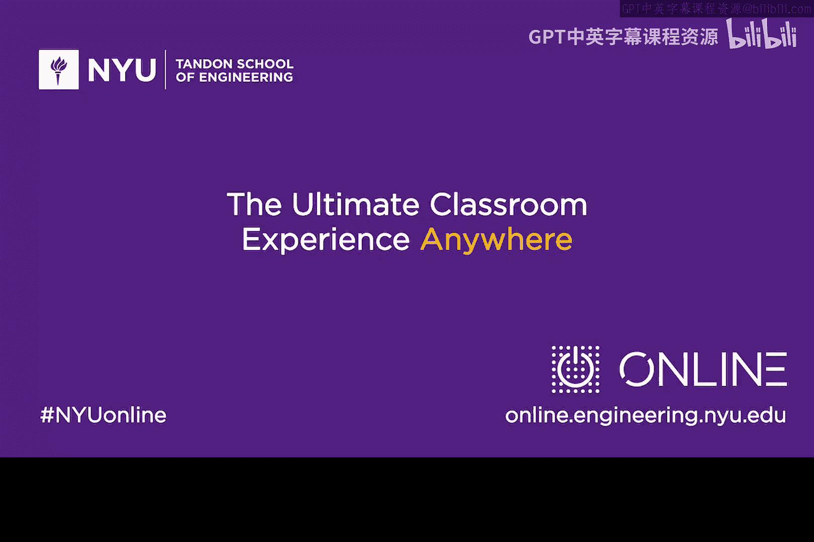

# 165：Chaum盲签名算法 🔐

在本节课中，我们将学习由David Chaum在20世纪80年代提出的一个有趣协议——盲签名。该协议旨在为客户端与服务器之间的交互引入一定程度的匿名性。

## 概述

盲签名的核心思想是，允许一方（如银行）对一份信息进行签名，而无需看到该信息的具体内容。这类似于将一张填写了金额和序列号的支票放入信封，请求银行在不打开信封的情况下签名，然后你再用这张签了名的支票进行支付。银行需要信任信封内的金额是合理的，而盲签名协议巧妙地解决了这个信任问题。

## 协议原理

上一节我们介绍了盲签名的基本概念，本节中我们来看看David Chaum提出的具体协议是如何工作的。

协议的核心步骤涉及客户端（Alice）和服务器（Bob）。Alice希望Bob为一份包含特定金额（例如2美元）和序列号的“数字支票”签名，但Bob不能看到支票的具体内容。协议通过一种巧妙的“批量验证”机制来实现这一点。

以下是协议的关键步骤：

1.  **创建批量票据**：Alice创建大量（例如1000张）结构相同的“票据”。每张票据都包含相同的金额（2美元），但具有**不同的序列号**和**不同的加密密钥**。其结构可以表示为：`票据 = 加密(序列号， 金额， 密钥)`。
2.  **发送票据**：Alice将这1000张加密后的票据全部发送给Bob。
3.  **随机抽查**：Bob随机选择一个数字（例如317），要求Alice提供**除第317张票据外**所有其他999张票据的解密密钥。
4.  **验证抽查样本**：Alice提供这999个密钥。Bob用它们解密对应的999张票据，检查它们是否都符合约定（金额均为2美元，格式正确）。
5.  **签署剩余票据**：如果所有被检查的票据都有效，Bob就有理由相信，那第317张未被检查的票据也是有效的。于是，Bob使用自己的私钥 `S_B` 对这第317张（仍处于加密状态）票据进行签名，然后将签名后的票据发回给Alice。
6.  **使用票据**：现在，Alice拥有了Bob签名过的加密票据。当Alice想向商户支付时，她将这张签名票据连同解密密钥 `K_317` 一起交给商户。商户可以用Bob的公钥验证签名，然后用 `K_317` 解密票据，确认其中的金额和序列号。

这个过程的精妙之处在于概率保证：由于Bob随机选择了一张票据不检查，Alice若想在其中一张票据中作弊（例如放入200万美元），她必须确保恰好是Bob未抽查到的那张票据作弊，而这个概率极低（1/1000）。因此，为了通过检查，Alice最好的策略就是让所有票据都诚实有效。

## 应用与思考

上一节我们详细解析了盲签名协议的工作流程，本节中我们来看看它的应用场景。

盲签名是实现匿名数字现金（如David Chaum创立的DigiCash公司的基础）的关键技术。它允许用户获得银行签名的、面值固定的数字代币，并在支付时保持匿名性，因为银行无法将签名的代币与最终花费它的用户联系起来。

除了数字现金，盲签名协议还可应用于许多需要匿名性或隐私保护的场景：

*   **匿名投票**：选民可以对加密后的选票进行盲签名，确保选票有效且内容保密。
*   **匿名凭证**：用户可以获得证明其具备某种资格（如年龄）的签名凭证，而无需向验证方透露全部身份信息。
*   **隐私保护的数据收集**：用户可以向调查机构提交经盲签名的反馈，确保反馈有效且无法追踪到个人。

## 总结

本节课中我们一起学习了David Chaum提出的盲签名算法。我们了解了它如何通过“批量创建、随机抽查”的巧妙设计，让签名者能够为一份未知内容的信息提供有效签名，同时以很高的概率保证该信息的合法性。这种协议为数字世界的匿名交易和隐私保护提供了强大的密码学工具。