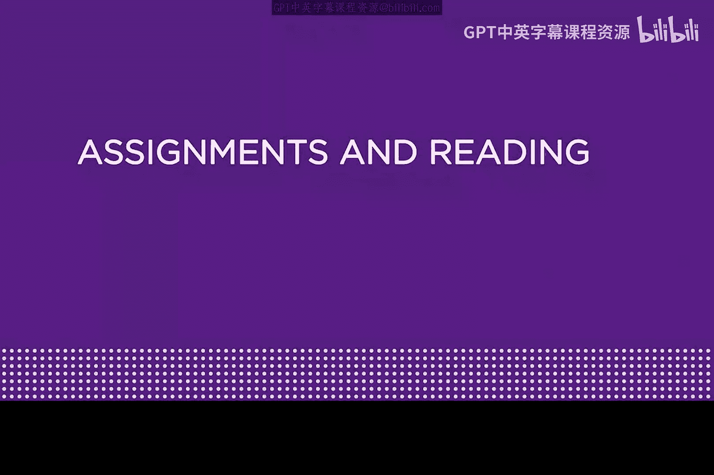
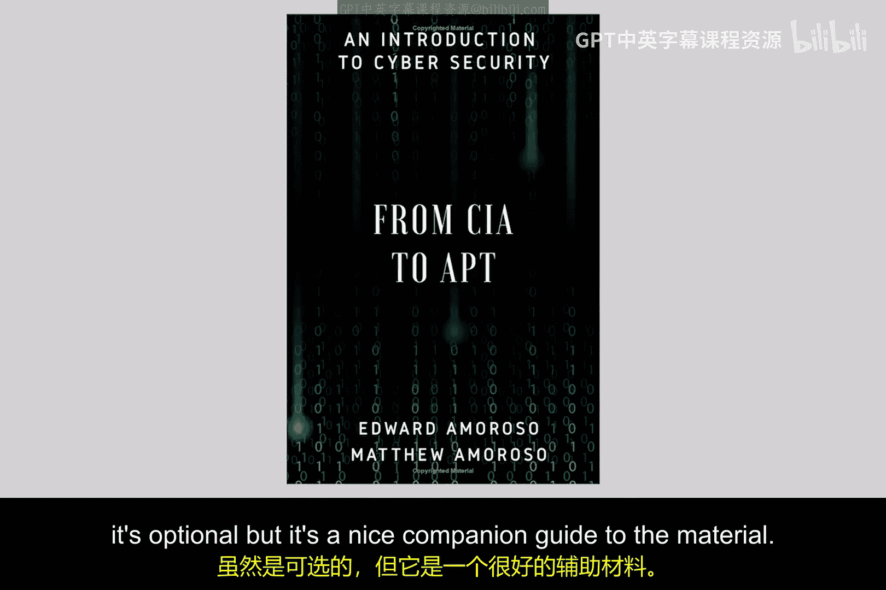
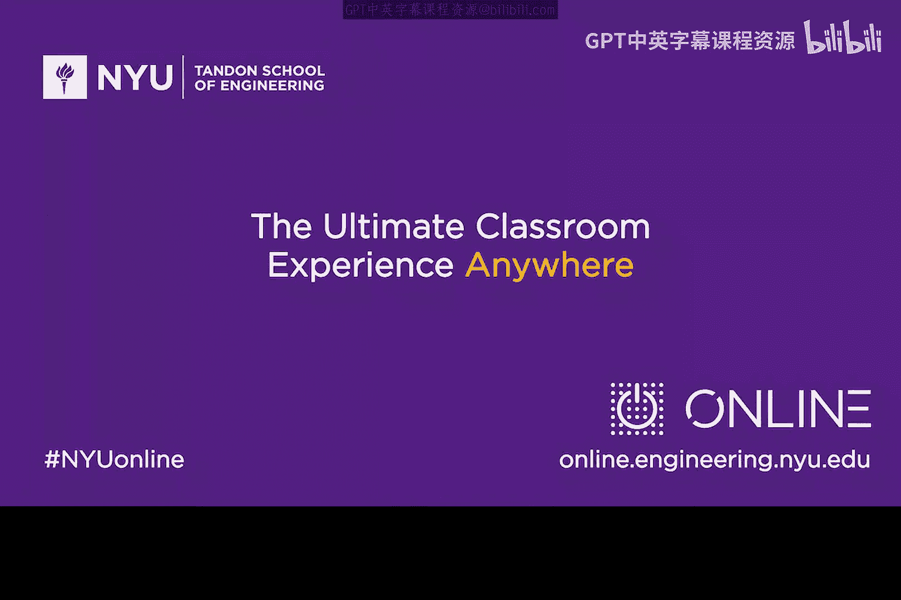

# 169：移动安全、物联网与职业建议 📚

在本模块中，我们将学习一系列不同的主题。我们将介绍移动安全的基础知识，探讨物联网安全，并花一些时间为大家提供网络安全领域的职业建议。这是一个内容丰富的模块，旨在拓宽大家对网络安全应用领域的认识。

为了辅助大家的学习，我们推荐一些额外的资源，包括论文、可选书籍和一个视频。

以下是推荐的阅读材料：

*   **论文**：有一篇关于“洋葱路由”的经典论文。如果你使用过Tor浏览器，那么你其实已经在不知不觉中使用洋葱路由技术匿名访问互联网了。这篇论文的作者正是洋葱路由和Tor的发明者之一，其中一位作者Paul Syverson是我认识多年的老朋友。
*   **论文**：另一篇关于“网络安全欺骗”的优秀论文，作者之一是我们的好朋友Eugene Spafford。这篇论文也值得一读。

以下是推荐的可选书籍：

*   **电子书**：我和我的儿子Matt合著了一本名为《从CIA到APT：网络安全入门》的电子书，可以在亚马逊上找到。这本书是可选的，但它可以作为本课程材料的很好补充。

以下是推荐的视频资源：

*   **视频**：一个来自知名移动安全公司Lookout的演讲视频，主讲人是Kevin Mahaffey。这个视频将很好地补充本模块中关于移动安全的学习内容。请确保查看视频链接，我相信你会从中受益。

请利用这些资源来辅助你的学习。希望大家能立即开始本模块的学习。

---

上一节我们介绍了本模块的学习目标和推荐资源，现在我们来总结一下本模块的核心内容。

在本节课中，我们一起学习了模块九的概览。我们了解到，本模块将涵盖移动安全、物联网安全以及网络安全职业建议等多个主题。同时，我们也获得了一系列推荐的论文、书籍和视频资源，这些都将帮助我们更深入地理解相关概念。接下来，就让我们开始具体内容的学习吧。