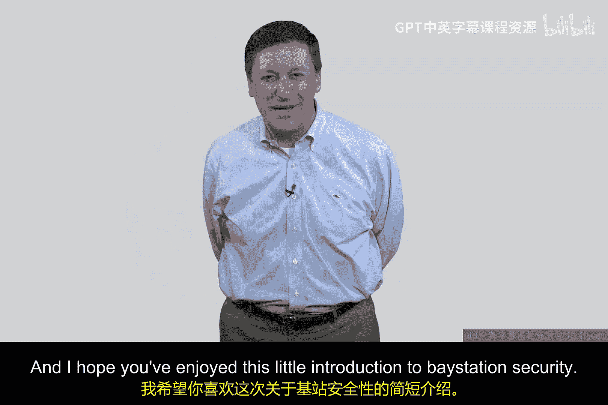

# 171：基站欺骗与移动性（IMSI捕获）📡

在本节课中，我们将学习移动通信网络中的一种安全威胁——基站欺骗，它也被称为IMSI捕获。我们将探讨这项技术从2G到5G的演变过程，以及不同代际网络在安全设计上的妥协与继承关系。

## 概述

基站欺骗是一种攻击手段，攻击者通过架设一个虚假的移动通信基站，诱使用户设备连接，从而可能进行监听或其他恶意活动。其核心在于利用早期移动网络标准中单向认证的缺陷。

## 移动网络安全的演进

上一节我们概述了基站欺骗的概念，本节中我们来看看这项技术是如何随着移动网络代际更迭而演变的。

### 2G网络：单向认证的诞生

在移动通信的早期，网络设计的首要目标是实现功能。第二代（2G）网络引入了一些算法，确保手机（终端）被基站认证。然而，认证是单向的，即基站验证手机，但手机并不验证基站。

当时的设计逻辑是：基站基础设施稀少，手机能找到信号已属幸运，无需再验证基站的真伪。此外，手机始终遵循一个原则：自动尝试连接到信号最强的基站。

这个设计留下了安全隐患：如果有人架设一个信号更强的虚假2G基站，附近的手机就会自动连接上去。

### 3G网络：试图修补与遗留问题

到了第三代（3G）网络，标准引入了双向认证，即手机也需要认证基站。这理论上可以防止手机连接到虚假基站。

但这里存在一个关键问题：**网络回退**。为了确保网络覆盖的连续性，当手机在某个区域找不到3G信号时，它必须能够回退到2G网络。这意味着，即使3G网络本身是安全的，它也必须支持回退到不安全的2G模式。

因此，3G网络继承了2G的安全缺陷。这是一个典型的案例，展示了新一代安全设计如何被迫继承前代遗留的问题。

### 4G/5G网络与未来

第四代（4G）和第五代（5G）网络采用了更严格、强大的双向认证机制。随着2G网络在全球范围内逐步退役，基站欺骗的威胁正在减小。但这个案例研究仍然极具价值，它揭示了通信协议迭代中安全设计的复杂性与妥协。

## 技术核心与思考

以下是关于基站欺骗技术及其社会影响的几点思考：

*   **核心漏洞**：攻击得以实现的核心在于早期协议中 **`手机认证基站 == False`** 这一设计缺陷，以及手机 **`连接策略 = 选择最强信号`** 的固有行为。
*   **应用场景的双面性**：架设小型基站（如蜂窝信号放大器或企业级微基站）在提供更好覆盖的同时，也引发了隐私问题。例如，当你的手机在咖啡店自动从5G切换到Wi-Fi时，这个过程是便捷的，但你是否考虑过其安全与隐私影响？
*   **社会接受的边界**：在办公室、商场或咖啡馆等场所进行无缝网络切换，在多大程度上是可接受的？这没有标准答案，取决于个人观点，也是社会需要共同探讨和界定的事项。

## 总结

本节课我们一起学习了基站欺骗（IMSI捕获）的攻击原理。我们回顾了从2G到5G移动网络在基站认证机制上的演进，看到了安全改进如何受制于向后兼容的需求。这个案例生动地说明，网络安全是一个动态的、需要在便利性、覆盖能力和安全性之间不断权衡的领域。