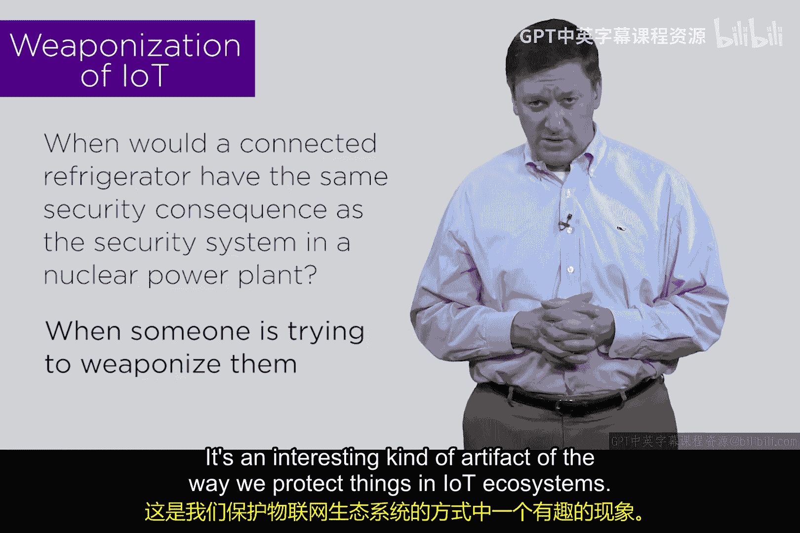

# 173：物联网僵尸网络 🧟‍♂️💻

在本节课中，我们将探讨一个看似有趣但至关重要的问题：物联网设备的“武器化”如何模糊了不同设备的安全风险边界，以及这对我们理解网络安全意味着什么。

---

## 核心问题：冰箱与核电站的等价性

上一节我们讨论了物联网设备的基本安全风险。本节中，我们来看看一个具体场景：一台联网的冰箱何时会与核电站的安全系统具有相同的安全后果？

表面上看，这个问题很荒谬。对核电站的网络攻击后果显然比攻击一台联网冰箱严重得多。然而，我们需要思考一个概念：**物联网的武器化**。

## 物联网武器化与僵尸网络

物联网武器化是指将大量物联网系统聚集起来，形成一个庞大的**僵尸网络**。互联网和大众媒体上已有许多文章讨论物联网武器化及其影响。

关键在于，无论是冰箱还是发电厂的安全系统，只要是物联网或工业控制设备，其内部都包含计算机。这些计算机拥有**操作系统、内存、CPU、输入/输出和网络连接**。

如果攻击者正在构建一个僵尸网络，试图扩大规模以攻击某个目标，那么他会在意所窃取的计算资源是来自冰箱还是发电厂吗？

**答案是不会。**

事实上，发电厂可能因安全防护严密而更难被利用，而你的联网冰箱很可能门户大开，更容易成为目标。

## 案例分析：Mirai僵尸网络

如果你一直关注网络安全新闻，会发现许多类似案例。一个著名的例子是来自美国的**Mirai僵尸网络**。一名研究生利用物联网设备创建并控制了一个僵尸网络。

以下是此类案例中常被攻击的设备类型：
*   **数字视频录像机**
*   **家用摄像头**
*   其他类似的无害设备

为什么是这些设备？因为**它们几乎没有安全防护**。如果攻击者想获取核电站安全系统的计算资源，并且这些系统也容易攻破、能提供CPU、内存和网络连接，他们同样会下手。攻击者总是选择**阻力最小**的路径。

## 结论与总结

所以，问题的答案是：当有人试图将它们“武器化”时，一台联网冰箱可能与核电站安全系统具有相同的安全后果。就这种武器化而言，消费级设备造成的后果甚至可能更严重。

这是一个有趣的现象，反映了我们在物联网生态系统中保护设备的方式。请记住这一点。

本节课我们一起学习了物联网设备如何被武器化以组建僵尸网络，理解了攻击者倾向于攻击安全防护最薄弱的设备，而不论其本身的功能重要性。这改变了我们评估不同设备安全风险的传统视角。

我们下节课再见。