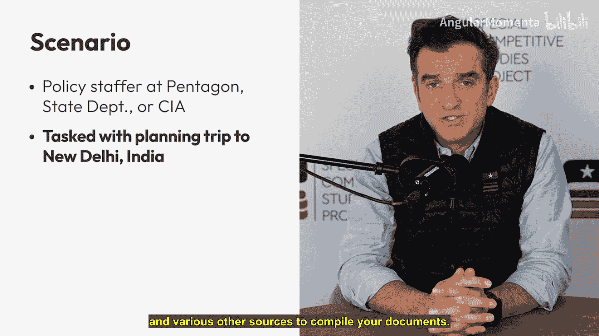
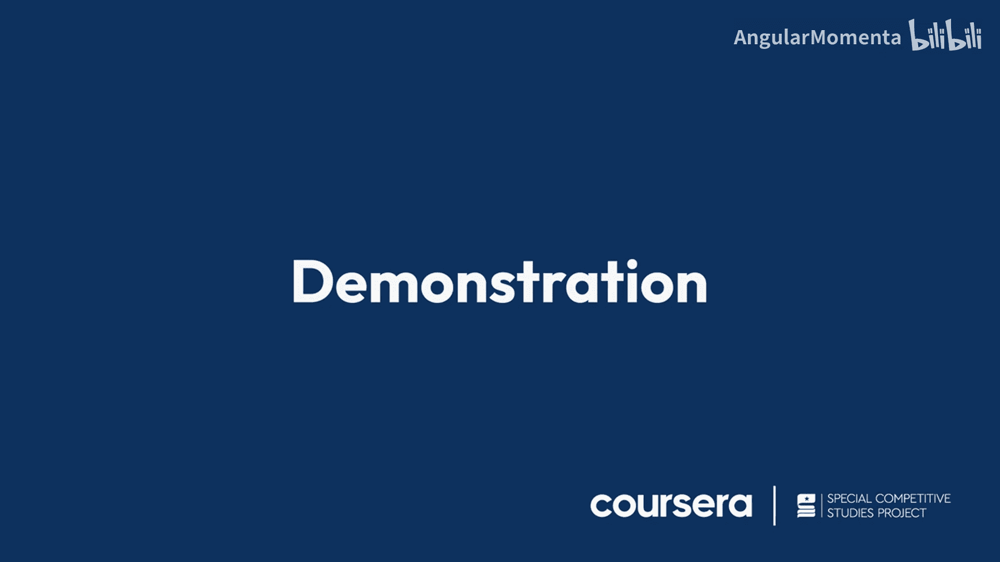
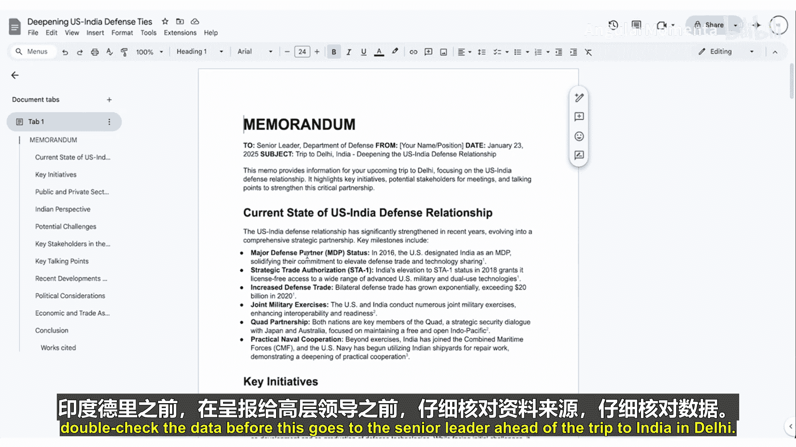
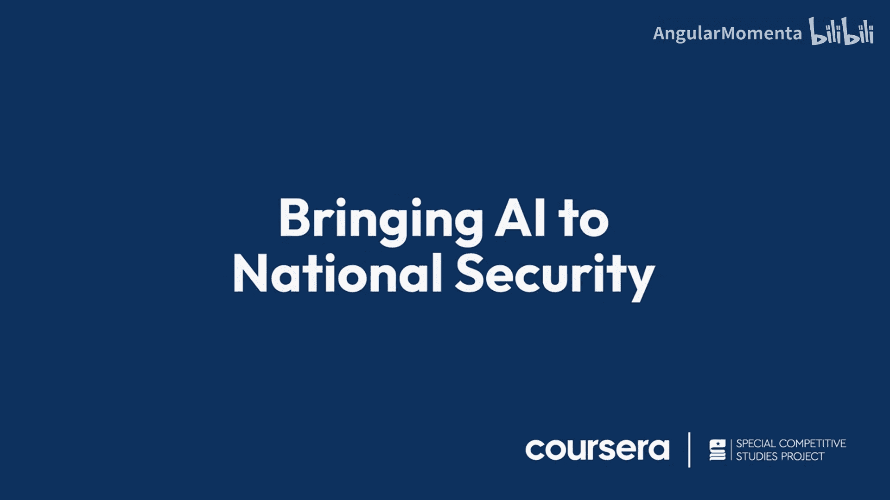

# 001：利用AI提升国家安全工作效率 🚀

在本课程中，我们将学习如何利用人工智能工具，特别是大型语言模型，来辅助完成国家安全领域的日常工作，例如撰写政策备忘录和准备背景资料。我们将通过一个具体的案例来演示其应用。

## 概述

我是米莉·巴拉兹托里，特殊竞争研究项目的首席执行官。在领导该项目之前，我曾在联邦政府担任多个职务。无论身处哪个岗位，为高级领导撰写备忘录和背景文件始终是一项核心工作。如今，人工智能可以为这些文档提供初稿，最终由政策分析师或主题专家进行编辑和完善。我们与Coursera合作创建本课程，旨在帮助联邦或州一级的员工利用最新工具完成使命。我们不仅希望讨论这些工具，更想通过真实案例展示如何将AI应用于日常工作。

## 案例演示：为出访准备背景备忘录

想象一下，您是五角大楼、国务院或中央情报局的一名政策工作人员，任务是为领导即将前往印度新德里的出访准备材料。在通常情况下，您需要花费数天甚至数周时间来汇编背景信息、安排通话、咨询内外部专家、确认行程细节，并最终为领导撰写谈话要点。您需要查阅政策文件、情报报告、简报及其他各种资料来汇编文档。这是一项耗时的工作，并且在处理日常其他事务的同时，总有可能遗漏关键细节。

上一节我们介绍了传统工作流程的挑战，本节中我们来看看如何利用AI工具来高效完成这项任务。

让我尝试演示如何使用一个大型语言模型来执行此任务。本例中，我将使用谷歌的Gemini及其名为“Deep Research”的工具。我相信其他模型（如Claude或ChatGPT）也具备类似功能，但为了本课程的目的，我将使用2025年1月发布的Gemini Deep Research。

以下是我将如何操作：

1.  **构建提示词**：在提示词中，我会包含一段文本，指示大型语言模型为我需要为国防部领导即将访问德里准备的备忘录进行调研。
2.  **生成研究计划**：模型会给我一个研究计划大纲。如果您对计划进行的研究不满意，可以在下方直接编辑。
3.  **执行研究**：如果认可研究计划，可以点击“开始研究”。在左侧，您可以看到模型为您构建备忘录的进度。整个过程甚至不需要一分钟。这一切都是基于互联网上现有的开源信息完成的。
4.  **审查与导出**：在右侧，模型从智库报告、政府文件、新闻网站、印度智库等来源提取信息。Gemini Advanced 1.5 Pro with Deep Research 为我提供了初稿。您可以将此文档导出到Google Docs中。

现在，让我向下滚动，让您感受一下这份文档作为起点的质量。这绝非最终成品。正如开头所说，它需要人工干预进行编辑、双重检查数据来源等。但它至少为您提供了一个坚实、出色的初稿，供您在此基础上继续工作。

您可以看到备忘录已按我的提示构建完成：
*   它讨论了美印防务关系的现状。
*   回顾了过去十年的关键倡议。
*   分析了印度对我们关系的看法。
*   指出了潜在挑战。
*   列出了对方的关键利益相关者和主要负责人。
*   然后为您的领导提供了与印度领导人对话的潜在谈话要点。
*   继续向下，它提供了总体贸易、商品和服务的经济数据。
*   在最底部，附有引用来源。

构建这份七页的备忘录用时不到一分钟。我认为这是一个极好的起点，您可以在此基础上继续加工、完善、双重检查来源和数据，然后才将其提交给领导，用于德里之行前的准备。

## 总结

本节课中，我们一起学习了如何利用AI大型语言模型（以Gemini Deep Research为例）来高效生成政策备忘录的初稿。我们看到了从输入提示词到获得一份结构完整、信息丰富的文档的完整流程。关键在于理解AI是强大的辅助工具，能够大幅节省信息搜集和初步整合的时间，但最终成品的准确性、深度和策略性仍需依赖人类的专业判断和编辑。这为国家安全领域的专业人士提供了一种提升工作效率的新方法。