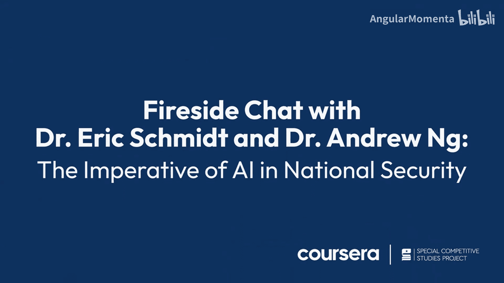

# 002：人工智能在国防中的关键应用

## 概述
在本节课中，我们将探讨人工智能如何塑造未来的国防能力。课程内容基于对专家埃里克的访谈，涵盖了从战术应用到公共部门效率提升等多个方面。我们将通过具体案例和概念分析，理解人工智能在国家安全领域的实际应用与战略意义。

## 人工智能如何塑造未来国防能力
上一节我们概述了课程主题，本节中我们来看看人工智能将如何具体改变国防能力。埃里克以坦克为例进行了阐述。

一辆美国坦克的成本可能高达3000万美元，而一架无人机的成本仅为1000美元。如果身处坦克中，士兵会面临巨大风险。理想的解决方案是在坦克前方和后方持续部署无人机群，提供不间断的侦察与监视能力。这被称为**持久、前沿、自主的ISR（情报、监视、侦察）能力**。

这种能力不仅适用于坦克，也适用于森林中的步兵。关键在于构建一个**始终存在、始终监视的无人机层**，而不仅仅是讨论单个人类、无人机与目标的关系。软件能够实现这种大规模、持续的自主系统部署。

## 人工智能在公共安全中的现实应用
理解了国防中的概念应用后，我们来看一个人工智能提升公共安全效率的真实案例。

大约一个月前，一家名为SkyFire AI的公司（由访谈者领导的风险投资基金投资）在美国帮助拯救了一名警察的生命。该公司提供“无人机作为第一响应者”项目。当警报响起时（许多是误报），系统会先派遣无人机前往查看。

在一个具体事件中，一名警官在凌晨2点拦停一辆车辆后失联。警方调度中心指令一架正从其他任务返回的无人机改变路线，前往寻找该警官。无人机从空中视角迅速定位了警官及其拦停的司机（后者是一名逃犯）。当时警官正在沟渠中与袭击者搏斗并处于下风。

地面巡逻车可能需要5到7分钟才能在复杂的多层立交桥区域找到事发地点。而借助无人机提供的实时图像，调度中心能立即引导响应单位精确抵达。第一辆警车在**45秒内**就到达现场，迅速控制了局势并逮捕了嫌疑人，确保了警官的安全。

## 人工智能提升公共部门工作效率
看到了人工智能在应急响应中的威力后，本节我们探讨如何利用AI工具提升公共部门工作人员的日常效率。

公共部门及国防领域的工作需要处理海量信息。人工智能作为一种通用技术，就像它正在帮助众多企业处理信息和决策一样，有巨大潜力被适配到公共部门的诸多用例中。

联邦政府面临的问题具有独特性，但并非完全独特。过去几十年的技术创新中，许多来自硅谷的发明后来也被证明对国防有用。例如，使用大语言模型梳理文件、帮助起草递交给国防部长的备忘录。

在国防生态系统中，人工智能有强大潜力帮助人们理解政策或遗留的IT系统，并处理更多数据。一种思考AI的方式是：**我们希望给每个人配备一支非常高效且成本低廉的“实习生”队伍**。这些“实习生”可能对我们的工作知之甚少，但非常勤奋，愿意完成所需任务。尽管存在局限，但AI可以承担联邦政府人员的大量繁琐、重复性工作，帮助我们的劳动力变得高效得多。

目前的现象是，许多非专业软件工程师的人正在学习足够多的AI知识，来构建创新的应用，从而在自己的工作角色中变得更高效。

## 国防部整合人工智能的关键领域
了解了AI对个人效率的提升后，我们转向组织层面，看看国防部哪些领域最有可能快速、全面地整合AI以增强防御能力和效率。

回顾多年前美军的“第三次抵消战略”，其核心思想是转向**精确性与自主性**。这仍然是正确的方向。现代人工智能系统允许你**精确识别目标并几乎避免附带损伤**。

因此，**自主系统**的概念，尤其是那些受人类远程控制的系统，可能是战争和国防领域即将发生的最大变革。在乌克兰可以看到，人们可以在舒适的办公楼里边喝咖啡边操作无人机执行防御或进攻任务。

美军应迅速转向这些技术。由于国防部的运作方式，这个过程可能漫长，但最终将会发生。

## 科技界参与国家安全的必要性
讨论了技术整合后，我们有必要思考提供这些技术的科技界所扮演的角色。作为教育者和AI技术专家，我很高兴我们的社区正在参与国家安全事务，探索我们的工具和专业知识如何贡献于国家安全。

我记得当“专家计划”出现时，一些大型科技公司决定不参与国家安全事务。这让我深思。我为自己能生活在一个民主国家而感到荣幸，军人们冒着生命危险保护我们所有人。如果科技界人士不愿站出来至少支持我们的军队，那 frankly，我们到底在做什么？因此，我非常高兴科技界愿意审视国家安全和国防提出的难题，并尽我们的一份力，为拥有一个安全、繁荣的民主国家做出贡献，并支持我们的军队。

## 人工智能人才培养与国家竞争力
认识到科技界的责任后，我们最后来探讨人才培养这一根本问题。任何在人工智能领域培训其劳动力的国家或地区都将在国家安全和经济竞争力方面获得优势。

人工智能是一项强大的技术。我认为，任何拥抱并善用它的国家或地区，都将在当前时刻于国家安全和经济竞争力方面获得优势。无论是为了安全、商业应用还是非政府组织应用，构建卓越事物的机会都是巨大的。每天我都感到，我们能构建的卓越事物的集合，远远大于目前现有技能人才所能追求和把握的所有机会数量。

因此，我想对政府内外的所有人说，现在是学习人工智能的大好时机。如果你拥抱这些工具，你将能比以往更有效地完成任务。这就是为什么培训是我们工作的如此重要的一环。我认为，曾经每个人都必须学习使用网络搜索，几乎每个人都必须学习使用智能手机。今天，在商业世界，我无法想象雇佣一个不会使用互联网搜索的营销人员、招聘人员或人力资源专业人士。我们正迅速接近这样一个阶段：我无法想象雇佣一个不会使用生成式人工智能的营销人员、招聘人员或几乎任何办公室职位的人员。

确保我们所有人都能拥抱这项技术并尽可能利用它，对于国家竞争力至关重要。

## 人工智能对未来战场的影响
我们探讨了AI在多个层面的应用，最后展望一下它将对未来战争形态产生的根本性影响。部分原因是人们相信人工智能技术将在人类的指导下改变我们所知的商业、营销、销售等几乎一切领域。

一个企业通常需要观察、设计、采购、制造、运输并建立客户关系。每个环节都可以理解为一个**智能体**，每个智能体都可以自主运作。因此，你有负责规划的智能体、负责采购的智能体、负责设计的智能体和负责制造的智能体。

**完全相同的智能体方法**也适用于军队的运作。从这个意义上说，军队就是一个大型公司，也是一个大型规划机制。在我服役的岁月里，我只能说他们整天都在用白板靠人力进行规划。然而，这种规划应该由人工智能系统来完成，以找出最优的防御策略、进攻策略等等。我认为这将彻底改变五角大楼的运作方式和我们的决策方式。

不幸的是，目前我们的政府总体上非常不擅长采购软件，尤其是人工智能系统。软件与硬件系统不同，**软件永远没有完成之日**。你总是在迭代，总是在让它变得更好。然而，我们尚未能以一种正确的方式让美国军方理解这一点。

## 总结
本节课中，我们一起学习了人工智能在国家安全与国防领域的多方面应用与影响。我们从具体的战术构想（如无人机群护航）出发，看到了AI在现实公共安全事件中的价值，探讨了其提升公共部门效率的潜力，并分析了国防部整合AI的关键领域。我们还反思了科技界参与国家安全的必要性，以及通过人才培养提升国家竞争力的战略。最后，我们展望了AI通过智能体模式对未来战场和军事决策流程可能带来的革命性变化。理解并主动驾驭这些变化，对于维护未来国家安全至关重要。