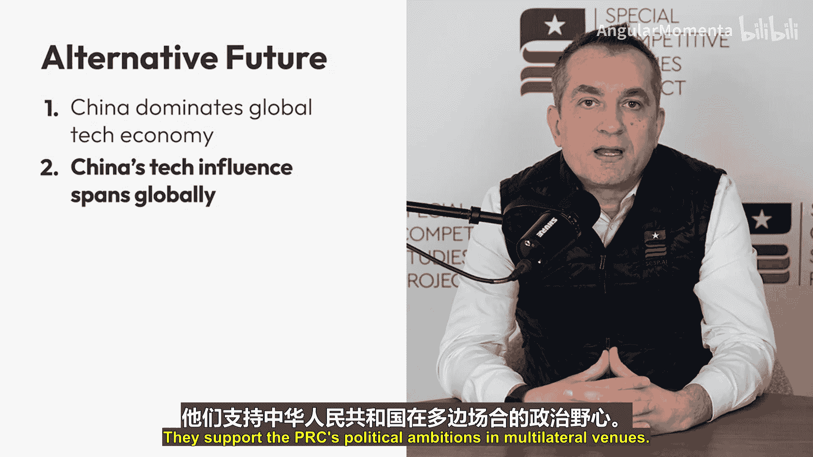

# 003：落后的代价

我是伊尔·B·巴拉卡里，曾在五角大楼和白宫工作超过13年，专注于国防政策与战略。

今天，超过97%的美国人只生活在一个以自由为各国理想归宿的世界里。民主，而非专制，被视为组织社会的最佳模式。技术创新的目的是改善，而非损害人类福祉。美国是世界领先的超级大国。

一场激烈的竞争正在展开，这关乎上述未来是否会延续。事实上，这个未来将主要由美国与中华人民共和国之间的技术竞争所塑造。

为了真正理解这场竞争的利害关系，设想一个替代性的未来是有益的，即中华人民共和国胜出的未来。换句话说，想象一下如果北京成功控制了全球数字基础设施、主导了世界技术平台、掌握了关键技术的生产手段并驾驭了人工智能、生物技术和新能源等新一代通用技术，未来会是什么样子。

如果那是未来，可以预见一系列令人深感不安的后果。我将列举六点作为说明。

以下是六种可能出现的后果：

1.  **中国主导世界经济，并攫取下一代技术产生的数万亿美元价值。** 美国及其盟友将错失新技术所承诺的大部分就业和增长机会。新技术供应链将在中国建立。北京在科技领域的主导地位，将催生强大的平台和公司，在云服务、社交媒体和互联网搜索等关键领域取代美国公司。
2.  **中国的技术影响力范围将遍及全球。** 北京将利用其技术优势获取政治杠杆。包括美国盟友在内的国家将日益依赖中国的技术，并不可避免地进入其政治轨道。依赖中国数字基础设施和平台的国家，将不愿在全球危机中冒险对抗北京，并在多边场合支持中国的政治抱负。
3.  **开放的互联网将受到损害，数字压迫将取代数字自由。** 北京所主张的“主权互联网”愿景将席卷全球。中国的监控国家模式将全球化。中国支持的科技平台将取代其他全球平台，利用复杂的算法塑造全球话语。中国最终将控制数字支付基础设施，削弱美元的力量。北京将收集海量数据，用于针对个人和优化其宣传。
4.  **各国的数字基础设施将面临网络威胁。** 世界将依赖中国提供大部分核心数字技术、关键电子元件和最终产品，这些技术被编织进每一个关键系统。能源网络、港口、机场、金融系统和政府办公室将容易受到中国的网络攻击。北京会在意见分歧时将其用作威胁，并在危机中发动网络攻击。
5.  **美军的科技优势将被侵蚀。** 中国将利用其在自主系统、机器人技术和低成本大规模制造方面的主导地位，建造超越美国能力的武器系统，创造新的作战模式，并削弱对美国军事威慑的信心。能力下降加上盟友的摇摆，将迫使美国在印太地区——本世纪最关键的区域——做出痛苦的妥协。
6.  **北京将威胁或实际切断芯片及其他关键技术投入的供应。** 北京将拒绝供应能源、数字和国防技术所必需的稀土材料，并切断尖端半导体的供应（其中92%产自台湾）。美国的军事能力将下降，国家将陷入萧条。美国人将被迫生活在一个中国可以随时关闭技术“水龙头”的世界里。

总而言之，这个替代性的未来意味着二战后美国及其盟友精心构建的世界秩序的解体，并对美国未来的繁荣构成严峻挑战。美国和其他民主国家将变得经济上依赖他人，失去其繁荣引擎和在世界上的行动自由。我们的领导人将面临艰难选择：要么为了在一个不同的世界秩序中谋得一席之地而妥协信念、牺牲盟友；要么从一个更小的技术工业基础、更弱的地缘政治地位和削弱的军事优势出发，为维持美国的地位而战。

现在，即使上述情况只有部分成为现实，对于美国和自由世界而言，世界也将变得黯淡得多。这将导致我们的日常生活发生无法忽视的转变。一个失败的场景是可能发生的。我们已经看到中国如何利用其技术优势来提取数据、强制服从，并惩罚那些不按其意愿行事或批评其政策的个人、公司甚至国家。

如果我们审视当前技术竞争的状态、我们如何走到这一步、我们今天驾驭新兴技术的准备程度，以及趋势线所指示的未来方向，我们有充分的理由感到担忧。

**总结**

在本节中，我们探讨了美国在人工智能和关键技术领域竞争中落后的潜在后果。我们设想了一个中国主导技术未来的场景，并分析了其对全球经济、地缘政治、数字自由、网络安全、军事平衡和供应链安全的深远影响。这些后果共同描绘了一个世界秩序可能发生根本性转变、美国及其盟友的繁荣与自由面临严峻挑战的未来图景。理解这些利害关系，是激励我们采取行动、确保在技术竞争中保持领先地位的第一步。